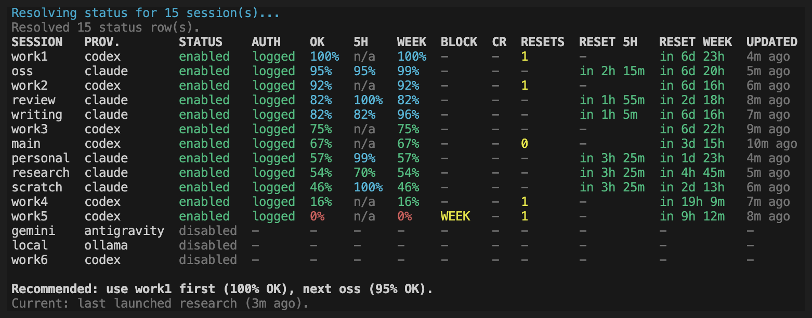
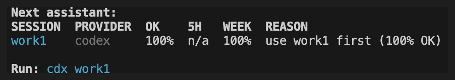
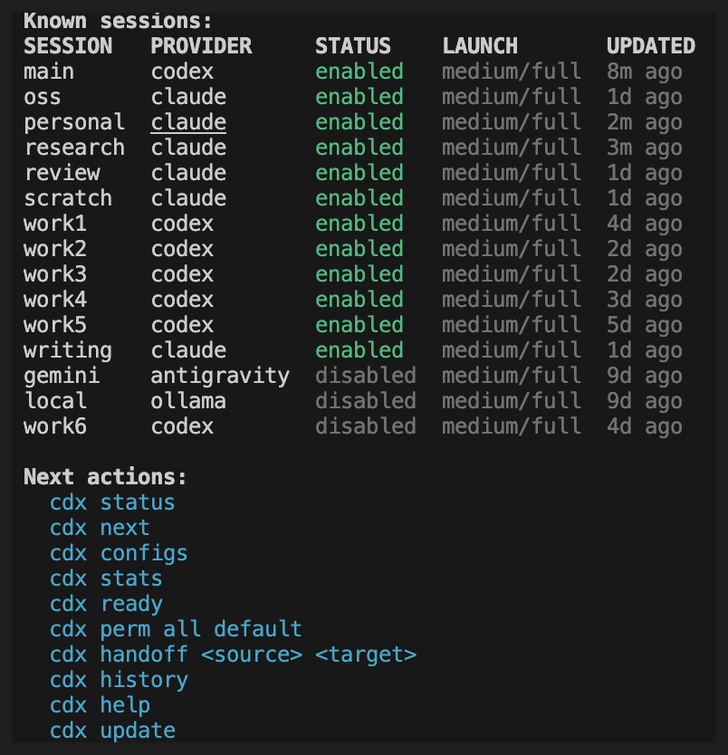
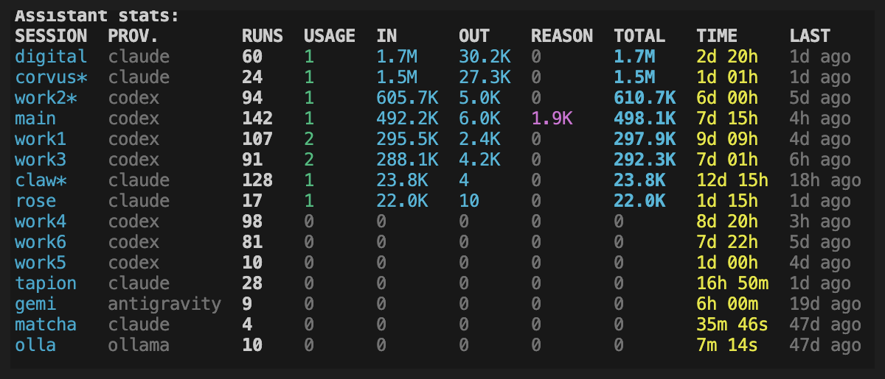

# CDX Manager

[](LICENSE)  

**Stop guessing which AI account still has quota.** `cdx` tracks the rate-limit window of every Codex and Claude account you own, tells you which one is usable right now, and launches it with isolated auth — in one command.

If you pay for several AI coding subscriptions, you know the dance: you hit a 5-hour limit mid-task, guess which other account still has room, re-authenticate, and lose your context on the way. `cdx` turns that into `cdx next`.



---

## Quick Start

```bash
npm install -g cdx-manager

cdx add codex work      # register an isolated Codex profile named "work"
cdx add claude perso    # and a Claude one
cdx status              # every account's remaining quota, side by side
cdx next                # which account should I use right now?
```

Supported providers: `codex`, `claude`, `antigravity`, `ollama`.

`cdx next` answers the question you actually have, and prints the command to run:



---

## The Core Five

Everything else is optional. These five cover the daily loop:

| Command | What it gives you |
|---|---|
| `cdx add <provider> <name>` | An isolated account profile — its own auth, its own home |
| `cdx <name>` | Launch that account, auth checked first |
| `cdx status` | Remaining 5-hour and weekly quota for every account at once |
| `cdx next` | The account you should use right now, and why |
| `cdx run --prompt ... --json` | The same routing, headless, for scripts and agents |

---

## Table of Contents

- [Quick Start](#quick-start)
- [The Core Five](#the-core-five)
- [What it does](#what-it-does)
- [Technical Overview](#technical-overview)
- [Getting Started](#getting-started)
- [All Commands](#all-commands)
- [JSON Output](#json-output)
- [Available Scripts](#available-scripts)
- [Windows Support](#windows-support)
- [Project Structure](#project-structure)
- [Data Layout](#data-layout)
- [Troubleshooting](#troubleshooting)
- [Contributing](#contributing)
- [License](#license)

---

## What it does

### Quota-aware routing

The reason `cdx` exists: knowing, across every account you own, which one you can actually use.

- **Usage at a glance.** `cdx status` shows token usage, 5-hour window quota, weekly quota, last-updated timestamps, priority guidance, and the last launched session in one aligned table.
- **Pick for me.** `cdx next` selects the best available assistant from your pinned priorities and the live quota picture, shows the reason, and prints the exact command to run.
- **Next-ready notification.** `cdx ready` schedules a native system notification for the next assistant that comes back from cooldown, then returns immediately. `cdx notify` covers reset times and scheduled wake-ups.
- **Passive status resolution.** Codex status is read from the local Codex app-server rate-limit API when available, with legacy transcript/history parsing kept as a fallback.
- **Banked reset visibility.** Eligible Codex accounts show the number of manually redeemable bonus resets in `cdx status` and expose reset details in JSON output.

### Isolated multi-account sessions



- **Multiple providers, one tool.** Register as many Codex, Claude, Antigravity, or Ollama sessions as you need. Codex and Claude get isolated auth environments; Antigravity is launchable through `agy` with OS-keyring auth; Ollama runs local models through `ollama run`.
- **Instant launch.** `cdx work` opens your "work" session. `cdx personal` opens another. No config files to edit mid-flow.
- **Quick relaunch.** `cdx last` reopens the most recently launched assistant profile.
- **Resume by identity, not by recency.** Each session records the provider's own conversation id — imposed at launch for Claude, read back from the rollout for Codex — so `cdx resume <name>` reopens *that* conversation regardless of your working directory or of which session ran last. `cdx can-resume --json` reports the strategy and where the id came from, so an automated caller can tell a named resume from a best-effort one.
- **Auth guardrails.** `cdx` checks authentication before launching. If a session is not logged in, it tells you exactly what to run — no silent failures.
- **Persistent launch settings.** Pin per-session power, permission, and fast-mode preferences once; `cdx` reapplies them on every launch until you unset them.
- **Spend ceiling and model fallback.** `cdx set <name> --budget 5` caps what a headless run may spend, and `--fallback-model sonnet,haiku` lets a run continue on the next model when the first is overloaded. Both are Claude Code flags that the provider accepts with `--print` only, so they apply to `cdx run` and not to interactive launches; `cdx configs` says so.
- **Session control.** Disable a session without deleting it when an account is temporarily out of credits; disabled sessions remain visible and sort last.
- **Optional session labels.** `cdx label <name> <label>` adds a short human label; list and full status tables show a `LABEL` column only when at least one session has one.
- **Clean removal.** `cdx rmv` wipes a session and its entire auth directory. No orphaned files, no stale credentials.

### Headless automation

- **One task, one JSON result.** `cdx run` executes a prompt against a chosen or auto-selected session and returns a stable payload; `--detach` returns a `run_id` immediately.
- **Observable runs.** `cdx run-status`, `cdx run-tail`, `cdx run-report`, and `cdx runs --since` follow a run while it happens and after it ends.
- **Selection without launching.** `cdx select --provider ... --require-ready --json` answers "which session should this job use?" for orchestrators.
- **Validated contract.** `cdx schema --json` publishes the enums, mutually-exclusive argument groups, and error codes programmatic callers should validate against.

### Context handoff

- **Shared handoff context.** Keep a per-workspace Markdown context, or build one from a source session transcript, and install it into another assistant session before switching providers or accounts.
- **Session transcript capture.** Every launch is recorded to a local log file via `script`, giving you a full terminal transcript for each session.

### Maintenance

- **Launch history.** Inspect recent launches with provider, result, duration, working directory, launch settings, and transcript path.
- **Aggregate usage.** `cdx stats` totals runs, token usage, and time spent per session over any period.



- **Disk usage and cleanup.** `cdx disk` reports `CDX_HOME` usage, `cdx disk profiles --candidates` identifies reclaimable profile caches/logs with evidence, and `cdx clean profiles ...` applies explicit cleanup actions.
- **Health and repair.** `cdx doctor` inspects dependencies, permissions, and orphan profiles; `cdx repair` plans or applies safe fixes.
- **Portable bundles.** `cdx export` / `cdx import` move sessions between machines, with passphrase-encrypted auth data when you ask for it.
- **Update prompts.** Periodic update checks surface `cdx update` directly in the `cdx`, `cdx status`, and launch output when a newer release is available. When `logics-manager` is installed, `cdx` can also suggest `logics-manager self-update`.
- **Logics viewer shortcut.** `cdx view` opens the Logics browser/focus viewer through `logics-manager view` when the companion CLI is installed. All viewer flags are forwarded: `--lan`, `--lan-rw`, `--focus <ref>`, `--read`, `--port`, `--host`, `--refresh-interval`, `--tls`, `--tls-cert`, `--tls-key`, `--open`, `--no-open`. `cdx view --json` reports availability and update diagnostics without opening the viewer.

---

## Technical Overview

- Python 3.9+.
- Environment isolation per session:
  - Codex sessions override `CODEX_HOME` to a dedicated profile directory.
  - Claude sessions override `HOME` to a dedicated profile directory and disable Claude Code commit co-author attribution by default.
  - Antigravity sessions launch `agy` with a dedicated `HOME` for file-based settings; Google account credentials may still be stored in the OS keyring by Antigravity itself.
  - Ollama sessions use the local Ollama server and launch `ollama run <model>`; set a model with `cdx set <name> --model <model>`.
  - New Codex sessions seed their auth home from your existing global `~/.codex/auth.json` when available, so an already logged-in Codex CLI can be reused without giving up per-session isolation afterward.
- Persistence:
  - Session registry at `~/.cdx/sessions.json` (versioned JSON store).
  - Per-session state at `~/.cdx/state/<name>.json`.
  - Per-workspace shared context at `~/.cdx/contexts/<workspace-hash>/context.md`.
  - Auth and provider data under `~/.cdx/profiles/<name>/`.
  - All paths are URL-encoded to support arbitrary session names.
- Status resolution pipeline:
  - Primary source: recorded status fields on the session record.
  - Codex live source: `codex app-server` JSON-RPC `account/rateLimits/read`, normalized into 5-hour, weekly, reset, credit, and plan fields.
  - Fallback: `status-source` scans provider JSONL history files and terminal log transcripts, strips ANSI/OSC sequences, and extracts `usage%`, `5h remaining%`, and `week remaining%` via pattern matching.
- Status latency controls: use `cdx status --cached` to skip live probes, `cdx status --timeout SECONDS` for one command, or `CDX_STATUS_TIMEOUT_SECONDS` to lower the default Codex live-probe timeout.
- Claude status refreshes are cached briefly by default; pass `--refresh` to force a live rate-limit probe.
- On Linux, transcript capture uses the `util-linux` `script -c` command form.
- If `script` is unavailable, Codex launch falls back to running without transcript capture.
- On Windows, transcript capture is optional. If no compatible `script` wrapper is installed, Codex still launches normally without transcript capture.
- Auth probe: synchronous subprocess call to `codex login status` or `claude auth status` before any interactive launch.
- Signal forwarding: `SIGINT`, `SIGTERM`, and `SIGHUP` are forwarded to the child process and produce clean exit codes.
- Test stack: `pytest`, `pytest-cov`, and `ruff` via the documented `dev` dependency extra.
---

## Getting Started

### Prerequisites

- Node.js 18+ with npm
- Python 3.9+
- `codex`, `claude`, `agy`, and/or `ollama` CLI installed and available in your PATH

On Windows, the npm launcher looks for Python in this order: `py -3`, `python`, then `python3`. Make sure at least one of those commands resolves to Python 3.

### Install

From npm:

```bash
npm install -g cdx-manager
```

With pipx:

```bash
pipx install cdx-manager
```

With uv:

```bash
uv tool install cdx-manager
```

On Windows with PowerShell:

```powershell
npm install -g cdx-manager
```

With the standalone PowerShell installer:

```powershell
Invoke-WebRequest https://raw.githubusercontent.com/AlexAgo83/cdx-manager/main/install.ps1 -OutFile install.ps1
# Optional: set CDX_SHA256 before running if you have a trusted checksum.
# Set CDX_ALLOW_UNVERIFIED=1 only if you intentionally accept an unverified archive.
powershell -ExecutionPolicy Bypass -File .\install.ps1
```

With the standalone GitHub installer:

```bash
curl -fsSL https://raw.githubusercontent.com/AlexAgo83/cdx-manager/main/install.sh -o install.sh
# Optional: set CDX_SHA256 before running if you have a trusted checksum.
# Set CDX_ALLOW_UNVERIFIED=1 only if you intentionally accept an unverified archive.
sh install.sh
```

For a specific version:

```bash
curl -fsSL https://raw.githubusercontent.com/AlexAgo83/cdx-manager/main/install.sh -o install.sh
CDX_VERSION=v0.8.0 sh install.sh
```

From source:

```bash
git clone <repo>
cd cdx-manager
make install
```

For local development, install the Python toolchain as well:

```bash
python3 -m pip install -e ".[dev]"
```

From source on Windows:

```powershell
git clone <repo>
cd cdx-manager
npm install -g .
```

`cdx` is now available globally. Changes to the source take effect immediately — no reinstall needed.

To update an installed copy later:

```bash
cdx update
```

To uninstall:

```bash
make uninstall
```

To uninstall on Windows after `npm install -g`:

```powershell
npm uninstall -g cdx-manager
```

Alternatively, for a non-symlinked global source install:

```bash
npm install -g .
```

Security note:

- The standalone installers resolve official release checksums from the tagged GitHub Release asset `release-archives.json`.
- You can still override verification explicitly through `CDX_SHA256`.
- If no checksum is available, standalone installers fail closed unless `CDX_ALLOW_UNVERIFIED=1` is set; that override prints a prominent warning before continuing.
- Prefer `npm`, `pipx`, or `uv` when you want registry-backed install flows.
- If you use the standalone script, download it first, inspect it, and prefer a release with the official checksum asset attached.

Release maintainer note:

- Before publishing npm or PyPI packages, run `npm run release:validate`.
- The release tag must match `package.json`, `pyproject.toml`, `src/cli.py`, and `VERSION`.
- `checksums/release-archives.json` must include the matching `vX.Y.Z` entry with both `github_tarball_sha256` and `github_zip_sha256`.
- Publishing a GitHub Release runs the checksum upload workflow: it regenerates `checksums/release-archives.json` for the release tag and uploads it as the `release-archives.json` asset with replacement enabled for safe reruns.
- If the asset is missing or stale, repair it with `python3 scripts/update_release_checksums.py --tag vX.Y.Z`, then `gh release upload vX.Y.Z checksums/release-archives.json --clobber`.
- Publish packages only after the checksum workflow succeeds and `npm run release:validate`, `npm run lint`, and `npm test` pass.

### Environment

By default, `cdx` stores all data under `~/.cdx/`. Override with:

```bash
export CDX_HOME=/path/to/custom/dir
```

Optional runtime knobs:

```bash
export CDX_CLAUDE_STATUS_MODEL=claude-haiku-4-5-20251001
export CDX_SCRIPT_BIN=script
export CDX_SCRIPT_ARGS='-q -F {transcript}'
```

PowerShell equivalents:

```powershell
$env:CDX_HOME = "C:\cdx-data"
$env:CDX_CLAUDE_STATUS_MODEL = "claude-haiku-4-5-20251001"
$env:CDX_SCRIPT_BIN = "script"
$env:CDX_SCRIPT_ARGS = "-q -F {transcript}"
```

Command Prompt equivalents:

```cmd
set CDX_HOME=C:\cdx-data
set CDX_CLAUDE_STATUS_MODEL=claude-haiku-4-5-20251001
set CDX_SCRIPT_BIN=script
set CDX_SCRIPT_ARGS=-q -F {transcript}
```

### Quick Start

```bash
# Register a Codex session
cdx add work

# Register a Claude session
cdx add claude personal

# Register an Ollama session
cdx add ollama local --model llama3.2

# List all sessions
cdx

# Launch a session
cdx work

# Check usage across all sessions
cdx status

# Pick the best session using the same priority logic as status
cdx next

# Notify when the next cooling-down assistant is ready
cdx ready

# Inspect CDX_HOME and profile disk usage
cdx disk
cdx disk profiles --candidates
```

### Next-Ready Notifications

Use `cdx ready` when every useful assistant is cooling down and you want your terminal back. It is shorthand for `cdx notify --schedule --next-ready`: cdx picks the next known reset, registers a native OS notification, and exits immediately. If no future reset is known, it exits successfully and explains that no notification was scheduled.

```bash
cdx ready
cdx ready --refresh
```

### Persistent Launch Settings

New sessions start with `power=medium` and `fast=off`, so launches are predictable without enabling fast mode. Set or override only the values you want to pin:

```bash
cdx set work --power medium --permission full --fast off
cdx set personal --power low --permission review
cdx set --sessions all --permission auto
cdx set --provider ollama --model llama3.2
cdx set work --priority 80
cdx set work --rtk on
cdx set work --logics off
cdx power all low
cdx perm provider:claude review
cdx model provider:ollama llama3.2
cdx config work
cdx configs
```

Those values are stored on the session and reapplied every time you run `cdx work`. Remove overrides to return to provider-native defaults:

```bash
cdx unset work --power
cdx unset --sessions work,personal --fast
cdx unset --provider claude --permission
cdx unset work --priority
cdx unset work --rtk
cdx unset work --logics
cdx unset work --all
cdx power all default
cdx model provider:ollama default
```

`--model` maps to Codex `--model`, Claude `--model`, and Ollama `ollama run <model>`. `--power` maps to Codex `model_reasoning_effort` and Claude `--effort`; supported values are `minimal`, `low`, `medium`, `high`, and `xhigh`. `--permission` maps to provider-native permission flags. Codex Fast mode is separate from reasoning effort: `--fast on` opts a Codex session into the Codex Fast service tier, while new sessions, `--fast off`, and default launches force the non-Fast `flex` tier. Use `--power low` when you want low reasoning effort without enabling Codex Fast credits. Existing legacy sessions that stored `fast=on` before this split continue to behave as low effort unless the user explicitly sets `--fast on` again. `--priority` is a 0..100 selector preference used as a tie-breaker after readiness and availability. `--rtk on` injects a launch instruction that encourages assistants to use RTK (`rtk <command>`) for noisy terminal commands when RTK is available, while keeping raw commands for exact output. Logics guidance is auto-enabled when `logics-manager` is available; use `--logics off` to disable that guidance for a session, or `--logics on` to pin it explicitly.

### Launch History

Every interactive `cdx <name>` launch is recorded under `CDX_HOME`, including success/failure, duration, cwd, launch settings, and transcript path.

```bash
cdx history
cdx history work
cdx history work --limit 5
cdx history work --json
cdx history --summary
cdx history --summary --since 7d
cdx history --summary --from 2026-05-01 --to 2026-05-28
```

`cdx history --summary` aggregates total time per assistant. Add `--since`, `--from`, or `--to` to focus on a period.

---

## All Commands

| Command | Description |
|---|---|
| `cdx` | List all sessions with last-updated timestamps |
| `cdx --json` | List all sessions as a machine-readable JSON payload |
| `cdx <name>` | Launch a session (checks auth first) |
| `cdx <name> [--json]` | Launch a session; `--json` returns a structured success payload after the interactive run ends |
| `cdx <name> -r` / `cdx <name> --resume` | Resume the provider-native conversation for a session when supported |
| `cdx add [provider] <name> [--model MODEL] [--json]` | Register a new session (`provider`: `codex`, `claude`, `antigravity`, or `ollama`; Ollama requires `--model`) |
| `cdx cp <source> <dest> [--json]` | Copy a session into another session name, overwriting the destination if it exists |
| `cdx ren <source> <dest> [--json]` | Rename a session and move its auth data |
| `cdx label <name> <label> [--json]` | Attach one short label to a session; tables show `LABEL` only when at least one label exists |
| `cdx label <name> --clear [--json]` | Clear a session label |
| `cdx login <name> [--json]` | Re-authenticate a session (logout + login) |
| `cdx logout <name> [--json]` | Log out of a session |
| `cdx disable <name> [--json]` | Disable a session without deleting it; disabled sessions stay visible and cannot launch |
| `cdx enable <name> [--json]` | Re-enable a disabled session |
| `cdx config <name> [--json]` | Show persistent launch settings for a session |
| `cdx configs [--json]` | Show persistent launch settings for all sessions in one table |
| `cdx power\|perm\|fast\|model <name\|all\|provider:PROVIDER\|a,b> <value\|default> [--json]` | Shortcut commands for setting or clearing one launch setting |
| `cdx set <name>\|--sessions all\|a,b\|--provider PROVIDER [--power minimal\|low\|medium\|high\|xhigh] [--permission review\|default\|auto\|full] [--fast on\|off] [--rtk on\|off] [--logics on\|off] [--model MODEL] [--fallback-model MODEL[,MODEL...]] [--budget USD] [--priority 0..100] [--json]` | Persist launch settings for one or more sessions |
| `cdx unset <name>\|--sessions all\|a,b\|--provider PROVIDER (--power\|--permission\|--fast\|--rtk\|--logics\|--model\|--fallback-model\|--budget\|--priority\|--all) [--json]` | Remove persisted launch settings and fall back to provider defaults |
| `cdx history [name] [--limit N] [--summary] [--since 7d\|today\|DATE] [--from DATE] [--to DATE] [--json]` | Show recent launch history or aggregate total launch time per assistant, optionally filtered by period |
| `cdx last [--json]` | Launch the most recent existing session from launch history |
| `cdx resume <name> [--json]` | Resume the provider-native conversation for a session using the named command form |
| `cdx can-resume <name> [--json]` | Check whether a session supports native resume without launching the provider |
| `cdx context show\|path\|init\|edit\|clear\|set\|append [text...] [--json]` | Manage the shared Markdown context for the current workspace |
| `cdx memory [--global\|--project NAME_OR_PATH] [show\|view\|path\|init\|edit\|clear\|set\|append\|list] [text...] [--json]` | Manage explicit user-controlled memory for the current workspace, global scope, or a named/path project |
| `cdx handoff <name> [--json]` | Install the current workspace context into a target session and launch it unless `--json` is used |
| `cdx handoff <source> <target> [--json]` | Build shared context from the source session's latest launch transcript, install it into the target session, and launch the target unless `--json` is used; supports cross-provider handoff |
| `cdx rmv <name> [--force] [--json]` | Remove a session and its auth data (prompts for confirmation unless `--force`) |
| `cdx clean [name] [--yes] [--json]` | Clear launch transcript logs for one session or all sessions after confirmation |
| `cdx clean profiles (--tmp\|--old-logs DAYS) [--yes] [--json]` | Remove explicit profile cleanup candidates after confirmation: temporary marketplace/plugin staging caches or old `.log` files |
| `cdx disk [profiles] [--candidates] [--json]` | Measure `CDX_HOME`; `profiles` includes per-profile breakdown, and `--candidates` reports reclaimable temporary caches and old logs with evidence |
| `cdx reset <name> [--yes] [--json]` | Explicitly consume one available banked Codex rate-limit reset; confirmation is required unless `--yes` is supplied |
| `cdx export <file> [--include-auth] [--sessions a,b] [--passphrase-env VAR\|--passphrase-stdin] [--force] [--json]` | Export sessions to a portable bundle; `--include-auth` encrypts auth data with a passphrase |
| `cdx import <file> [--sessions a,b] [--passphrase-env VAR\|--passphrase-stdin] [--force\|--merge] [--allow-authless-force] [--json]` | Import sessions from a bundle into the current `CDX_HOME` |
| `cdx doctor [--severity OK|WARN|FAIL[,OK|WARN|FAIL...]] [--check-provider-flags] [--json]` | Inspect CLI dependencies, provider CLI versions/capability hints, CDX_HOME permissions, missing state, orphan profiles, and pending quarantines; optionally filter issue severities. `--check-provider-flags` additionally verifies that the CLI flags cdx maps for each permission are actually accepted by each provider's installed CLI |
| `cdx repair [--dry-run] [--force] [--json]` | Plan or apply safe repairs for missing state files, quarantines, and orphan profiles |
| `cdx view [--json] [--lan] [--lan-rw] [--focus <ref>] [--read] [--port <port>] [--host <host>] [--refresh-interval <s>] [--tls] [--tls-cert <path>] [--tls-key <path>] [--open] [--no-open]` | Open the Logics browser/focus viewer by delegating to `logics-manager view`; all viewer flags are forwarded; JSON mode reports diagnostics without launching it |
| `cdx update [--check] [--yes] [--json] [--version TAG]` | Update cdx-manager using the installer that matches how it was installed |
| `cdx update all [--yes] [--json]` | Check installed providers, RTK, and Ponytail across Codex profiles; show the plan and ask once before applying safe native/Homebrew updates and missing RTK/Ponytail setup |
| `cdx ready [--refresh] [--json]` | Schedule an OS notification for the next cooling-down assistant that becomes ready, then return immediately |
| `cdx notify <name> --at-reset [--poll seconds] [--once] [--schedule] [--refresh] [--json]` | Wait for a session reset time or schedule an OS wake-up notification when due |
| `cdx notify --next-ready [--poll seconds] [--once] [--schedule] [--refresh] [--json]` | Wait until the recommended session is usable, or schedule the next known reset notification |
| `cdx next [--json] [--refresh]` | Select the best next assistant using the same priority logic as `cdx status` |
| `cdx select --provider PROVIDER [--min-reasoning-effort minimal\|low\|medium\|high\|xhigh] [--min-power minimal\|low\|medium\|high\|xhigh] [--require-ready] [--refresh] --json` | Select a suitable session for headless automation |
| `cdx run [session] --cwd PATH (--prompt-file PATH\|--prompt TEXT\|--prompt-file -) [--provider PROVIDER] [--model MODEL] [--reasoning-effort minimal\|low\|medium\|high\|xhigh] [--power minimal\|low\|medium\|high\|xhigh] [--permission MODE] [--timeout-seconds N] [--detach] [--refresh] --json` | Run one headless task and return a stable JSON result; `--detach` returns the `run_id` at launch without waiting, `--prompt-file -` reads the prompt from stdin |
| `cdx run-report <run_id> --json` | Full report, transcript metadata, and final payload for a run |
| `cdx run-status <run_id> --json` | Status of one run by id |
| `cdx run-tail <run_id> [--lines N] --json` | Last lines of a run's own output, while it is still running or after it finished |
| `cdx runs [--limit N] [--since 7d\|today\|DATE] --json` | List recent runs; `--since` returns every run completed after the cursor and ignores `--limit` |
| `cdx schema --json` | Publish the enums, mutually-exclusive argument groups, and error codes programmatic callers should validate against |
| `cdx stats [name] [--since 7d\|today\|DATE] [--from DATE] [--to DATE] [--json]` | Aggregate launch counts, duration, and known headless token usage by session |
| `cdx status [--json] [--refresh\|--cached] [--timeout SECONDS]` | Show token usage table for all sessions; `--cached` skips live provider probes and returns only stored status |
| `cdx status --small [--refresh\|--cached] [--timeout SECONDS]` / `cdx status -s [--refresh\|--cached] [--timeout SECONDS]` | Show compact token usage table without provider, blocking quota, credits, and updated columns |
| `cdx status <name> [--json] [--refresh\|--cached] [--timeout SECONDS]` | Show detailed usage breakdown for one session; `--cached` avoids live provider refreshes |
| `cdx --help` | Show usage |
| `cdx --version` | Show version |

---

## JSON Output

`cdx-manager` can be consumed by other apps through its CLI JSON contract.

Commands with machine-readable output:

- `cdx --json`
- `cdx status --json`
- `cdx status <name> --json`
- `cdx add ... --json`
- `cdx cp ... --json`
- `cdx ren ... --json`
- `cdx label ... --json`
- `cdx rmv ... --json`
- `cdx clean ... --json`
- `cdx disk ... --json`
- `cdx reset ... --json`
- `cdx export ... --json`
- `cdx import ... --json`
- `cdx login ... --json`
- `cdx logout ... --json`
- `cdx disable ... --json`
- `cdx enable ... --json`
- `cdx context ... --json`
- `cdx memory ... --json`
- `cdx handoff ... --json`
- `cdx history ... --json`
- `cdx stats ... --json`
- `cdx last --json`
- `cdx doctor --json`
- `cdx repair --json`
- `cdx view --json`
- `cdx update --json`
- `cdx ready --json`
- `cdx notify ... --json`
- `cdx select ... --json`
- `cdx run ... --json`

Success payloads follow a shared envelope:

```json
{
  "schema_version": 1,
  "ok": true,
  "action": "add",
  "message": "Created session work (codex)",
  "warnings": [],
  "session": {
    "name": "work"
  }
}
```

Most commands use a shared stderr JSON envelope for errors whenever `--json` is present:

```json
{
  "schema_version": 1,
  "ok": false,
  "error": {
    "code": "invalid_usage",
    "message": "Usage: cdx status [--json] [--refresh|--cached] [--timeout SECONDS] | ...",
    "exit_code": 1
  }
}
```

`status --json` and similar commands also use the same envelope and place non-fatal issues in `warnings` instead of mixing plain-text diagnostics into `stderr`. `cdx run --json` is the exception: it always writes one final JSON payload to stdout, including cdx-side and provider-start errors, so supervisors can parse a single result stream while provider stdout and stderr are captured to files.

This makes `cdx-manager` usable from editor plugins, scripts, and desktop apps without scraping human-readable terminal output.

### Headless Runs

`cdx run` is designed for supervisors such as Orchestia. In `--json` mode, stdout contains only the final JSON payload; provider stdout and stderr are captured to files.

```bash
cdx run codex-work \
  --cwd /path/to/workspace \
  --prompt-file task_prompt.md \
  --model gpt-5.3-codex \
  --reasoning-effort low \
  --permission workspace-write \
  --timeout-seconds 1800 \
  --json
```

Use provider-based auto-selection when the caller wants cdx-manager to pick the account:

```bash
cdx run \
  --provider codex \
  --cwd /path/to/workspace \
  --prompt "Summarize the repo status." \
  --reasoning-effort low \
  --json
```

The result includes `launcher: "cdx"`, `run_id`, selected `session`, `provider`, `exit_code`, `duration_seconds`, absolute `transcript_path`, `stdout_path`, `stderr_path`, and normalized usage token fields. Codex headless runs use `codex exec --json`; Claude headless runs use `claude --print --output-format json`. Token counts are `null` when the provider does not expose a supported JSON or JSONL usage shape.

Known headless token usage is persisted in launch history and can be aggregated later:

```bash
cdx stats --since 7d --json
cdx stats work
```

`cdx select` exposes the same session selection logic directly:

```bash
cdx select --provider codex --min-reasoning-effort low --require-ready --json
```

### How cdx picks a session

`cdx select`, `cdx run --provider`, `cdx next`, the `cdx status` recommendation, and `cdx ready` all use one ranking. They used to use two that disagreed, so the answer depended on which command you asked.

**Candidate filters** exclude sessions before any ordering happens: disabled sessions, logged-out sessions (they cannot serve work), sessions of another provider when one is requested, sessions below a requested `--min-reasoning-effort`, and — when readiness is required — sessions with no availability left.

**Ordering** compares the remaining candidates factor by factor:

1. **Usability** — usable now, then blocked with a known upcoming reset, then reset known, then nothing known.
2. **Priority** — the `--priority` you set with `cdx set <name> --priority 0..100`, highest first.
3. Then, for a session you can use now: **credits** (sessions *without* credits first, so included quota is spent before paid credits), **availability**, **reset time**. For a session you cannot use now the order is **reset time** first, then credits and availability — when you cannot use it, what matters is when it comes back.
4. **Reasoning effort** — the lowest configured effort that still clears any requested floor, leaving stronger sessions free for work that needs them.
5. **Session name**, so the order is deterministic.

`--priority` ranks sessions *within* a usability class, never across one. A high-priority session with no quota left does not outrank a usable one: priority expresses which usable session to prefer, not a way to route work somewhere it will fail.

`cdx select --json` reports `selection_policy` (built from the ranking itself, so it cannot describe an order the code does not apply) and `deciding_factor`/`reason`, naming the factor that actually separated the winner from the runner-up for that call — or reporting that it was the only candidate. Do not treat `selection_policy` as a stable identifier; it changes when the ranking changes, which is the point.

`cdx run --provider` selects from cached status by default. Pass `--refresh` to fetch status first. When a session is auto-selected without any recorded availability, the run payload carries a `session_selected_without_status` warning — that is different from a session known to be low, and on a freshly imported or long-idle set of sessions it is the ordinary case.

### Verifying provider flag mappings

cdx translates each `--permission` value into concrete provider CLI flags. Those mappings are declarations about someone else's CLI, and a provider can drop or rename a flag without cdx noticing — which is exactly what happened with an `--experimental-yolo` flag mapped for ollama that the ollama CLI never had.

`cdx doctor --check-provider-flags` verifies them against the installed provider CLIs:

```bash
cdx doctor --check-provider-flags --json
```

For each configured provider it reports, per permission, whether every mapped flag is accepted. A rejected flag is a `FAIL` naming the provider, the permission, and the flag. A provider whose CLI is not installed, or whose help cannot be read, is a `WARN` — never an `OK`: "could not verify" is precisely the state a stale mapping hides in. A provider that maps no flags at all, such as ollama, reports `OK` with an empty mapping, so having nothing to check is distinguishable from having failed to check.

It is opt-in because it costs one provider CLI invocation per configured provider. When it is not requested, the default `cdx doctor` report says so with a `provider_permission_flags_unchecked` warning rather than omitting it, so a green report never implies the mappings were verified.

### Programmatic Callers

`cdx run` blocks until the provider finishes, which suits a supervisor that can wait. Agents, MCP servers, and watchdogs usually cannot, so the surface below exists specifically for them: launch without waiting, watch progress, react to failures by code, and discover valid values instead of hard-coding them.

**Launch without waiting.** `--detach` returns as soon as the run is registered, with the `run_id` already assigned:

```bash
cdx run work --cwd /path/to/repo --prompt-file task.md --detach --json
```

The payload carries `detached: true`, `run_id`, `pid`, and the artifact paths — but no `exit_code`, `duration_seconds`, or `usage`, since the run has not finished. The detached process is put in its own session, so it survives the launcher exiting, including when cdx was invoked over an SSH command that returns immediately. It transitions its own registry entry to a terminal status, so `cdx runs` and `cdx run-status` stay accurate with nobody supervising.

Authentication is still resolved before the launch returns, so a login problem surfaces synchronously rather than silently in the background.

**Watch a run in progress.** `cdx run-status` reports only running/succeeded/failed; `run-tail` shows what the run is actually doing:

```bash
cdx run-tail <run_id> --lines 50 --json
```

It returns the last lines of the run's own `stdout_path` plus its current status, whether the run is still going or already finished. Lines are raw provider output, not summarized. Undecodable bytes come back with replacement characters rather than failing the call.

**Pipe an untrusted prompt.** `--prompt-file -` reads the prompt from standard input, so arbitrary text never has to reach a command line or a temporary file the caller must clean up:

```bash
echo "$UNTRUSTED_PROMPT" | cdx run work --cwd /path/to/repo --prompt-file - --json
```

It fails immediately if standard input is a terminal, rather than blocking at a silent prompt.

**Poll for completions with a cursor.** `cdx runs --since` returns every run that completed after the cursor, using the same cursor forms as `cdx history --since`:

```bash
cdx runs --since 15m --json
cdx runs --since 2026-08-07T09:00:00Z --json
```

A cursor is bounded by time, not by row count: `--limit` is ignored when `--since` is given (and says so in `warnings`). That is deliberate — capping a cursor query by row count would silently drop completions a caller had not yet seen, which is exactly the miss the cursor removes. Runs still in flight are not returned; they appear once they complete. Callers do not need to keep their own set of already-reported run ids.

**React to failures by code, not by message.** Argument failures report a specific `error.code` and name the offending arguments as data:

| `error.code` | Raised when |
| --- | --- |
| `missing_required_argument` | A required argument is absent |
| `mutually_exclusive_arguments` | Two arguments that cannot be combined were both given |
| `invalid_argument_value` | A constrained option got a value outside its accepted set |
| `argument_value_out_of_range` | A numeric argument fell outside its accepted range |
| `unknown_argument` | An unrecognized flag |

```json
{
  "ok": false,
  "error": {
    "code": "mutually_exclusive_arguments",
    "message": "cdx run: cannot specify both a session name and --provider.",
    "arguments": ["session", "--provider"],
    "allowed_values": null
  }
}
```

Never branch on `error.message`; it is written for a human reading a terminal and may be reworded.

**Discover valid values.** `cdx schema --json` publishes the enums and argument constraints the parser itself validates against:

```bash
cdx schema --json
```

It returns accepted values for `permission` (with its aliases and canonical forms), `reasoning_effort`/`power`, `kind`, and `provider`, plus the declared mutually-exclusive argument groups and the error codes above. Validate against this rather than copying the lists into your own code — a hand-maintained copy drifts, and cdx will not tell you when it does.

**Surface run warnings.** The run payload's `warnings` list reports degradations a zero exit code would otherwise hide, on the successful path as much as the failing one:

```json
{
  "ok": true,
  "exit_code": 0,
  "warnings": [
    {
      "code": "network_disabled_by_permission",
      "message": "codex runs at permission 'review' inside a sandbox with no network access, ...",
      "provider": "codex",
      "permission": "review"
    }
  ]
}
```

Codex ties network access to its sandbox, so any permission below `full` leaves the run unable to resolve DNS — `gh`, `curl`, and package installs fail inside an otherwise successful run. Show these warnings to whoever reads your output rather than discarding them; a run that succeeds while quietly doing less is the case they exist for.

---

## Backup And Restore

You can move sessions between machines with portable bundles:

```bash
cdx export backup.cdx
cdx import backup.cdx
```

To migrate auth and avoid logging in again, include auth data in an encrypted bundle:

```bash
export CDX_BUNDLE_PASSPHRASE='choose-a-strong-passphrase'
cdx export backup-auth.cdx --include-auth --passphrase-env CDX_BUNDLE_PASSPHRASE
cdx import backup-auth.cdx --passphrase-env CDX_BUNDLE_PASSPHRASE
```

Notes:

- `--include-auth` is encrypted, requires a passphrase, and exports only provider credential files rather than full profile caches, logs, or installed plugins.
- Without `--passphrase-env`, `cdx` prompts in an interactive terminal. Non-interactive callers can pass `--passphrase-stdin` to read the passphrase from stdin (one line) instead of exposing it in the child environment.
- `--sessions work,perso` exports or imports only a subset.
- `--force` allows overwriting existing destination sessions during import or replacing an existing bundle file during export. Import preserves detected local `plugins/` state when the bundle does not provide it, and refuses to overwrite existing sessions from a bundle without auth payloads unless `--allow-authless-force` is also passed.
- Auth bundles contain credentials. Treat them like secrets and delete them after transfer.

---

## Available Scripts

- `npm test`: run the Python test suite with `pytest`
- `npm run test:py`: run `pytest` through the portable launcher
- `npm run test:coverage`: run `pytest` with terminal coverage reporting for `src/`
- `npm run lint`: check project guidance, the Node launcher, `ruff`, and byte-compile the Python sources, scripts, and tests
- `npm run release:validate`: verify version alignment and required GitHub release archive checksum metadata before publication
- `npm run link`: link `cdx` globally for local development (`npm link`)
- `npm run unlink`: remove the global link

---

## Windows Support

- Supported install paths on Windows:
  - `npm install -g cdx-manager`
  - `pipx install cdx-manager`
  - `uv tool install cdx-manager`
  - `install.ps1`
- The npm launcher resolves Python via `py -3`, `python`, then `python3`, so a global npm install works even when `python3.exe` is missing.
- `install.sh` is Unix-only.
- `make install` and `make uninstall` are Unix-oriented convenience commands, not the default Windows path.
- `cdx` isolates Claude sessions on Windows by setting `HOME`, `USERPROFILE`, `HOMEDRIVE`, and `HOMEPATH`.
- Desktop notifications use PowerShell on Windows.
- Codex transcript capture is optional on Windows:
  - if a compatible `script` command is available and exposed via `CDX_SCRIPT_BIN`, `cdx` uses it
  - otherwise Codex launches without transcript capture and the session still works normally
- `cdx doctor` reports the transcript-capture fallback explicitly so missing `script` on Windows is visible without being treated as a hard failure.
- `cdx doctor --json` includes detected `codex --version` and `claude --version` output when available, plus conservative capability hints for recent provider memory, model, and headless diagnostic surfaces. These hints are informational; `cdx` does not edit provider-private memory stores.

---

## Project Structure

```text
bin/
  cdx.js                # Node launcher used by npm
  python-runner.js      # Shared Python resolver and process wrapper
  cdx                   # Python entrypoint invoked by the launcher

src/
  cli.py                # Top-level command router
  cli_commands.py       # Command handlers and argument handling
  cli_render.py         # Terminal formatting, tables, colors, and errors
  backup_bundle.py      # Portable session bundle encoding/decoding + auth encryption
  status_view.py        # Status table/detail rendering and priority ranking
  provider_runtime.py   # Provider launch/auth commands, transcripts, signals
  claude_refresh.py     # Claude usage refresh orchestration
  session_service.py    # Session lifecycle: create, copy, rename, launch, remove, status
                        # resolution, auth state management
  session_store.py      # JSON persistence layer: sessions.json + per-session
                        # state files
  status_source.py      # Status artifact discovery: scans JSONL history files
                        # and terminal log transcripts, strips ANSI sequences,
                        # extracts usage metrics via pattern matching
  config.py             # CDX_HOME resolution (env override or ~/.cdx)
  errors.py             # CdxError with optional exit code
  __init__.py           # Public Python exports

test/
  test_cli_py.py            # CLI command dispatch tests
  test_session_service_py.py  # Session service unit tests
```

---

## Data Layout

All session data lives under `CDX_HOME` (default: `~/.cdx/`):

```text
~/.cdx/
  sessions.json             # Session registry (versioned, all sessions)
  state/
    <encoded-name>.json     # Per-session rehydration state
    launch_history.jsonl    # Append-only launch history
  contexts/
    <workspace-hash>/context.md     # Current-workspace shared context / memory
    global/context.md               # Global cdx memory
    projects/<encoded-name>/context.md  # Named project memory from cdx memory --project NAME
  profiles/
    <encoded-name>/         # Codex session: CODEX_HOME points here
      log/
        cdx-session.log     # Terminal transcript (written by script(1))
    <encoded-name>/
      claude-home/          # Claude session: HOME points here
        log/
          cdx-session.log
```

Session names are URL-encoded when used as directory or file names. CLI command names such as `add`, `disk`, `status`, and `login` are reserved and cannot be used as new session names.

`cdx memory` is the user-facing interface for explicit memory. `--project NAME` uses a stable free-form project name; `--project /path/to/repo` resolves to the same workspace-hash memory that repo would use as the current workspace. `append` adds the text as-is with a clean newline boundary; it does not add dates or headings. `list` reports global memory, named project memories, and the current workspace memory when present; it does not scan your filesystem for repos.

Provider-private memory files, such as Codex SQLite memory databases or Claude Code project memory files, are not edited by `cdx memory`.

### Disk maintenance

Use `cdx disk` for a total `CDX_HOME` measurement, and `cdx disk profiles` for the `profiles/` total plus a per-profile breakdown.

In an interactive terminal, long scans report their current stage and per-profile progress on stderr. JSON and redirected output remain free of progress messages.

Text output uses aligned summary tables with profile size, share of total space, and reclaimable space. Candidate details are grouped by profile with separate size, type, risk, and evidence columns.

```bash
cdx disk
cdx disk profiles
```

To find cleanup candidates without deleting anything:

```bash
cdx disk profiles --candidates
cdx disk profiles --candidates --json
```

Candidate evidence includes profile name, path, size, risk, reason, and metadata such as modified time or old-log file counts. The current cleanup candidates are intentionally limited to:

- temporary marketplace/plugin staging caches under `profiles/*/.tmp/`
- `.log` files older than the requested age inside profile `log/` directories

`cdx` also runs a passive disk cleanup check at most once per day on advisory commands such as `cdx` and `cdx status`. It writes the check timestamp and latest measurements to `~/.cdx/state/disk-cleanup-check.json`. A warning is shown only when at least one threshold is met:

- `CDX_HOME` uses 10 GB or more
- cleanup candidates can reclaim 1 GB or more
- temporary cache candidates can reclaim 500 MB or more
- old log candidates can reclaim 500 MB or more
- one profile is 2 GB or more, or one profile is at least 25% of `profiles/` when `profiles/` is already 1 GB or more

The passive warning is read-only and points to `cdx disk profiles --candidates`; it never deletes files.

Apply cleanup only with explicit actions:

```bash
cdx clean profiles --tmp
cdx clean profiles --old-logs 30d
```

`--tmp` removes temporary marketplace/plugin clone/backup staging directories. `--old-logs 30d` removes only `.log` files older than 30 days. The commands do not remove `auth.json`, `config.toml`, `sessions/`, SQLite state, installed `plugins/`, `skills/`, or credentials.

All `cdx clean` actions require interactive confirmation before any deletion or log truncation begins. Non-interactive scripts must pass `--yes` explicitly.

The cleanup action is selected only when `--tmp` or `--old-logs` is present. This keeps `cdx clean profiles` available for an existing session named `profiles`. If any candidate or old log cannot be removed, cleanup stops with a non-zero error that identifies the affected path; it does not report the operation as successful.

### Banked Codex resets

Eligible Codex accounts expose manually redeemable rate-limit resets through the Codex app-server. `cdx status` shows their available count in the `RESETS` column; `cdx status <name>` also shows the nearest known expiration, and JSON status includes the available reset details supplied by Codex.

Activation is always explicit:

```bash
cdx reset <name>
cdx reset <name> --yes --json
```

Without `--yes`, an interactive confirmation is required. `cdx` sends an idempotency key, consumes at most one available reset, and refreshes the session status after a successful activation. It never activates a reset from `cdx status` or any background check.

---

## Troubleshooting

- **`cdx <name>` fails with "not authenticated"** — run `cdx login <name>` first.
- **One of two Codex accounts keeps asking for login** — run `cdx doctor --json` and inspect each Codex session's `codex_auth_file`, `codex_live_auth`, and `codex_stale_auth_logs` checks. If recent logs mention expired auth, repair only that isolated profile with `cdx login <name>`. Codex Business profiles can share the same `tokens.account_id`; `cdx doctor` reports `codex_shared_account_id` as a workspace-level clue, not proof that two profiles use the same user. Newly created sessions seed from the current global `~/.codex/auth.json` when one exists. For two separate Codex accounts, create or repair each session by running `cdx login <name>` for that session; `cdx login` does not log out first, so use `cdx logout <name>` explicitly only when you want to clear that isolated profile.
- **`cdx` says no compatible Python 3 interpreter was found** — install Python 3 and make `py -3`, `python`, or `python3` available on PATH.
- **`cdx add` succeeds but the session does not appear** — check that `CDX_HOME` is consistent between calls; a mismatch creates two separate registries.
- **Status shows `n/a` for all fields** — the Codex app-server rate-limit probe may be unavailable, the session may not be authenticated, and no legacy transcript/history status has been captured yet.
- **`cdx rmv` says "Removal requires confirmation in an interactive terminal"** — pass `--force` to bypass the prompt in non-interactive environments (scripts, CI).
- **`cdx login` hangs** — the provider's login flow requires a browser or device code. Follow the on-screen instructions in the terminal that opened.
- **`make install` says `npm link` is not found** — ensure Node.js and npm are installed and in your PATH.
- **On Windows, `doctor` warns that `script` is missing** — this is expected on many setups. Codex still launches, but transcript capture stays disabled unless you point `CDX_SCRIPT_BIN` to a compatible wrapper.

---

## Contributing

Contribution guidelines are available in [`CONTRIBUTING.md`](CONTRIBUTING.md).

---

## License

This project is licensed under the MIT License. See [`LICENSE`](LICENSE).
