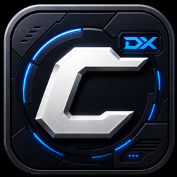
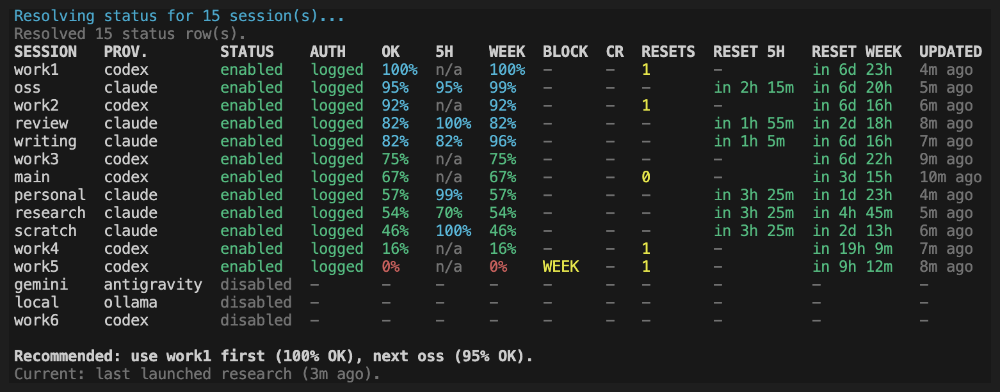
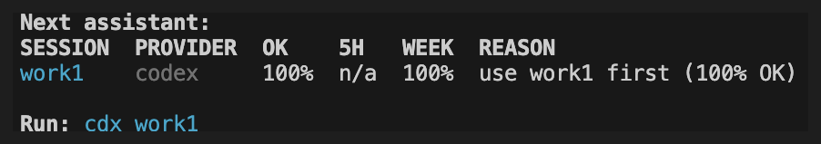

# CDX Manager

<br clear="left"/>

[](LICENSE)  

**The right AI coding account, when you need it.** CDX Manager keeps your Codex and Claude accounts in separate profiles, shows which ones have quota, and helps you pick the next usable session from your terminal.

When one account hits a limit mid-task, you should not have to guess which login still works or rebuild your context from memory. CDX shows the available accounts and can prepare a transcript-backed handoff to another session.



## Get started in a minute

Install with npm (Node.js 18+ and Python 3.9+):

```bash
npm install -g cdx-manager
cdx add codex work
cdx add claude personal
cdx status
cdx next
cdx work
```

`cdx next` recommends a session and prints the launch command; `cdx work` opens your isolated `work` profile. CDX also supports Antigravity and local Ollama sessions. Prefer pipx or uv? See [installation and setup](docs/getting-started.md).



## What you can do

| Need | CDX command | Detail |
| --- | --- | --- |
| See quota and choose an account | `cdx status`, `cdx next` | [Quota-aware routing](docs/features.md#quota-aware-routing) |
| Keep logins and settings separate | `cdx add`, `cdx <name>`, `cdx set` | [Isolated sessions](docs/features.md#isolated-multi-account-sessions) |
| Continue work in another session | `cdx handoff source target` | [Context handoff](docs/features.md#context-handoff) |
| Run a prompt from a script | `cdx run --prompt "..." --json` | [Headless automation](docs/features.md#headless-automation) |
| Inspect usage or get an alert | `cdx stats`, `cdx ready` | [Maintenance and notifications](docs/sessions-and-notifications.md) |

CDX checks authentication before interactive launches. Handoff keeps the source transcript in place and asks the receiving agent to verify the conversation and workspace before acting. No account switch or prompt submission happens just because you run `cdx next`.

## Documentation

- [Installation and first steps](docs/getting-started.md) — prerequisites, npm/pipx/uv, Windows, configuration.
- [Features and handoff](docs/features.md) — routing, isolated accounts, automation, recovery.
- [Sessions and notifications](docs/sessions-and-notifications.md) — alerts, launch settings, history.
- [Command and JSON reference](docs/cli.md) — commands, selection, usage fields, programmatic contracts.
- [Operations](docs/operations.md) — backup, disk cleanup, Windows notes, troubleshooting, release procedure.
- [Technical overview](docs/technical-overview.md) — isolation, status sources, project and data layout.
- [Tray companion testing](docs/tray-local-testing.md) — local development loops.

Contributions are welcome; see [CONTRIBUTING.md](CONTRIBUTING.md). CDX Manager is [MIT licensed](LICENSE).
