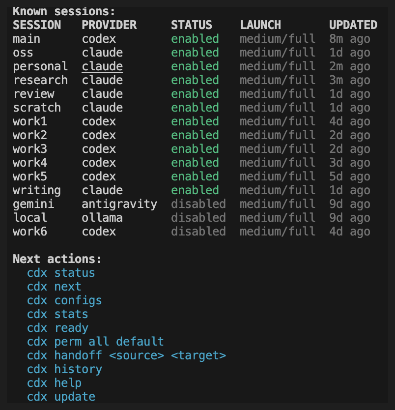

# Features

## Quota-aware routing

The reason `cdx` exists: knowing, across every account you own, which one you can actually use.

- **Usage at a glance.** `cdx status` shows token usage, 5-hour window quota, weekly quota, last-updated timestamps, priority guidance, and the last launched session in one aligned table.
- **Pick for me.** `cdx next` selects the best available assistant from your pinned priorities and the live quota picture, shows the reason, and prints the exact command to run.
- **Agent notifications.** At the first interactive launch of a supported provider, cdx asks before installing its hook. Delivery starts muted; `cdx tray alerts on` enables the next event globally, with or without the tray running.
- **Next-ready notification.** `cdx ready` schedules a native system notification for the next assistant that comes back from cooldown, then returns immediately.
- **Passive status resolution.** Codex status is read from the local Codex app-server rate-limit API when available, with legacy transcript/history parsing kept as a fallback.
- **Banked reset visibility.** Eligible Codex accounts show the number of manually redeemable bonus resets in `cdx status` and expose reset details in JSON output.

## Isolated multi-account sessions



- **Multiple providers, one tool.** Register as many Codex, Claude, Antigravity, or Ollama sessions as you need. Codex and Claude get isolated auth environments; Antigravity is launchable through `agy` with OS-keyring auth; Ollama runs local models through `ollama run`.
- **Instant launch.** `cdx work` opens your "work" session. `cdx personal` opens another. No config files to edit mid-flow.
- **Quick relaunch.** `cdx last` reopens the most recently launched assistant profile.
- **Resume by identity, not by recency.** Each session records the provider's own conversation id — imposed at launch for Claude, read back from the rollout for Codex — so `cdx resume <name>` reopens *that* conversation regardless of your working directory or of which session ran last. The conversation is looked up before it is named: a recorded id whose transcript the provider never wrote degrades to the provider's own fallback (`--continue`, or `resume --last`) and reports `reason: conversation_not_found`, rather than naming a conversation that does not exist and letting the provider exit with an error. `cdx can-resume --json` reports the strategy and where the id came from, so an automated caller can tell a named resume from a best-effort one.
- **Auth guardrails.** `cdx` checks authentication before launching. If a session is not logged in, it tells you exactly what to run — no silent failures.
- **Persistent launch settings.** Pin per-session power, permission, and fast-mode preferences once; `cdx` reapplies them on every launch until you unset them.
- **Spend ceiling and model fallback.** `cdx set <name> --budget 5` caps what a headless run may spend, and `--fallback-model sonnet,haiku` lets a run continue on the next model when the first is overloaded. Both are Claude Code flags that the provider accepts with `--print` only, so they apply to `cdx run` and not to interactive launches; `cdx configs` says so.
- **Session control.** Disable a session without deleting it when an account is temporarily out of credits; disabled sessions remain visible and sort last.
- **Optional session labels.** `cdx label <name> <label>` adds a short human label; list and full status tables show a `LABEL` column only when at least one session has one.
- **Clean removal.** `cdx rmv` wipes a session and its entire auth directory. No orphaned files, no stale credentials.

## Headless automation

- **One task, one JSON result.** `cdx run` executes a prompt against a chosen or auto-selected session and returns a stable payload; `--detach` returns a `run_id` immediately.
- **Survives a rate limit.** `cdx run --failover` notices that a run stopped because its account ran out, moves the task to the next account the ranking allows, and carries on — one `run_id` for the whole task, with every account it occupied listed in `cdx run-report`. A spent account is always confirmed against its own refreshed quota first, so a healthy account is never abandoned. From there two routes migrate a run: the provider said so in words cdx recognises, or — since that wording differs between an enterprise workspace out of credits, a personal plan hitting its 5-hour window, and Claude's own phrasing — simply that the account's quota is gone and the run failed. `cdx run-report` names which route applied. Exhausting every account reports `failover_exhausted`, which a caller can tell apart from the task itself failing.
- **Native background delegation (opt-in).** With `CDX_EXPERIMENTAL_NATIVE_BG=1`, `cdx run --detach` hands the run to Claude Code's own background agents (`--bg`) instead of cdx's detached launcher. The run keeps its cdx `run_id`, closes out with its token usage and final answer read from the provider's own session transcript, and the parked session is stopped once its task is done. Off by default for one release while it settles; the in-house launcher is unchanged and is what every run takes otherwise. Codex keeps the in-house path while its `cloud`/`exec-server` surfaces are marked experimental.
- **Observable runs.** `cdx run-status`, `cdx run-tail`, `cdx run-report`, and `cdx runs --since` follow a run while it happens and after it ends.
- **Selection without launching.** `cdx select --provider ... --require-ready --json` answers "which session should this job use?" for orchestrators.
- **Escape hatch for unmapped flags.** `cdx set <name> --extra-args "--add-dir ../shared"` passes provider arguments cdx does not model straight through, so a flag your provider shipped last week never forces you to abandon cdx. These arguments are explicitly unvalidated: cdx does not parse or verify them, `cdx schema --json` lists them under `unvalidated` rather than describing them, and `cdx doctor --check-provider-flags` ignores them. They are split into literal argv entries and never passed through a shell.
- **Validated contract.** `cdx schema --json` publishes the enums, mutually-exclusive argument groups, and error codes programmatic callers should validate against.

## Context handoff

- **Transcript-first handoff.** Switch accounts or providers using the source conversation's recorded native identity and verified workspace. CDX never chooses a conversation by file modification time. Missing, stale or mismatched identity requires an explicit choice; JSON/non-interactive callers receive candidate diagnostics instead of a launch.
- **Instructions before action.** The receiving agent is told to read applicable `AGENTS.md`/`CLAUDE.md` and their required references (including Logics instructions), recover the task from bounded portions of the complete transcript, verify current state, then show a concise objective/state/next-action checkpoint before modifying anything. Existing clear authorization still permits continuation. CDX supplies this prompt; it cannot certify that an agent has understood or obeyed it.
- **Shared notes remain yours.** `cdx context` and `cdx memory` remain explicit notes. Automatic handoff does not overwrite them or copy authentication. A dated reference to workspace notes is supplementary, never a substitute for the native conversation.
- **Session transcript capture.** Every launch is recorded to a local log file via `script`, giving you a full terminal transcript for each session.

Run handoff from the intended project directory:

```sh
cd /path/to/project
cdx handoff source target --json                 # prepare only, no provider launch
cdx handoff target                               # use that prepared entry and launch
cdx handoff source target --source-conversation CONVERSATION_ID
# Exact native file when several transcripts share an identity:
cdx handoff source target --source-native-transcript /path/to/source/sessions/rollout.jsonl
# Explicit fallback when only a terminal capture is available:
cdx handoff source target --source-transcript /path/to/source/log/cdx-session.log
```

The three source-selection options are mutually exclusive and apply only to
`SOURCE TARGET`. Without a usable recorded identity, an interactive terminal offers
up to 20 valid conversations from the current workspace, ordered by actual event
time for inspection, with no default choice. Blank input or Ctrl-C cancels. A stale
recorded identity never silently falls back, even if there is only one candidate.
Run from the conversation's original workspace if its metadata names another directory.

Each preparation writes a private, unique `<target-auth-home>/handoffs/<uuid>.json`
entry. `context.target_path` in JSON output names that entry; `handoff` contains its
metadata, including recovery mode, source conversation ID, transcript path, workspace,
preparation time, readable byte extent and SHA-256. `source_session`/`target_session`
contain names/providers only. Transcript bodies and credentials are not emitted.
Unresolved JSON source selection returns `ok: false`, error code
`handoff_source_unresolved`, a bounded `candidates` array and a nonzero exit status.

The original JSONL remains in place, including early decisions, tool calls/results
and compaction records. Read it in bounded portions up to `extent_bytes`; there is
no 120000-character tail replacement. An unfinished final JSONL record is excluded
from that preparation. Later appends do not change its boundary. Reusing an entry
checks the original bytes: deletion, truncation or rewriting requires a new handoff,
not a silent downgrade to notes. Keep the original source profile/transcript available
until recovery completes. No transcript copy or automatic artifact cleanup is performed;
entries can be removed after use. A small per-workspace/target pointer chooses the most
recent preparation for the one-name command; concurrent launches retain their own entry
path and cannot overwrite each other's entry.

Legacy one-name handoff without a prepared entry reads workspace notes in `notes-only`
mode and explicitly reports that native history was not recovered. Terminal fallback
requires a named file from that source session's launch logs and is labelled `degraded`:
it cannot prove complete history or tools, and its workspace is operator-selected rather
than verified from native metadata. Native resolution currently supports Codex and Claude.
All modes ask the recipient to report material gaps, and none bypass provider access rules
or turn historical tool output into new authorization.

## Maintenance

- **Launch history.** Inspect recent launches with provider, result, duration, working directory, launch settings, and transcript path.
- **Aggregate usage.** `cdx stats` totals runs, token usage, and time spent per session over any period. Interactive Codex and Claude launches also record provider-native token totals when their local session transcript is available.

- **Disk usage and cleanup.** `cdx disk` reports `CDX_HOME` usage, `cdx disk profiles --candidates` identifies reclaimable profile caches/logs with evidence, and `cdx clean profiles ...` applies explicit cleanup actions.
- **Health and repair.** `cdx doctor` inspects dependencies, permissions, and orphan profiles; `cdx repair` plans or applies safe fixes.
- **Portable bundles.** `cdx export` / `cdx import` move sessions between machines, with passphrase-encrypted auth data when you ask for it.
- **Update prompts.** Periodic update checks surface `cdx update` directly in the `cdx`, `cdx status`, and launch output when a newer release is available. When `logics-manager` is installed, `cdx` can also suggest `logics-manager update`.
- **Logics viewer shortcut.** `cdx view` opens the Logics browser/focus viewer through `logics-manager view` when the companion CLI is installed. All viewer flags are forwarded: `--lan`, `--lan-rw`, `--focus <ref>`, `--read`, `--port`, `--host`, `--refresh-interval`, `--tls`, `--tls-cert`, `--tls-key`, `--open`, `--no-open`. `cdx view --json` reports availability and update diagnostics without opening the viewer.
