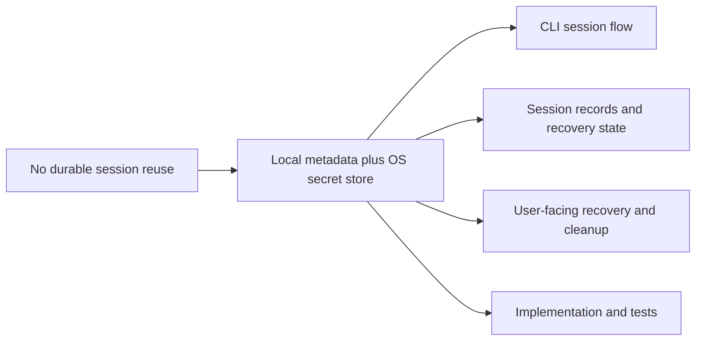

## adr_000_persist_and_restore_cdx_sessions - Persist and restore cdx sessions
> Date: 2026-04-15
> Status: Proposed
> Drivers: Persistent login state, explicit recovery, local privacy, predictable session reuse.
> Related request: (none yet)
> Related backlog: `item_001_persistent_codex_session_storage_and_rehydration`
> Related task: (none yet)
> Reminder: Update status, linked refs, decision rationale, consequences, migration plan, and follow-up work when you edit this doc.

# Overview
Persist session metadata locally and protect credentials with the host OS secret store when available.
Restore sessions explicitly when `cdx <name>` is launched, and fail with a clear recovery path when the saved state is missing, expired, or revoked.
This keeps named sessions reusable across terminal restarts without silently guessing the user identity.

# Context
The product needs named sessions that survive process exit and terminal restarts.
The main constraint is that the user must not be silently rebound to the wrong account if stored state becomes stale or corrupted.
We also want the storage approach to be portable across local development environments and simple enough to reason about during support and debugging.
These drivers point toward a local-first model with a clear separation between metadata and sensitive login material.

# Decision
Store session metadata in a local repository-owned file and store sensitive login material in the native secure storage mechanism available on the host.
Rehydration is explicit: a saved session is restored only when the user launches that named session.
If the saved state is invalid, the CLI stops with a concise recovery message rather than attempting a hidden fallback.

# Alternatives considered
- Plain text metadata and credentials in one local file: simplest to implement, but too weak for sensitive login material.
- Remote account storage: unnecessary for a single-terminal local workflow and worse for privacy and offline use.
- Metadata only without secure secret storage: would not satisfy the requirement to avoid repeated reauthentication.

# Consequences
- The CLI can relaunch sessions without forcing a fresh login on every use.
- The implementation must handle expiry, revocation, and corruption as first-class states.
- Support becomes easier because the source of truth is local and deterministic.
- Security expectations are higher because credentials are preserved between launches.

# Migration and rollout
- Start with a new local storage format for new sessions.
- Keep recovery behavior explicit so failures are visible instead of silent.
- If a future storage migration is needed, add a dedicated migration step before changing the on-disk format.

# References
- `logics/backlog/item_001_persistent_codex_session_storage_and_rehydration.md`

# Follow-up work
- Implement session metadata persistence and secure credential storage.
- Add validation and recovery paths for expired, revoked, and missing session state.
- Add tests for save, restore, delete, and failure scenarios.
