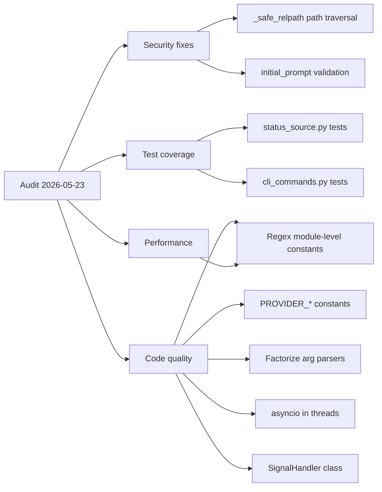

## adr_001_code_quality_and_security_improvements - Code Quality, Security and Performance Improvements
> Date: 2026-05-23
> Status: Accepted
> Drivers: Security hardening, test coverage, code duplication reduction, performance, maintainability.
> Related request: `req_XXX_audit_2026_05`
> Related backlog: `item_003_command_ergonomics_validation_and_safety`
> Related task: `task_000_command_ergonomics_validation_and_safety`
> Reminder: Update status, linked refs, decision rationale, consequences, migration plan, and follow-up work when you edit this doc.

# Overview
Address 7 categories of issues found during a full audit of the cdx-manager codebase (v0.5.3): security gaps, missing test coverage, code duplication, performance waste, inconsistent error handling, magic strings, and missing type hints.
All changes are backward-compatible — no CLI contract or on-disk format changes.



# Context
A full static audit of the codebase surfaced issues across six dimensions.
The product is a local CLI distributed via npm wrapping Python, used daily by developers to manage Codex and Claude sessions.
The highest-risk issues are security (path traversal, unvalidated user input passed to subprocess) and test coverage (0% on modules that handle file I/O and subprocess).
The remaining issues are code quality debt that slows future changes: regex compiled on every call, duplicate arg parsers, magic provider strings, and a broken asyncio-in-threads pattern.

# Decision
Apply all fixes in three ordered phases (security first, then tests, then quality/performance) with no changes to the public CLI interface or on-disk session format.

---

## Phase 1 — Security (do first, highest risk)

### 1.1 Fix path traversal in `_safe_relpath()` — `src/session_service.py:83-87`

**Problem**: The current implementation does `.replace("\\", "/")` before checking for `..`, so `..\\..\\evil` on Windows bypasses the guard.

**Current code**:
```python
def _safe_relpath(path):
    normalized = str(path or "").replace("\\", "/").strip("/")
    if not normalized or normalized.startswith("../") or "/../" in f"/{normalized}/":
        raise CdxError("Bundle contains an unsafe file path.")
    return normalized
```

**Fix**:
```python
def _safe_relpath(path):
    normalized = os.path.normpath(str(path or "")).replace("\\", "/")
    if not normalized or normalized.startswith("/") or normalized.startswith(".."):
        raise CdxError("Bundle contains an unsafe file path.")
    return normalized
```

**Why**: `os.path.normpath()` resolves `..` before any string comparison, making the check OS-agnostic.

### 1.2 Validate `initial_prompt` before passing to subprocess — `src/provider_runtime.py:107`

**Problem**: `initial_prompt` flows from `_handoff_launch_prompt()` (which includes `session.get("authHome")`) into `_build_launch_spec()` args. If a session name or authHome contains shell metacharacters, it could be misinterpreted.

**Fix**: Add explicit type and content validation in `_build_launch_spec()` before the prompt is appended to args:
```python
def _build_launch_spec(spec, session, install, initial_prompt=None):
    if initial_prompt is not None:
        if not isinstance(initial_prompt, str):
            raise CdxError("initial_prompt must be a string.")
        if len(initial_prompt) > 32768:
            raise CdxError("initial_prompt exceeds maximum allowed length.")
    # rest of existing logic...
```

**Why**: `subprocess.Popen` with a list (not `shell=True`) prevents shell injection, but explicit validation is defense-in-depth and catches future refactors that might switch to `shell=True`.

---

## Phase 2 — Tests (second priority, enables confident refactoring)

### 2.1 Add tests for `src/status_source.py` — currently 0% coverage

Create `test/test_status_source_py.py` covering:

- `extract_named_statuses_from_text()`: test with realistic Codex/Claude terminal output snippets covering all 16 named fields. Provide fixture strings inline.
- `find_latest_status_artifact()`: mock `os.walk` to return a fixture directory tree with dated `.jsonl` files; verify the most recent is selected.
- `_safe_relpath()` (once fix from 1.1 is applied): test normal paths, paths with `../`, paths with `..\\`, empty paths, absolute paths.
- `_parse_reset_timestamp()`: test ISO format, `Z`-suffix format, invalid strings.

### 2.2 Add tests for `src/cli_commands.py` — currently <5% coverage

Extend `test/test_cli_py.py` or create `test/test_cli_commands_py.py` covering:

- `handle_export()` with `--include-auth` flag and passphrase: verify the bundle file is created and the passphrase round-trips correctly.
- `handle_import()` with a valid bundle and with a corrupted bundle: verify `CdxError` is raised on corruption.
- `handle_clean()` with sessions that have logs and sessions that don't: verify only target sessions are cleaned.
- `_parse_export_args()`, `_parse_import_args()`, `_parse_add_args()`: unit test each parser in isolation with all valid flags and invalid combinations.

### 2.3 Add tests for `src/notify.py` — currently 0% coverage

Create `test/test_notify_py.py` covering:

- `notify()` dispatches to the correct backend based on platform.
- Graceful fallback when `osascript` / `notify-send` is not available.

---

## Phase 3 — Code Quality and Performance

### 3.1 Compile regex at module level — `src/status_source.py:415-430`

**Problem**: `extract_named_statuses_from_text()` compiles 16+ regex patterns on every call. This function is called in a loop (one per session) in `session_service.py:627`.

**Fix**: Move all `re.compile()` calls to module-level constants:
```python
# At top of status_source.py, after imports:
_USAGE_PCT_RE = re.compile(r"usage_pct\s*[:=]\s*(\d{1,3})%?", re.I)
_REMAINING_5H_RE = re.compile(r"remaining_?5h_pct\s*[:=]\s*(\d{1,3})%?", re.I)
# ... one constant per pattern ...

_KEY_VALUE_PATTERNS = [
    ("usage_pct", _USAGE_PCT_RE),
    ("remaining_5h_pct", _REMAINING_5H_RE),
    # ...
]
```

Then replace the inline list in `extract_named_statuses_from_text()` with `_KEY_VALUE_PATTERNS`.

### 3.2 Add provider constants — `src/config.py`

**Problem**: The strings `"codex"` and `"claude"` appear ~15 times across the codebase without a shared constant, creating a rename risk.

**Fix**: Add to `src/config.py`:
```python
PROVIDER_CODEX = "codex"
PROVIDER_CLAUDE = "claude"
PROVIDERS = (PROVIDER_CODEX, PROVIDER_CLAUDE)
```

Then replace all `== "codex"` and `== "claude"` comparisons in `cli_commands.py`, `session_service.py`, `provider_runtime.py`, `status_source.py`, `status_view.py` with the constants.

**Scope**: grep for `"codex"` and `"claude"` as string literals — only replace provider identity comparisons, not log messages or display strings.

### 3.3 Factorize duplicate arg parsers — `src/cli_commands.py:185-322`

**Problem**: `_parse_export_args()`, `_parse_import_args()`, `_parse_add_args()` share the same `while index < len(args)` loop structure with ~100 lines of duplication.

**Fix**: Extract a shared `_parse_flag_args(args, schema)` helper where `schema` is a dict mapping flag names to their types and defaults:
```python
def _parse_flag_args(args, schema):
    """Parse a flat list of CLI args against a schema dict.

    schema format: {"--flag": {"key": "flag", "type": "bool"|"str", "default": ...}}
    Returns a dict of resolved values. Raises CdxError on unknown flags.
    """
    parsed = {v["key"]: v["default"] for v in schema.values()}
    index = 0
    while index < len(args):
        arg = args[index]
        if arg not in schema:
            raise CdxError(f"Unknown argument: {arg}")
        spec = schema[arg]
        if spec["type"] == "bool":
            parsed[spec["key"]] = True
            index += 1
        else:
            if index + 1 >= len(args):
                raise CdxError(f"Missing value for {arg}")
            parsed[spec["key"]] = args[index + 1]
            index += 2
    return parsed
```

Rewrite `_parse_export_args()`, `_parse_import_args()`, `_parse_add_args()` as thin wrappers that define their schema and call `_parse_flag_args()`.

### 3.4 Fix asyncio-in-threads antipattern — `src/claude_refresh.py:32-73`

**Problem**: `_refresh_claude_sessions()` spawns threads then calls `asyncio.run()` inside each thread, creating a new event loop per thread. This is inefficient and semantically wrong.

**Fix**: If `refresh_fn` is always sync (inspect the call sites — it appears to be), remove the `inspect.isawaitable()` branch entirely:
```python
def _refresh_claude_sessions(sessions, refresh_fn, results):
    threads = []
    def fetch(s):
        try:
            usage = refresh_fn(s)  # no async handling needed
            if usage:
                results[s["name"]] = usage
        except Exception:
            pass
    for s in sessions:
        t = threading.Thread(target=fetch, args=(s,), daemon=True)
        threads.append(t)
        t.start()
    for t in threads:
        t.join(timeout=10)
```

If `refresh_fn` must remain async-capable, switch to `asyncio.gather()` and remove threads entirely.

### 3.5 Replace mutable list signal hack — `src/provider_runtime.py:253`

**Problem**: `forwarded_signal = [None]` is used as a mutable container to capture a signal value inside a closure. This is an obscure antipattern.

**Fix**: Use `nonlocal` (Python 3.x):
```python
forwarded_signal = None

def _handle_signal(sig, _frame):
    nonlocal forwarded_signal
    forwarded_signal = sig
    child.send_signal(sig)
```

Or extract a minimal `SignalCapture` class if the pattern appears more than once.

---

# Alternatives considered

- Rewrite session_service.py with dataclasses: improves type safety but large surface area change; deferred to a future ADR.
- Add mypy to CI: good long-term but requires annotating ~5000 lines before it pays off; deferred.
- Cache status results for 60s: would improve multi-session `cdx status` performance; deferred to a separate performance ADR.
- Split cli_commands.py into one file per command group: valid but out of scope for this ADR; log as backlog item.

# Consequences

- `_safe_relpath()` becomes OS-agnostic and safe against Windows path traversal.
- `initial_prompt` has explicit validation as a first line of defense.
- Test coverage rises from ~5% to ~40%+ on the most critical modules.
- Regex compilation cost for `extract_named_statuses_from_text()` drops from O(N×16) to O(16) once at import.
- `"codex"` and `"claude"` strings become refactor-safe.
- `_parse_flag_args()` removes ~100 lines of duplication and makes future flag additions a one-liner.
- Thread/asyncio code in `claude_refresh.py` becomes readable and correct.

# Migration and rollout

- All changes are internal implementation only — no CLI flags, commands, or on-disk formats change.
- Apply phases in order: Phase 1 (security) → Phase 2 (tests) → Phase 3 (quality).
- Run `npm test` after each phase to confirm no regressions.
- Phase 3.2 (constants) requires a codebase-wide grep/replace — do it in a single commit to keep the diff reviewable.

# References
- `src/session_service.py` lines 83-87 (`_safe_relpath`)
- `src/provider_runtime.py` lines 101-115 (`_build_launch_spec`), lines 253-282 (signal handling)
- `src/status_source.py` lines 410-556 (`extract_named_statuses_from_text`), lines 559-612 (`_collect_candidate_files`)
- `src/claude_refresh.py` lines 32-73 (`_refresh_claude_sessions`)
- `src/cli_commands.py` lines 185-322 (arg parsers)
- `src/config.py` (provider constants to add)

# Follow-up work
- Phase 1: Fix `_safe_relpath()` in `src/session_service.py`.
- Phase 1: Add `initial_prompt` validation in `src/provider_runtime.py`.
- Phase 2: Create `test/test_status_source_py.py` with coverage for all functions listed in 2.1.
- Phase 2: Extend `test/test_cli_py.py` or create `test/test_cli_commands_py.py` per 2.2.
- Phase 2: Create `test/test_notify_py.py` per 2.3.
- Phase 3: Move regex to module-level constants in `src/status_source.py`.
- Phase 3: Add `PROVIDER_CODEX` / `PROVIDER_CLAUDE` to `src/config.py` and replace all literal strings.
- Phase 3: Implement `_parse_flag_args()` and refactor the three arg parsers in `src/cli_commands.py`.
- Phase 3: Fix asyncio-in-threads in `src/claude_refresh.py`.
- Phase 3: Replace `forwarded_signal = [None]` with `nonlocal` in `src/provider_runtime.py`.
- Backlog: Evaluate migrating session dicts to `dataclass` or `TypedDict` for static type checking.
- Backlog: Consider splitting `cli_commands.py` into command-group modules.
