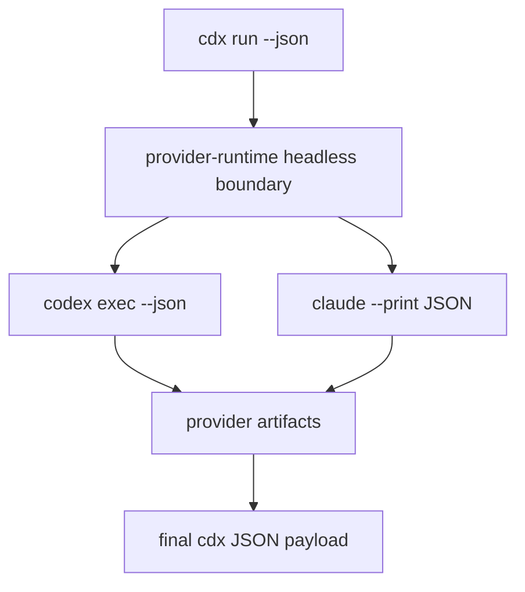

## adr_002_provider_native_headless_run_boundary - Provider native headless run boundary
> Date: 2026-06-08
> Status: Settled
> Drivers: JSON-only stdout contract, non-TTY provider execution, provider artifact capture, token usage extraction, supervisor compatibility.
> Related request: `req_000_orchestia_headless_json_task_runner`, `req_001_populate_headless_run_usage_tokens_for_orchestia`
> Related backlog: `item_006_headless_cdx_run_json_execution_contract`, `item_007_automatic_headless_session_selection`, `item_008_provider_neutral_reasoning_effort_mapping`, `item_009_headless_run_artifacts_usage_and_error_reporting`, `item_010_populate_cdx_run_usage_and_launcher_payload`, `item_011_use_provider_native_headless_launch_modes_for_cdx_run`
> Related task: `task_006_headless_cdx_run_json_execution_contract`, `task_007_automatic_headless_session_selection`, `task_008_provider_neutral_reasoning_effort_mapping`, `task_009_headless_run_artifacts_usage_and_error_reporting`, `task_010_implement_cdx_run_usage_extraction_and_launcher_payload`, `task_011_implement_provider_native_headless_cdx_run_launch_modes`
> Reminder: Update status, linked refs, decision rationale, consequences, migration plan, and follow-up work when you edit this doc.

# Overview
Headless `cdx run --json` uses provider-native non-interactive launch modes where available, while preserving the cdx-manager JSON contract and session isolation.

# Context
- Orchestia launches `cdx-manager` as a subprocess and needs one final JSON payload on stdout.
- The interactive provider launch path is not a reliable headless boundary:
  - Codex can require a TTY when launched through the interactive path.
  - Claude can return plain text without usage metadata unless invoked through a print/JSON mode.
- Provider stdout and stderr are still needed for debugging and token parsing, but they must be captured as artifacts rather than streamed into cdx stdout.

# Decision
- Keep interactive launches and headless launches as separate runtime paths.
- Use Codex's native headless command (`codex exec --json` or the current verified equivalent) for Codex `cdx run --json`.
- Use Claude's native print JSON mode (`claude --print --output-format json`) for Claude `cdx run --json`.
- Continue applying cdx-manager session isolation, model, permission, and reasoning-effort mapping at the provider-runtime boundary.
- Capture provider stdout and stderr to artifact files and parse usage only from trusted JSON/JSONL shapes.
- Return nullable usage fields when the provider shape is unknown, malformed, unsupported, or unavailable.

# Consequences
- The JSON stdout contract is stable for supervisors.
- Provider-specific behavior stays inside `src/provider_runtime.py` and the usage parser rather than leaking into Orchestia.
- Token parsing can be conservative and fixture-driven.
- Future providers can implement headless modes incrementally without changing the top-level result schema.

# References
- `logics/product/prod_002_headless_automation_contract_for_orchestia.md`
- `logics/request/req_000_orchestia_headless_json_task_runner.md`
- `logics/request/req_001_populate_headless_run_usage_tokens_for_orchestia.md`
- `logics/backlog/item_006_headless_cdx_run_json_execution_contract.md`
- `logics/backlog/item_007_automatic_headless_session_selection.md`
- `logics/backlog/item_008_provider_neutral_reasoning_effort_mapping.md`
- `logics/backlog/item_009_headless_run_artifacts_usage_and_error_reporting.md`
- `logics/backlog/item_010_populate_cdx_run_usage_and_launcher_payload.md`
- `logics/backlog/item_011_use_provider_native_headless_launch_modes_for_cdx_run.md`
- `logics/tasks/task_006_headless_cdx_run_json_execution_contract.md`
- `logics/tasks/task_007_automatic_headless_session_selection.md`
- `logics/tasks/task_008_provider_neutral_reasoning_effort_mapping.md`
- `logics/tasks/task_009_headless_run_artifacts_usage_and_error_reporting.md`
- `logics/tasks/task_010_implement_cdx_run_usage_extraction_and_launcher_payload.md`
- `logics/tasks/task_011_implement_provider_native_headless_cdx_run_launch_modes.md`
