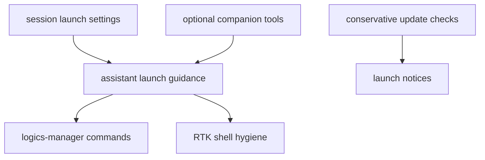

## adr_003_logics_and_companion_tool_launch_guidance - Logics and companion tool launch guidance
> Date: 2026-06-08
> Status: Accepted
> Drivers: assistant launch hygiene, optional companion tools, Logics workflow navigation, update notices, no hard dependency on RTK or logics-manager.
> Related request: `req_002_support_logics_manager_suggestions_and_update_notices`
> Related backlog: `item_012_support_logics_manager_suggestions_and_update_notices`
> Related task: `task_012_support_logics_manager_suggestions_and_update_notices`
> Reminder: Update status, linked refs, decision rationale, consequences, migration plan, and follow-up work when you edit this doc.

# Overview
`cdx-manager` may inject concise assistant launch guidance for optional companion tools when those tools are available or explicitly configured.
The guidance should improve operator workflow without making RTK or `logics-manager` hard runtime dependencies.

# Context
- Users can ask assistants to run noisy shell commands; RTK wrappers can make that output easier to consume.
- Repositories using Logics benefit when assistants know the high-value `logics-manager` commands for status, health, audit, lint, view, sync, flow, and MCP surfaces.
- Companion tools may not be installed on every machine, and update checks must not slow ordinary cdx commands or create false-positive warnings.

# Decision
- Store `rtk` and `logics` launch preferences alongside other per-session launch settings.
- Default Logics guidance on only when `logics-manager` is available, unless the session explicitly disables it.
- Inject RTK guidance only as an instruction preference; do not force shell commands through RTK.
- Keep raw commands for exact diffs, machine-readable JSON, security-sensitive inspection, and other fidelity-sensitive work.
- Surface update notices for `logics-manager` only when the installed version and latest-version source are reliable.
- Avoid RTK update warnings until a reliable version source exists.

# Consequences
- Assistant prompts can adapt to local companion tooling without changing the user's workflow.
- `cdx config` and launch metadata expose the Logics/RTK preference state.
- Missing RTK or missing `logics-manager` does not break launches.
- Update warnings remain conservative and should degrade silently when version data is uncertain.

# References
- `logics/request/req_002_support_logics_manager_suggestions_and_update_notices.md`
- `logics/backlog/item_012_support_logics_manager_suggestions_and_update_notices.md`
- `logics/tasks/task_012_support_logics_manager_suggestions_and_update_notices.md`
- `README.md`
- `src/cli.py`
- `src/cli_commands.py`
- `src/provider_runtime.py`
- `src/update_check.py`
- `test/test_cli_py.py`
- `test/test_runtime_py.py`
- `test/test_update_check_py.py`
