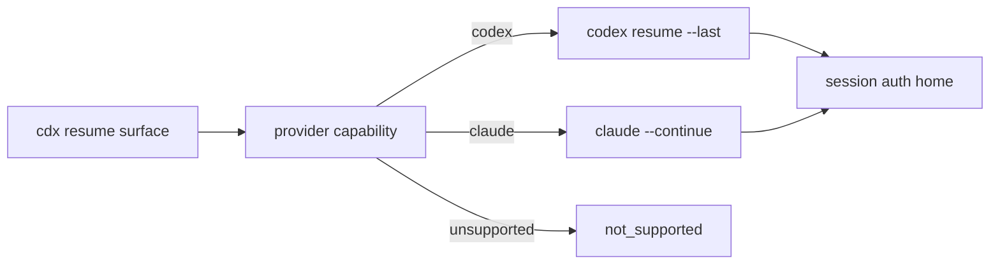

## adr_004_provider_native_resume_command_boundary - Provider-native resume command boundary
> Date: 2026-06-18
> Status: Settled
> Drivers: Provider-native continuity, named session isolation, predictable CLI behavior, scriptable capability checks.
> Related request: `req_008_add_provider_native_session_resume_commands`
> Related backlog: `item_020_add_provider_native_session_resume_commands`
> Related task: `task_019_add_provider_native_session_resume_commands`
> Reminder: Update status, linked refs, decision rationale, consequences, and follow-up work when you edit this doc.

# Overview
Expose session resume through `cdx` as a provider-native runtime action.
`cdx` should decide whether a named session can resume and route to the provider's native resume command, while preserving per-session auth isolation and existing launch settings.

# Context
- `cdx` manages named sessions across providers and launches them inside isolated auth homes.
- Codex exposes `codex resume [SESSION_ID] [PROMPT]` and `codex resume --last`.
- Claude exposes `claude --continue`, `claude --resume [value]`, `--fork-session`, `--session-id`, and `--name`.
- Antigravity and Ollama do not have a verified native resume contract in this repository.
- `cdx handoff` already covers cross-provider continuity through shared context, but native resume should preserve the provider's own conversation state when the same provider/session is used.

# Decision
- Add resume as an explicit provider runtime action, separate from normal launch and auth actions.
- Default Codex resume strategy is `provider_last`, implemented with `codex resume --last` under the named session's `CODEX_HOME`.
- Default Claude resume strategy is `provider_continue`, implemented with `claude --continue` under the named session's isolated `HOME` and process cwd.
- Add a provider-neutral capability probe so `cdx can-resume <name> --json` can report support without launching an interactive provider.
- Do not silently fall back from resume to normal launch. If resume is unsupported or impossible, fail with a clear reason.
- Keep `cdx handoff` as the cross-provider transfer mechanism; do not use handoff prompts to emulate native resume.

# Rationale
- Provider-native resume keeps real conversation state, attachments, and provider metadata where the provider supports it.
- A provider-neutral `cdx` surface avoids forcing users to remember that Codex uses a subcommand while Claude uses flags.
- Capability probing gives scripts a stable decision point before starting an interactive process.
- Separating resume from launch prevents a user from thinking they resumed prior state when `cdx` actually opened a fresh session.

# Consequences
- Provider launch specs need a new resume path and focused tests per provider.
- The JSON contract must expose capability information without leaking sensitive auth-home paths or prompt content.
- Codex may later improve from `--last` to a parsed explicit resume id, but only if the source is reliable under session isolation.
- Claude may later support explicit `--resume <value>` if `cdx` records or accepts a stable provider conversation value.
- Unsupported providers must be handled as first-class capability states, not implementation errors.

# Alternatives considered
- Reuse normal launch with an initial "resume" prompt: rejected because it does not guarantee provider conversation continuity.
- Always invoke provider pickers: rejected because picker behavior is interactive, hard to automate, and less predictable for named sessions.
- Add only `cdx resume <name>` without `cdx <name> --resume`: rejected because the flag form is faster for daily use and was the original operator request.
- Add only `cdx <name> --resume` without a check command: rejected because scripts and operators need a non-launching probe.

# References
- `logics/request/req_008_add_provider_native_session_resume_commands.md`
- `logics/backlog/item_020_add_provider_native_session_resume_commands.md`
- `logics/tasks/task_019_add_provider_native_session_resume_commands.md`
- `logics/product/prod_000_codex_multi_account_session_manager.md`

# Follow-up work
- Implemented provider runtime resume specs in `d01b778`.
- Implemented CLI routing, JSON capability output, README/help documentation, and focused tests in `48eaa30`.
- Revisit explicit provider conversation id support after the first `provider_last`/`provider_continue` delivery is stable.
