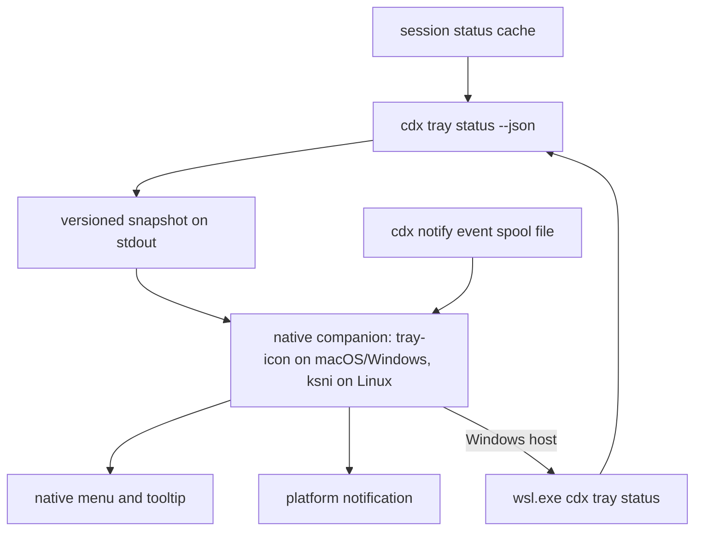

## adr_005_cdx_tray_runtime_and_companion_transport_boundary - CDX tray runtime and companion transport boundary
> Indicators reviewed: 2026-08-10 21:15:14

> Date: 2026-08-10
> Status: Settled
> Related request: `req_035_add_an_optional_cross_platform_cdx_tray_usage_monitor`
> Related backlog: `item_080_build_native_tray_companions_for_macos_and_windows_plus_wsl`
> Related task: `task_046_orchestrate_the_optional_cross_platform_cdx_tray_usage_monitor`
> Drivers: Cross-platform native tray surface, no mandatory GUI dependency in the CLI, honest data freshness, bounded WSL interop cost, contract stability between independently updated components.
> Reminder: Update status, linked refs, decision rationale, consequences, and follow-up work when you edit this doc.

# Overview
- Fix the tray companion's runtime, its transport to CDX, and its refresh policy before any native code is written, because `req_036`, `req_037`, and `req_038` already depend on properties of that choice.

# Context
- CDX is a Python CLI whose only runtime dependency is `cryptography`. A tray runtime must stay outside that dependency set.
- The tray UI is an icon, a tooltip, and a native menu. There is no document view, no form, and no styled layout: `cdx view` already owns the browser surface.
- `src/session_status.py` already caches status per session with per-provider TTLs: `STATUS_CACHE_TTL_SECONDS = 60`, `CODEX_STATUS_CACHE_TTL_SECONDS = 300`, `CLAUDE_STATUS_CACHE_TTL_SECONDS = 600`. `cdx status --cached` reads without probing.
- `src/codex_usage.py` serializes live probes on `codex_auth_lock` because Codex rotates its OAuth refresh token and a racing probe can log the user out. The launcher holds that lock for the whole interactive session, so a live probe during active work returns `auth_locked` and falls back to cache.
- A live probe spawns a Codex app-server process and costs seconds. It is not a poll-safe operation.
- WSL 2 in default NAT mode lets Windows reach WSL over localhost, but WSL reaches Windows only through the host IP; localhost is symmetric only in mirrored mode (Windows 11 22H2+). Neither direction is guaranteed on an arbitrary machine.
- Each `wsl.exe` invocation from Windows costs roughly 100-300 ms and keeps the WSL VM alive, which defeats `vmIdleTimeout`.
- Linux has no single tray API. The StatusNotifierItem D-Bus protocol is the only portable one, and GNOME implements it only through an extension (shipped by Ubuntu, absent from a stock GNOME).
- `tray-icon` dynamically links gtk3, libxdo, and libayatana-appindicator3 on Linux, so a companion built on it refuses to start wherever those packages are absent. `ksni` speaks the same StatusNotifierItem protocol over D-Bus in pure Rust with no C library at all.
- Windows toast notifications require an installed application with a registered AppUserModelID. This is a platform constraint, not a framework one.
- A registered AppUserModelID is not sufficient on Windows: without a Start Menu shortcut carrying `System.AppUserModel.ID`, the toast is silently dropped. That shortcut lives in `%APPDATA%\Microsoft\Windows\Start Menu\Programs` and needs no administrator rights, and a stub CLSID on it is what lets Action Center persist the notification.
- Windows Mark-of-the-Web behaves like macOS quarantine: the downloading application writes the `Zone.Identifier` stream, browsers and mail clients do so, and command-line fetchers generally do not.
- Apple Silicon refuses to execute arm64 code that is not at least ad-hoc signed, so signing is a build step rather than a distribution option.
- Gatekeeper only evaluates files carrying `com.apple.quarantine`, and that attribute is set by the downloading application. Browsers set it; `curl` and `scp` do not.
- Since Big Sur, a macOS notification shows the icon of the bundle that sent it and no API can override it, which is why `osascript` delivery is attributed to Script Editor.
- TCC binds a permission grant to the signature's Designated Requirement, not to the certificate authority. Ad-hoc signing mints a new identity on every build, so grants are forgotten at each update; a stable identity keeps them.

# Decision
- Build one Rust companion with no webview and no application framework. The UI is an icon plus a native menu, so a webview runtime would add tens of megabytes, a second update surface, and attack surface for no rendered pixel.
- Use `tray-icon` and `muda` on macOS and Windows, and `ksni` on Linux behind one internal trait. Two backends cost a thin abstraction; one backend would cost gtk3, libxdo, and libayatana-appindicator3 as runtime prerequisites on every Linux machine.
- On Windows, `cdx tray install` creates a per-user Start Menu shortcut carrying the AppUserModelID and a stub CLSID, records it in the install state, and removes it on uninstall. No administrator rights, no HKLM write, no service.
- Register startup per platform with the plainest reversible mechanism: a `~/Library/LaunchAgents` plist on macOS, the per-user `Run` key on Windows, and an XDG autostart `.desktop` file on Linux. Each is a single recorded artifact that `cdx tray autostart off` deletes.
- Deliver one binary per OS and architecture. The companion never embeds CDX logic: it reads a snapshot and invokes `cdx` for every action.
- Make `cdx` itself the transport, invoked as a child process. The companion never opens a socket, never listens on a port, and never calls a provider API. This is what makes the Windows-to-WSL bridge a `wsl.exe` command rather than a networking assumption.
- Carry status on stdout: the companion runs `cdx tray status --json` natively and `wsl.exe cdx tray status --json` across the WSL boundary, and parses the result. There is no status file on disk. **Amended 2026-08-10, see Amendments.**
- Keep a file for the event spool only, because there its writer is a provider hook and its reader is the tray, two processes that never meet. Status has a reader that can invoke its writer on demand; events do not.
- The companion is a cache consumer. It calls `cdx tray status --json`, which reads the cache by default, and never passes `--refresh` on a timer. Freshness comes from the existing per-provider TTLs and from whatever refreshed the cache: an interactive `cdx status`, a session launch, or an explicit manual refresh from the tray menu.
- The tray menu's manual refresh is the only path that may request a live probe, and it surfaces `auth_locked` as an explicit "not refreshable while a session is running" state rather than as an error.
- Set the poll period at 30 seconds for the native case and 60 seconds for the Windows-to-WSL case, where each tick is one `wsl.exe` call. Agent event latency is therefore bounded by one poll period; the accepted budget is 60 seconds worst case on Windows plus WSL.
- Stop polling when no CDX session is enabled and back off to 5 minutes after three consecutive read failures, so a stopped WSL distribution is not woken indefinitely.
- Version the snapshot contract explicitly. A companion that reads a snapshot whose major version it does not know renders a single "update the tray companion" menu entry and keeps working for everything else. CDX and the companion are never required to be in lockstep.
- Detect Linux tray capability at runtime by resolving the `org.kde.StatusNotifierWatcher` D-Bus name, never by matching a distribution or desktop name.
- Use a monochrome template image for the macOS menu bar and carry capacity state in the glyph, not in a tint. The supplied assets are full-colour application icons on a dark rounded square, which is the wrong artwork for a menu bar: a template image is black plus alpha with no background, and the system inverts it for the current theme. Windows and Linux keep colour artwork, where their tray surfaces support it.
- Ship the macOS companion as a `CDX.app` bundle with `LSUIElement` set, a stable bundle identifier, and the CDX icon, signed with a **self-signed certificate held on the build machine**. Do not ad-hoc sign, and do not buy a Developer ID for v1.
- Deliver macOS notifications from that bundle so they carry the CDX icon and name. Keep the existing `osascript` path as the fallback when authorization is absent or refused.
- Never distribute the macOS companion through a browser link, a `.dmg`, or a direct click on a release asset. `cdx tray install` fetches it, which leaves no quarantine attribute and keeps Gatekeeper out of the path.

# Rationale
- Choosing the runtime now is what makes `req_036` AC7 and `req_038` AC7 verifiable: both already assert platform properties that depend on it.
- `tray-icon` and `muda` are the same crates a full framework would use underneath, so nothing is lost by dropping the layer above them.
- Treating the companion as a cache consumer removes the only mechanism by which a background tray could log the user out or burn provider quota, and it turns "the data is stale while you work" from a bug report into a documented, displayed state.
- A file snapshot is the only transport that behaves identically on macOS, Linux, native Windows, and Windows hosting WSL. Every alternative needs a per-platform exception.
- Bounding the poll period explicitly converts an unbounded background cost into a number that can be measured on the managed hosts in `item_085`.
- A self-signed certificate is the only free option that is also stable. Ad-hoc costs the same and loses the notification grant at every companion update; a Developer ID is stable but buys nothing else here, because the install path already avoids Gatekeeper.
- Sending notifications from the CDX bundle is the only way to show the CDX icon at all, so the signing decision and the notification decision are the same decision.
- On Linux, dropping three C libraries is worth one extra backend. A tray that will not start on a stock Fedora is a support burden that a thin trait removes permanently.
- A template menu bar icon costs nothing to maintain and is correct on both themes for free, while a colour icon needs a light and a dark variant kept in sync forever. `req_038` AC4 already forbids colour from being the only state signal, so a distinguishable glyph per state has to exist regardless; a template image simply stops the project paying for colour twice.
- A LaunchAgent plist works for any executable and is trivially reversible. `SMAppService` is the modern API and surfaces the entry in System Settings, which fits this request's transparency goal, but its behaviour under a self-signed identity is unverified, so it stays a candidate to evaluate on the managed macOS host rather than the v1 mechanism.

# Consequences
- The build machine holds a signing identity that must be backed up outside the repository. Losing it changes the app's identity and forces every user to re-authorize notifications.
- macOS notification authorization is requested once by the companion. `req_038` privacy and Do Not Disturb behaviour applies to that path, not to `osascript`.
- The managed macOS smoke run must verify that the notification grant survives a companion update, because TCC does not honour a self-signed Team ID and falls back to matching the identifier and the leaf certificate. If that proves unstable, the fallback is `osascript` delivery without the CDX icon, not a purchase.
- The install path becomes load-bearing for security posture: a browser-downloaded companion would be quarantined and blocked, so documentation and release notes must not offer a direct download link. The same reasoning applies to Windows Mark-of-the-Web and SmartScreen, and the managed Windows host must confirm that the fetch path leaves no `Zone.Identifier` stream.
- The Linux asset carries no C library prerequisite, so the only Linux failure mode left is an absent StatusNotifierItem watcher, which is detectable and reportable rather than a startup crash.
- The existing icon set in `logics/external/icones` is the application-icon source, usable for the `.app` bundle, the `.ico`, and the Linux tray. A separate monochrome menu bar glyph set must be produced, and the mockups showing a tinted macOS menu bar icon no longer describe the intended rendering.
- The Windows install state gains one Start Menu shortcut, which uninstall must remove; a missing shortcut is also the first thing `cdx tray doctor` should check when Windows toasts go missing.
- The repository gains a Rust build toolchain and a per-platform release matrix. CI must produce and checksum those assets.
- The tray shows cached values during active sessions. Product copy, the mockups, and `req_035` AC2 must present freshness as first-class rather than implying live gauges.
- Windows event delivery is not instant: an agent completion can surface up to 60 seconds later. If that proves unacceptable in the `item_085` smoke run, the fix is a shorter Windows poll period with a measured VM-wake cost, not a socket.
- The Logics card in `req_037` inherits this refresh model and adds no loop of its own.
- Windows notification delivery still requires an installed companion with a registered AppUserModelID, so `cdx tray install` must create that registration on Windows.
- A Developer ID and notarization stay deferred. Their only remaining benefit is browser-link distribution, so they become worth buying when v1's install-only path stops being enough.

# Amendments
- **2026-08-10, status transport: file replaced by stdout.** Settled and amended the same day, while `item_079` wired the contract and made the cost measurable.
- Measurement: `cdx tray status --json` costs 70-80 ms end to end on the arm64 macOS host, Python startup and store read included. At one tick per 30 seconds that is 0.27% of a core, so a file bought nothing worth a second artifact.
- It bought even less across WSL, where reading a file through `wsl.exe cat` costs the same interop crossing as running the command. The file would have saved 80 ms inside a call that costs 100-300 ms regardless.
- The deciding argument is not the measurement. The session store is already the persistent cache and already owns the TTLs, so a snapshot file would have been a second cache derived from the first, with its own staleness, write concurrency, and version to keep alive. Two caches that can disagree, where one suffices.
- The objection considered and rejected: without a file, a companion that cannot execute `cdx` has no last-known state to show. `req_035` AC2 already requires an honest unavailable state, and showing a six-hour-old quota because CDX is broken is worse than saying nothing is known. The objection argues for stdout.
- **2026-08-10, wsl.exe cost measured on the managed host.** On kdesktop (Windows 11 build 26200, default Ubuntu distribution, VM already running): the bare crossing `wsl.exe -d Ubuntu -- true` costs 132 ms steady, and a full `wsl.exe -d Ubuntu -- cdx --json` tick costs 344 ms steady. The 212 ms difference is Python startup inside WSL, roughly three times its cost on the arm64 macOS host.
- The crossing is inside the 100-300 ms this ADR assumed; the full tick is not. At the 60 second WSL period that is 0.57% of a core, so the budget holds, but the assumption was about the crossing rather than the tick and is corrected here.
- These are warm figures: the distribution was already running. A tick that has to cold-start a stopped WSL VM costs far more, which is the whole reason polling stops when no session is enabled.
- Reopen this only with a number. If `item_085` measures a `wsl.exe` tick cost that actually hurts, add a disk cache then, justified by that figure.

# Alternatives considered
- Tauri v2 as the application framework: rejected for v1 because it brings a webview, a config surface, and its own updater for a UI that renders no HTML. Reconsider only if the notification or update plumbing proves more expensive to hand-roll than the framework's weight.
- Electron or a Python `pystray` companion: rejected on footprint and on packaging a second runtime next to the CLI.
- `tray-icon` on Linux as well, for a single backend: rejected because it makes gtk3, libxdo, and libayatana-appindicator3 hard runtime prerequisites, turning a missing package into a companion that will not start.
- Registering Windows startup or the AppUserModelID under HKLM: rejected because it needs administrator rights for a per-user status icon; the per-user shortcut and `Run` key achieve the same result.
- A colour, non-template macOS menu bar icon matching the mockups: rejected because it requires a light and a dark variant maintained in parallel, reads as foreign in the menu bar, and buys a colour signal that the accessibility rule already forbids relying on.
- A localhost socket or HTTP endpoint between CDX and the companion: rejected because WSL localhost is directional in NAT mode and mirrored mode cannot be assumed, and because it opens a listener on a developer machine for a read-only status feed.
- A status snapshot file written by `cdx` and polled by the companion: rejected on amendment, see Amendments. It duplicates a cache that already exists for a saving that does not.
- Letting the companion probe providers directly: rejected because it duplicates quota logic, races `codex_auth_lock`, and can invalidate the user's OAuth refresh token.
- Ad-hoc signing the macOS companion: rejected because the identity changes at every build, so the notification grant is lost at each update and no CDX icon survives. It costs exactly the same as a self-signed certificate.
- Buying a Developer ID for v1: rejected because the install path already keeps Gatekeeper out of the picture, so the certificate would buy only a browser-download story that v1 does not offer.
- Overriding the notification icon at call time (`-appIcon`, `-contentImage`, a spoofed sender bundle id): rejected because since Big Sur the icon is the sending bundle's icon and the override relied on a private method that no longer works.
- A push model where `cdx notify` wakes the tray: rejected across the WSL boundary, where a Linux process cannot signal a Windows process without interop the other way; the spool plus poll degrades to the same latency without the mechanism.

# References
- Related request: `req_035_add_an_optional_cross_platform_cdx_tray_usage_monitor`
- Related backlog: `item_080_build_native_tray_companions_for_macos_and_windows_plus_wsl`
- Related task: `task_046_orchestrate_the_optional_cross_platform_cdx_tray_usage_monitor`
- `src/session_status.py`
- `src/codex_usage.py`
- https://learn.microsoft.com/en-us/windows/wsl/networking
- https://github.com/ubuntu/gnome-shell-extension-appindicator
- https://github.com/tauri-apps/tray-icon
- https://github.com/iovxw/ksni
- https://learn.microsoft.com/en-us/windows/win32/shell/enable-desktop-toast-with-appusermodelid
