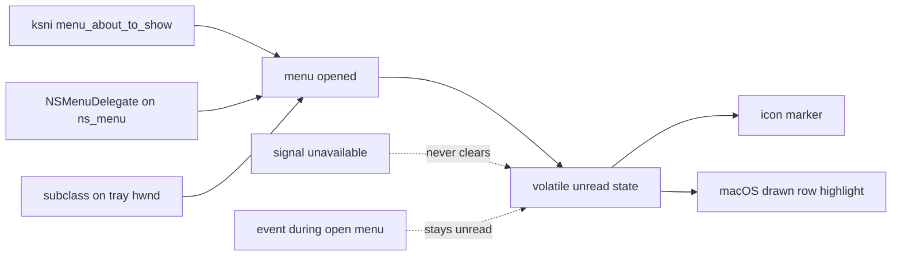

## adr_006_tray_menu_lifecycle_observation_boundary - Tray menu lifecycle observation boundary
> Date: 2026-08-11
> Status: Proposed
> Related request: req_042_synchronize_cdx_tray_alert_badges_with_menu_reading
> Related backlog: item_089_unify_tray_alert_marker_and_recent_alert_read_state
> Related task: task_053_orchestrate_coherent_cdx_tray_alert_read_state
> Drivers: One reading signal across three unrelated menu stacks, alerts that are never silently lost, drawn session cells that still behave like menu items, a stated coupling to `muda` internals rather than an accidental one.
> Reminder: Update status, linked refs, decision rationale, consequences, and follow-up work when you edit this doc.
> Indicators reviewed: 2026-08-11 12:03:25

# Overview
- Fix how the companion learns that its menu was opened, and rule out learning that it was closed, because `req_042`, `req_043` and `req_039` all need that signal and none of the three tray stacks offers it the same way.

# Context
- Nothing in the companion observes the menu today: no menuWillOpen, no about_to_show, no WM_INITMENUPOPUP anywhere under `tray/src`.
- Neither crate-level event stream carries it. `muda::MenuEvent` reports item activation only, and `tray_icon::TrayIconEvent` (Click, DoubleClick, Enter, Move, Leave) is documented as never emitted on Linux at all, so the click that opens the menu is not observable there.
- Linux is the only stack with a first-class signal: `ksni::Tray` exposes `fn menu_about_to_show(&mut self)`, called before the root menu is shown. It has no closing counterpart, and the dbusmenu protocol offers none that a host is obliged to send.
- macOS has both halves, but only through AppKit. `muda::ContextMenu::ns_menu() -> *mut c_void` hands over the `NSMenu`, and an NSMenuDelegate on it receives `menuWillOpen:` and `menuDidClose:`.
- Two crates already claim that delegate slot, and the order they claim it in decides whether the companion sees anything. `muda` installs MudaMenuDelegate when the menu is created, whose only job is to carry the menu id for set_as_windows_menu_for_nsapp — an API this companion never calls. Then `tray-icon`'s `set_menu` ends with `setDelegate: ns_status_item`, replacing whatever is there.
- That second one is the trap, and it cost a working feature: a delegate installed while the menu is being built is thrown away by the `set_menu` on the same call, with nothing reporting an error. The symptom was a badge that never cleared. The delegate has to go on after the menu is on the status item, reached through `ns_status_item().menu()`.
- Windows has both halves through Win32. `tray-icon` displays the menu with TrackPopupMenu on its own internal window and exposes that window through `TrayIcon::hwnd()`; it handles none of WM_INITMENUPOPUP, WM_UNINITMENUPOPUP or WM_EXITMENULOOP, so a subclass on that HWND sees all three.
- TrackPopupMenu is modal. It runs inside the window procedure the Windows pump dispatches to, so `tray/src/win.rs` stops pumping for as long as the menu is open: no poll, no spool read, no redraw, and no reaction to an external request while the user reads the menu.
- A session row is already a drawn cell on macOS (`backend.rs:113` -> `mac_cell::Cell`), and an `NSMenuItem` carrying a view draws none of the standard furniture — not the title, not the state, not the highlight, and not the submenu chevron. Since Big Sur the parent item's highlighted property stays true when the drawn item is no longer highlighted, so it cannot be used as the drawing signal either.

# Decision
- Treat menu opening as the single reading event. Do not model closing, on any platform.
- Observe opening per backend: `menu_about_to_show` on Linux, an NSMenuDelegate installed on `ns_menu()` on macOS, a window subclass on `TrayIcon::hwnd()` watching WM_INITMENUPOPUP on Windows.
- Clear unread state against the snapshot that was already drawn, never against the one arriving. Events that land while the menu is open stay unread.
- Fail closed. Where the signal cannot be installed — subclass refused, delegate not set, no `ns_menu` — never clear. A sticky marker is the accepted failure; a marker cleared without a reading is not.
- Keep the unread state volatile and in memory. A restarted companion presents everything as unread.
- Take the macOS delegate replacement as a deliberate coupling: the companion owns the delegate on that menu, and installs it after `set_menu` rather than before, because `tray-icon` sets its own there.
- Let the same open/close observation drive the drawn cell's highlight on macOS, since a view-bearing item has to draw its own highlight and chevron anyway.

# Rationale
- Closing is unavailable on Linux, and a signal that exists on two platforms out of three forces either three semantics or a lowest common denominator that is exactly "opening".
- Opening is also the honest moment: the user has seen the list when the menu is drawn, not when it goes away.
- Clearing against the drawn snapshot is what makes the Windows modal pump harmless. The alert that arrives during TrackPopupMenu was never on screen and must survive.
- Failing closed keeps the one property the request is about: an alert is never silently dropped. Every other outcome is cosmetic.
- Volatile state avoids a persisted read marker that would have to be reconciled with a spool CDX owns and a history the companion rebuilds each poll.

# Consequences
- Three backend-specific installation paths, each with its own failure mode, and a shared state module none of them owns.
- Clearing the marker is not the mirror of setting it. `tray-icon`'s macOS `set_title` ignores a `None` entirely — it is `if let Some(title) = title`, with no else — so the badge can be raised and never lowered, and the companion has to empty the status item's button title itself. This predates the unread state: the 45-second expiry it replaced never cleared anything either, and nobody noticed, because a marker that outstays its welcome looks like one that is still true.
- The macOS path is the fragile one: it depends on when two crates set a delegate they do not document setting, so a `muda` or `tray-icon` upgrade is a review point rather than a version bump. It also fails silently — nothing errors when a delegate is replaced, and the only symptom is a signal that never arrives.
- The Windows subclass must be removed before the tray icon is dropped, or the process tears down through a dangling window procedure.
- Nothing refreshes while a Windows menu is open, so a bounded graceful-shutdown request from `req_041` can wait up to the time the user leaves the menu open. Its timeout has to survive that, and must not escalate to a kill.
- Session rows that gain a submenu in `req_043` must draw their own chevron and highlight on macOS, or drop the drawn cell for those rows. The drawn cell is kept. task_054 drew the chevron; the highlight needs `menu:willHighlightItem:` rather than the opening signal this ADR installs, and is tracked separately in req_045.

# Alternatives considered
- Model opening and closing where both exist: rejected because Linux would need a third behaviour and the marker would mean different things per platform.
- Approximate opening on Windows with `TrayIconEvent::Click`: rejected because it is only correlated with the menu, and the subclass gives the real message at the same cost.
- Persist read state to disk: rejected because it duplicates ownership of a spool CDX already acknowledges, for a marker whose worst failure is showing again after a restart.
- Stop setting the menu on the tray icon and show it ourselves with `show_context_menu_for_hwnd`, whose blocking return marks the close: rejected because it re-implements what `tray-icon` already does, on every platform, to obtain a closing edge this ADR does not want.
- Drop the drawn macOS cell so submenu rows get standard furniture: rejected because the capacity bar is the reason the row is drawn at all.

# References
- Related request: `req_042_synchronize_cdx_tray_alert_badges_with_menu_reading`
- Related backlog: `item_089_unify_tray_alert_marker_and_recent_alert_read_state`
- Related task: `task_053_orchestrate_coherent_cdx_tray_alert_read_state`
- `adr_005_cdx_tray_runtime_and_companion_transport_boundary`
- `ksni::Tray::menu_about_to_show` — https://docs.rs/ksni/latest/ksni/trait.Tray.html
- `muda::ContextMenu::ns_menu` — https://github.com/tauri-apps/muda
- `tray_icon::TrayIconEvent` — https://docs.rs/tray-icon/latest/tray_icon/enum.TrayIconEvent.html
- Views in Menu Items — https://developer.apple.com/library/mac/documentation/Cocoa/Conceptual/MenuList/Articles/ViewsInMenuItems.html
