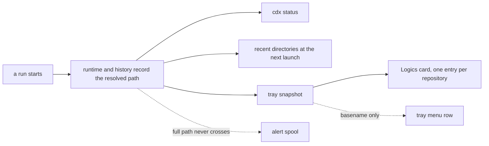

## adr_007_what_cdx_records_about_where_a_run_happened - What CDX records about where a run happened
> Date: 2026-08-11
> Status: Settled
> Related request: `req_051_launch_a_session_in_the_directory_it_belongs_to`
> Related backlog: `item_100_record_and_honour_a_per_session_working_directory`
> Related task: `task_062_orchestrate_the_per_session_working_directory`
> Drivers: One fact several surfaces will read, a privacy boundary that must not be re-decided per consumer, and a shape that survives the same account running in two projects at once.
> Reminder: Update status, linked refs, decision rationale, consequences, and follow-up work when you edit this doc.

# Overview
- Fix what CDX stores about the location of a run, and what of it may cross to a companion, before three requests each invent their own answer.

# Context
- A run's directory is decided at one place per entry point and handed to every provider the same way: `options.cwd`, plus `--cd` for Codex. Nothing keeps it afterwards. The runtime record holds a pid, a command, a label and a transcript path, and not the one fact that says what the session is working on.
- Three open requests want it. `req_051` needs the recent directories of a session to offer them at the next launch. `req_048` needs the repositories the running sessions are in, so the Logics card reports on something. `req_050` wants commands to name what they are acting on. Without one decision they will each pick a shape.
- The same account legitimately runs in two directories at once, so this cannot be a property of the session. It is a property of the run, and there can be several live at the same time.
- `task_050` already drew a privacy line for the tray: the alert envelope carries `project` as a basename, never a path, because a working directory says more about a person than a session name does. That line was drawn for hooks and is about to be tested by three consumers that are not hooks.
- Derived values age differently from recorded ones. A path recorded at launch describes what happened; a repository root computed from it describes what is true now, and the two diverge the moment a directory is moved or a repository is initialised.

# Decision
- Record the **resolved absolute path** of the directory a run used, on the run: in the runtime record while it lives, and in the run history once it ends. Resolved means symlinks followed and the value stable for the life of the run.
- Record it as one field with one meaning. Anything else — a repository root, a project name, whether it is a Logics repository — is **derived at the moment it is read**, never stored beside it. A stored derivation is a second thing to keep true.
- The full path stays inside CDX. What crosses to a companion or a spool is the **basename**, exactly as `task_050` decided for alerts. A consumer that needs to distinguish two repositories with the same basename receives a stable identifier, not a longer path.
- Every consumer reads the same field. `cdx status`, the tray snapshot, the launch picker and the Logics card do not each ask the filesystem where a session is; they read what the run recorded.
- Several concurrent runs of one session are told apart by their run identity, which already exists, and each carries its own directory.
- A run that recorded no directory — because it predates this, or because the record was lost — is an absence, never a guess. No consumer substitutes the current process directory for a missing one.

# Rationale
- One recorded fact and many derivations is the shape that survives reuse: the derivations can be wrong or refined without rewriting history, and history stays a record of what happened rather than of what was believed.
- Keeping the path inside CDX and letting only a basename cross is the line already drawn, and re-deciding it per consumer is how a privacy boundary erodes: each step is small and defensible, and the sum is a full path in a menu.
- Making the absence explicit is what stops the class of bug this whole area keeps producing — a tool that quietly substitutes the wrong thing and reports success. A missing directory that reads as the current one would be exactly that.
- Run identity already distinguishes concurrent runs. Inventing a second key for the same job would create two answers to "which run is this".

# Consequences
- The runtime and history records gain a field, which is a schema addition: readers that predate it see nothing and must behave as they do today.
- `req_048` becomes a reader rather than a designer: the Logics card reports on the repositories of the running sessions, grouped by directory, and says nothing when none is recorded.
- The launch picker in `req_051` has a source that costs nothing extra — the runs already recorded — rather than a new store to maintain.
- A consumer that genuinely needs to tell apart two repositories with the same basename will need an identifier added deliberately, and that is a decision to take then, with the case in front of us, rather than by shipping paths now.
- Anything that renders a directory has to handle its absence, which is the common case for every run recorded before this exists.

# Alternatives considered
- A directory per session: rejected in `req_051` because the same account runs in two projects at once, so the setting would describe a state that does not exist and would need changing every time it was right.
- Storing the repository root beside the path: rejected because it is derivable, and a stored derivation becomes false when a directory moves or a repository appears, with nothing to notice.
- Letting the full path cross to the companion: rejected because `task_050` drew that line for alerts on the same reasoning, and a menu row needs a name rather than a location.
- Taking the directory from the provider's hook payload: rejected because it is CDX's own fact about its own launch, and reading it back from a provider payload would put it on the wrong side of a boundary that already exists.

# References
- Related request: `req_051_launch_a_session_in_the_directory_it_belongs_to`
- Related backlog: `item_100_record_and_honour_a_per_session_working_directory`
- Related task: `task_062_orchestrate_the_per_session_working_directory`
- `req_048_give_the_logics_tray_card_a_repository_to_report_on`
- `req_050_say_which_installation_and_which_home_a_command_is_acting_on`
- `item_086_deliver_structured_private_hook_context_to_actionable_tray_alerts` — where the basename boundary was first drawn
