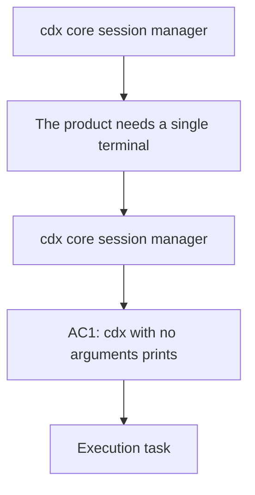

## item_000_cdx_core_session_manager - cdx core session manager
> From version: 1.13.0
> Schema version: 1.0
> Status: Draft
> Understanding: 95%
> Confidence: 90%
> Progress: 0%
> Complexity: Medium
> Theme: CLI
> Reminder: Update status/understanding/confidence/progress and linked request/task references when you edit this doc.

# Problem
- The product needs a single terminal entrypoint that can list, create, remove, and launch named Codex sessions without forcing the user to remember separate commands.

# Scope
- In: `cdx` with no arguments lists the available sessions and points to the next action.
- In: `cdx add <name>` creates a new named Codex session.
- In: `cdx add <provider> <name>` creates a session for `codex` or `claude`.
- In: `cdx rmv <name>` removes a named Codex session.
- In: `cdx <name>` launches Codex in the matching named session.
- In: `cdx --help` and `cdx -h` show usage help.
- In: `cdx --version` and `cdx -v` show the installed version.
- Out: provider support beyond Codex, secret storage internals, and broader team or enterprise workflows.

# Acceptance criteria
- AC1: `cdx` with no arguments prints the current session list and the supported actions.
- AC2: `cdx add <name>` creates a new session name and rejects duplicates.
- AC2: `cdx add <provider> <name>` creates a provider-specific session and rejects unsupported providers.
- AC3: `cdx rmv <name>` removes an existing session and fails cleanly for unknown names.
- AC4: `cdx <name>` starts Codex in the named session.
- AC5: Invalid syntax returns a concise usage hint instead of a stack trace.
- AC6: `cdx --help` and `cdx -h` print a concise help summary.
- AC7: `cdx --version` and `cdx -v` print the installed version and exit cleanly.

# AC Traceability
- AC1 -> Scope: `cdx` with no arguments lists the available sessions and points to the next action.
- AC2 -> Scope: `cdx add <name>` creates a new named Codex session.
- AC2 -> Scope: `cdx add <provider> <name>` creates a session for `codex` or `claude`.
- AC3 -> Scope: `cdx rmv <name>` removes a named Codex session.
- AC4 -> Scope: `cdx <name>` launches Codex in the matching named session.
- AC5 -> Scope: Invalid syntax returns a concise usage hint.
- AC6 -> Scope: `cdx --help` and `cdx -h` show usage help.
- AC7 -> Scope: `cdx --version` and `cdx -v` show the installed version.

# Decision framing
- Product framing: Already covered by the product brief.
- Product signals: Clear terminal-first multi-account workflow.
- Product follow-up: Keep the brief linked to all future backlog splits.
- Architecture framing: Not needed
- Architecture signals: (none detected)
- Architecture follow-up: No architecture decision follow-up is expected based on current signals.

# Links
- Product brief(s): `logics/product/prod_000_codex_multi_account_session_manager.md`
- Architecture decision(s): (none yet)
- Request: (none yet)
- Primary task(s): (none yet)
<!-- When creating a task from this item, add: Derived from `this file path` in the task # Links section -->

# AI Context
- Summary: Core `cdx` entrypoint for listing, adding, removing, and launching named Codex sessions.
- Keywords: cdx, session, list, add, remove, launch, help, version, provider, Codex, Claude
- Use when: Use when implementing the terminal-facing command surface for named Codex sessions.
- Skip when: Skip when the work is only about auth storage, provider expansion, or CLI polish outside the core command flow.

# Priority
- Impact: High
- Urgency: High

# Notes
- This is the visible MVP slice that makes the product useful on day one.
- Keep the command surface small and predictable before adding provider expansion.
- Help and version flags are first-class CLI affordances, not optional extras.
- The provider syntax should remain explicit so sessions are easy to reason about later.
