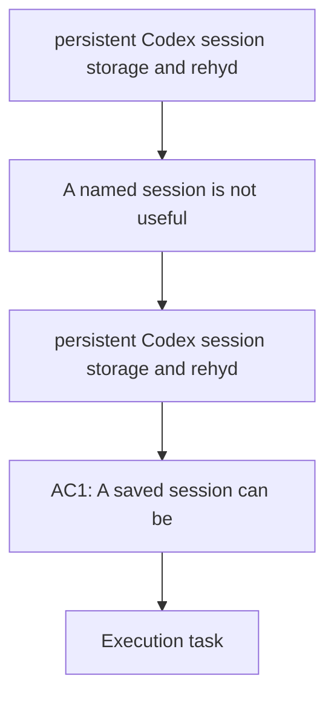

## item_001_persistent_codex_session_storage_and_rehydration - persistent Codex session storage and rehydration
> From version: 1.13.1
> Schema version: 1.0
> Status: Ready
> Understanding: 96%
> Confidence: 91%
> Progress: 5%
> Complexity: High
> Theme: Auth
> Reminder: Update status/understanding/confidence/progress and linked request/task references when you edit this doc.

# Problem
- A named session is not useful if the user has to reconnect every time the terminal restarts or the command is relaunched.

# Scope
- In: persist the user and session state needed to relaunch an existing Codex session without manual reauthentication when credentials are still valid.
- In: restore the saved session state when the user launches a named session.
- In: detect expired, revoked, or missing state and route the user to a clear recovery path.
- In: delete or invalidate persisted state when a session is removed.
- Out: multi-provider routing and CLI discoverability polish.

# Acceptance criteria
- AC1: A saved session can be reopened after process exit or terminal restart without asking the user to reconnect when credentials remain valid.
- AC2: Expired, revoked, or missing state is detected and reported with a clear recovery path.
- AC3: Removing a session also removes or invalidates the persisted state tied to that session.
- AC4: Rehydration never silently binds the user to the wrong account or session.

# AC Traceability
- AC1 -> Scope: Persist the user and session state needed to relaunch an existing Codex session without manual reauthentication when credentials are still valid.
- AC2 -> Scope: Detect expired, revoked, or missing state and route the user to a clear recovery path.
- AC3 -> Scope: Delete or invalidate persisted state when a session is removed.
- AC4 -> Scope: Restore the saved session state when the user launches a named session.

# Decision framing
- Product framing: Not needed
- Product signals: Persistent login is part of the core value proposition.
- Product follow-up: Keep the product brief aligned if the session recovery promise changes.
- Architecture framing: Required
- Architecture signals: data model, persistence, and secret handling
- Architecture follow-up: Create or link an architecture decision before irreversible implementation work starts.

# Links
- Product brief(s): `logics/product/prod_000_codex_multi_account_session_manager.md`
- Architecture decision(s): `logics/architecture/adr_000_persist_and_restore_cdx_sessions.md`
- Request: (none yet)
- Primary task(s): `task_000_persistent_codex_session_storage_and_rehydration`
<!-- When creating a task from this item, add: Derived from `this file path` in the task # Links section -->

# AI Context
- Summary: Save and restore Codex session state so named sessions survive terminal restarts.
- Keywords: persistence, rehydration, login state, session recovery, Codex
- Use when: Use when working on session persistence, reconnect avoidance, and recovery behavior.
- Skip when: Skip when the change is only about command listing or provider selection.

# Priority
- Impact: High
- Urgency: High

# Notes
- Needs an architecture decision for storage format, secrets, and recovery behavior.
- This item is the main retention and convenience feature of the product.
