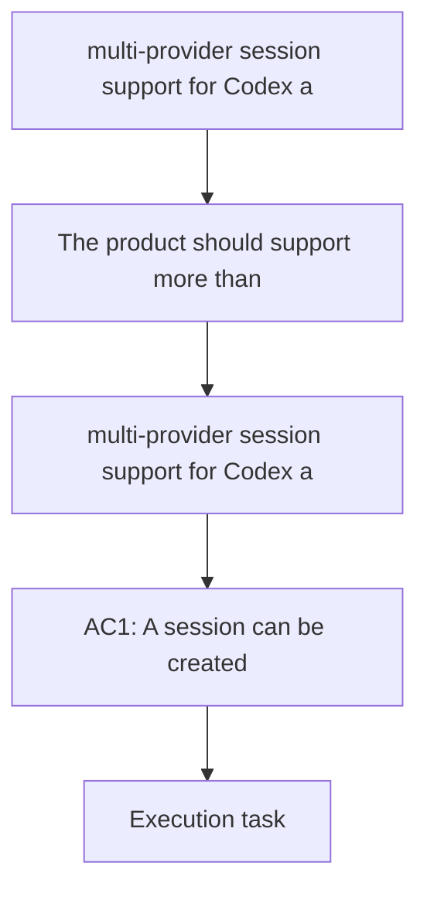

## item_002_multi_provider_session_support_for_codex_and_claude - multi-provider session support for Codex and Claude
> From version: 1.13.1
> Schema version: 1.0
> Status: Ready
> Understanding: 92%
> Confidence: 86%
> Progress: 5%
> Complexity: High
> Theme: CLI
> Reminder: Update status/understanding/confidence/progress and linked request/task references when you edit this doc.

# Problem
- The product should support more than one assistant provider without forcing a redesign of the session model.

# Scope
- In: allow a session to be associated with an explicit provider using `cdx add <provider> <name>`.
- In: launch the correct provider when the user starts a named session.
- In: show the provider on list output so users can tell sessions apart.
- In: keep the session naming model stable across providers.
- Out: plugin marketplaces, arbitrary provider autodiscovery, and enterprise provider routing.

# Acceptance criteria
- AC1: A session can be created with an explicit provider value for Codex or Claude using the documented syntax.
- AC2: Starting a session routes to the matching provider.
- AC3: Session listings show which provider each session belongs to.
- AC4: Unsupported provider values fail with a clear error message.
- AC5: Existing Codex-only usage keeps working without requiring a new mental model.

# AC Traceability
- AC1 -> Scope: Allow a session to be associated with an explicit provider using `cdx add <provider> <name>`.
- AC2 -> Scope: Launch the correct provider when the user starts a named session.
- AC3 -> Scope: Show the provider on list output so users can tell sessions apart.
- AC4 -> Scope: Keep the session naming model stable across providers.
- AC5 -> Scope: Keep the session naming model stable across providers.

# Decision framing
- Product framing: Not needed
- Product signals: Multi-provider support is part of the intended product direction, but not the first thing users should notice.
- Product follow-up: Keep the brief aligned if the provider list expands beyond Codex and Claude.
- Architecture framing: Required
- Architecture signals: contracts, integration, and provider mapping
- Architecture follow-up: Create or link an architecture decision before irreversible implementation work starts.

# Links
- Product brief(s): `logics/product/prod_000_codex_multi_account_session_manager.md`
- Architecture decision(s): (none yet)
- Request: (none yet)
- Primary task(s): `task_003_multi_provider_session_support_for_codex_and_claude`
<!-- When creating a task from this item, add: Derived from `this file path` in the task # Links section -->

# AI Context
- Summary: Extend session handling so named sessions can target Codex or Claude explicitly.
- Keywords: provider, Codex, Claude, session, routing, list output
- Use when: Use when implementing provider-aware session creation, launch, or display.
- Skip when: Skip when the change only concerns persistence or command ergonomics.

# Priority
- Impact: Medium
- Urgency: Medium

# Notes
- This item depends on the session model being stable enough to carry provider metadata.
- Create or link an ADR before hardening provider routing behavior.
