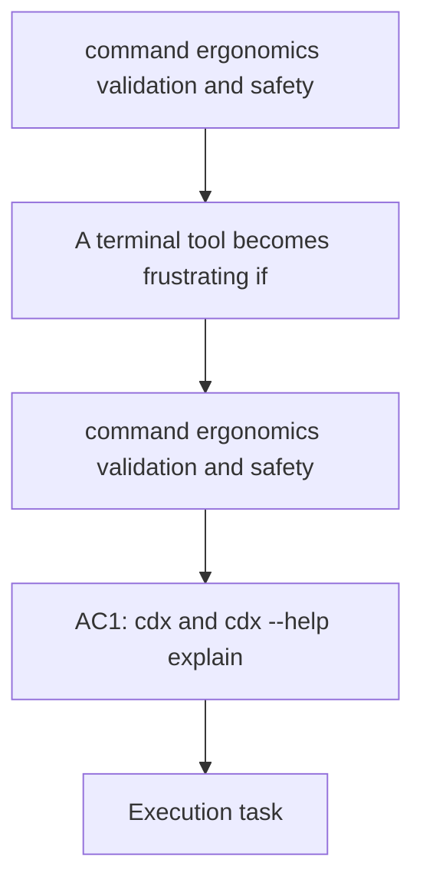

## item_003_command_ergonomics_validation_and_safety - command ergonomics validation and safety
> From version: 0.1.0
> Schema version: 1.0
> Status: Done
> Understanding: 91%
> Confidence: 86%
> Progress: 100%
> Complexity: Medium
> Theme: CLI
> Reminder: Update status/understanding/confidence/progress and linked request/task references when you edit this doc.

# Problem
- A terminal tool becomes frustrating if the commands are hard to discover, ambiguous, or unsafe to use by mistake.

# Scope
- In: helpful usage output for `cdx`, invalid syntax guidance, and consistent error messages.
- In: `cdx --help`, `cdx -h`, `cdx --version`, and `cdx -v` should behave predictably.
- In: predictable handling of duplicate names, unknown names, and malformed provider arguments.
- In: safe behavior for destructive actions, including a clear confirmation path or an explicit force flag.
- Out: session persistence internals and provider integration.

# Acceptance criteria
- AC1: `cdx` and `cdx --help` explain the available commands in a concise way.
- AC2: Invalid syntax returns a readable usage hint instead of a stack trace.
- AC3: Duplicate names, unknown names, and invalid provider values produce clear errors.
- AC4: Removing a session is intentionally safe, either with confirmation or an explicit force flag.
- AC5: List output is readable enough to be used as the default discovery surface.
- AC6: `cdx --version` and `cdx -v` print the installed version and exit without side effects.
- AC7: `cdx -h` is accepted as an alias for `cdx --help`.

# AC Traceability
- AC1 -> Scope: Helpful usage output for `cdx`, invalid syntax guidance, and consistent error messages.
- AC2 -> Scope: Helpful usage output for `cdx`, invalid syntax guidance, and consistent error messages.
- AC3 -> Scope: Predictable handling of duplicate names, unknown names, and malformed provider arguments.
- AC4 -> Scope: Safe behavior for destructive actions, including a clear confirmation path or an explicit force flag.
- AC5 -> Scope: Helpful usage output for `cdx`, invalid syntax guidance, and consistent error messages.
- AC6 -> Scope: `cdx --version`, `cdx -v`, `cdx --help`, and `cdx -h` should behave predictably.
- AC7 -> Scope: `cdx --help`, `cdx -h`, `cdx --version`, and `cdx -v` should behave predictably.

# Decision framing
- Product framing: Not needed
- Product signals: Discoverability and safety are part of the daily user experience.
- Product follow-up: Keep the brief aligned if the command surface changes.
- Architecture framing: Not needed
- Architecture signals: (none detected)
- Architecture follow-up: No architecture decision follow-up is expected based on current signals.

# Links
- Product brief(s): `logics/product/prod_000_codex_multi_account_session_manager.md`
- Architecture decision(s): (none yet)
- Request: (none yet)
- Primary task(s): `task_000_command_ergonomics_validation_and_safety`
<!-- When creating a task from this item, add: Derived from `this file path` in the task # Links section -->

# AI Context
- Summary: Improve command help, validation, and safety for the `cdx` CLI surface.
- Keywords: help, usage, validation, safety, delete, version, error handling, alias flags
- Use when: Use when shaping the user-facing command experience.
- Skip when: Skip when the change is only about storage or provider routing.

# Priority
- Impact: Medium
- Urgency: Medium

# Notes
- This item reduces friction and prevents destructive mistakes in daily use.
- Confirmation or force behavior for `rmv` should remain explicit and documented.
- Help and version flags should be available before any command tries to mutate state.
- Alias handling for `-h` and `-v` must not be treated as secondary behavior.
