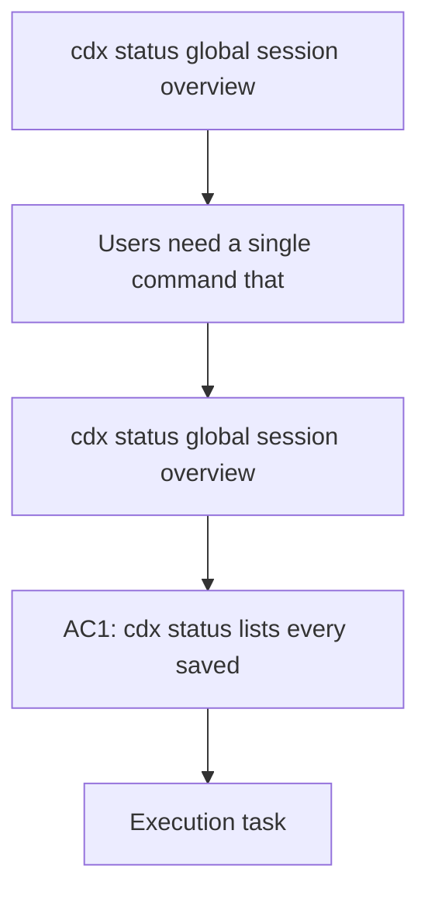

## item_004_cdx_status_global_session_overview - cdx status global session overview
> From version: 0.1.0
> Schema version: 1.0
> Status: Done
> Understanding: 91%
> Confidence: 91%
> Progress: 100%
> Complexity: Medium
> Theme: CLI
> Reminder: Update status/understanding/confidence/progress and linked request/task references when you edit this doc.

# Problem
- Users need a single command that shows the latest known `/status` usage data for every saved Codex session, so they can compare `main`, `work1`, and `work2` without switching contexts one by one.

# Scope
- In: `cdx status` shows every saved session and its latest stored `/status` usage result.
- In: `cdx status <name>` shows the latest stored `/status` usage result for one named session.
- In: sessions with no stored result still appear with a clear empty state.
- In: the stored status remains isolated per session.
- In: the global list is ordered by most recent status activity first.
- Out: full transcript browsing, arbitrary search across all sessions, and non-Codex provider support.

# Acceptance criteria
- AC1: `cdx status` lists every saved session with the latest stored `/status` usage result or a clear empty state.
- AC2: `cdx status <name>` shows the latest stored `/status` usage result for the named session.
- AC3: The result for one session does not overwrite or leak into another session.
- AC4: A session with no stored `/status` is still shown in the global view.
- AC5: The command output is readable enough to compare multiple sessions at once.
- AC6: The most recently updated session appears first in the global listing.

# AC Traceability
- AC1 -> Scope: `cdx status` shows every saved session and its latest stored `/status` usage result.
- AC2 -> Scope: `cdx status <name>` shows the latest stored `/status` usage result for one named session.
- AC3 -> Scope: The stored status remains isolated per session.
- AC4 -> Scope: Sessions with no stored result still appear with a clear empty state.
- AC5 -> Scope: `cdx status` shows every saved session and its latest stored `/status` result.
- AC6 -> Scope: The global list is ordered by most recent status activity first.

# Decision framing
- Product framing: Not needed
- Product signals: The product needs a global session-status comparison surface.
- Product follow-up: Keep the status-recall product brief aligned if the output format changes.
- Architecture framing: Not needed
- Architecture signals: (none detected)
- Architecture follow-up: No architecture decision follow-up is expected based on current signals.

# Links
- Product brief(s): `logics/product/prod_000_codex_multi_account_session_manager.md`, `logics/product/prod_001_per_session_codex_status_recall.md`
- Architecture decision(s): (none yet)
- Request: (none yet)
- Primary task(s): `task_002_cdx_status_global_session_overview`
<!-- When creating a task from this item, add: Derived from `this file path` in the task # Links section -->

# AI Context
- Summary: Global `cdx status` view that compares the latest stored usage data for all sessions and supports per-session detail.
- Keywords: cdx, status, global view, session comparison, detail view
- Use when: Use when implementing the session-status overview command and its per-session detail output.
- Skip when: Skip when the change is unrelated to status recall or session comparison.

# Priority
- Impact: Medium
- Urgency: Medium

# Notes
- This item depends on per-session status storage already being available.
- The command should favor the latest stored result rather than raw transcript dumping.
- The extracted payload should include usage and remaining percentage data for the 5h and week windows when available.
- The global view should stay Codex-only for v1.
