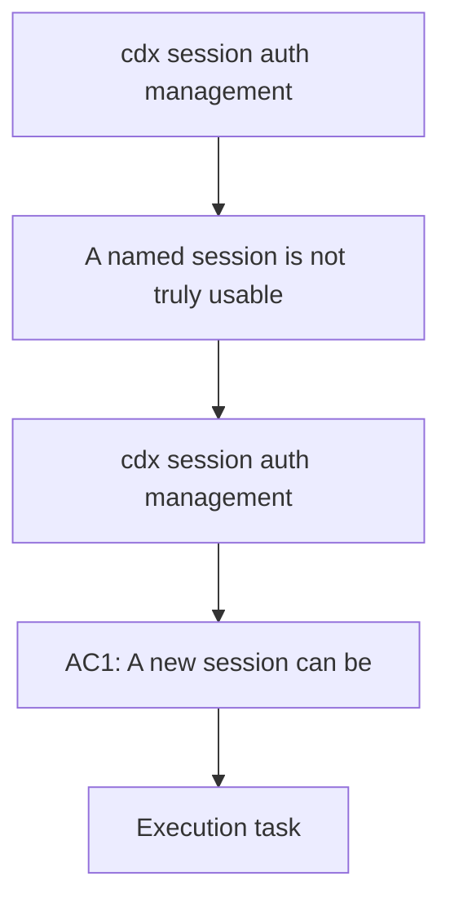

## item_005_cdx_session_auth_management - cdx session auth management
> From version: 0.1.0
> Schema version: 1.0
> Status: Done
> Understanding: 95%
> Confidence: 95%
> Progress: 100%
> Complexity: High
> Theme: Auth
> Reminder: Update status/understanding/confidence/progress and linked request/task references when you edit this doc.

# Problem
- A named session is not truly usable if the first login is still a separate manual step, and users also need a clean way to reauthenticate or clear credentials for one session without touching the others.

# Scope
- In: bootstrap the login flow when `cdx add <name>` creates a session that does not yet have valid credentials.
- In: bootstrap the login flow when `cdx add <provider> <name>` creates a provider-specific session with missing credentials.
- In: `cdx login <name>` to force reauthentication for one named session.
- In: `cdx logout <name>` to remove saved credentials for one named session.
- In: keep auth isolated per named session so one account cannot bleed into another.
- Out: global account switching without an explicit session name.
- Out: provider discovery beyond the documented provider list.

# Acceptance criteria
- AC1: `cdx add <name>` creates the session and immediately starts the login flow when no valid credentials exist yet.
- AC2: `cdx add <provider> <name>` does the same for the selected provider.
- AC3: `cdx login <name>` forces a fresh login for the targeted session only.
- AC4: `cdx logout <name>` clears the saved credentials for the targeted session only.
- AC5: `cdx <name>` reuses valid credentials when they exist and shows a clear recovery path when they do not.
- AC6: Auth state remains isolated between `main`, `work1`, `work2`, and other sessions.

# AC Traceability
- AC1 -> Scope: Bootstrap the login flow when `cdx add <name>` creates a session that does not yet have valid credentials.
- AC2 -> Scope: Bootstrap the login flow when `cdx add <provider> <name>` creates a provider-specific session with missing credentials.
- AC3 -> Scope: `cdx login <name>` to force reauthentication for one named session.
- AC4 -> Scope: `cdx logout <name>` to remove saved credentials for one named session.
- AC5 -> Scope: Keep auth isolated per named session and reuse valid credentials on launch.
- AC6 -> Scope: Keep auth isolated per named session so one account cannot bleed into another.

# Decision framing
- Product framing: Consider
- Product signals: first-run onboarding and explicit reauthentication are part of the core user flow
- Product follow-up: Keep the product brief aligned if the auth lifecycle changes again
- Architecture framing: Required
- Architecture signals: authentication storage, provider-specific login flow, and session isolation
- Architecture follow-up: Create or link an architecture decision before irreversible implementation work starts

# Links
- Product brief(s): `logics/product/prod_000_codex_multi_account_session_manager.md`
- Architecture decision(s): `logics/architecture/adr_000_persist_and_restore_cdx_sessions.md`
- Request: (none yet)
- Primary task(s): `task_005_cdx_session_auth_management`

# AI Context
- Summary: Manage the login lifecycle for one named session at a time, including first-run onboarding, explicit reauth, and logout.
- Keywords: auth, login, logout, onboarding, session isolation, Codex, Claude
- Use when: Use when implementing per-session login bootstrap or explicit reauthentication commands.
- Skip when: Skip when the work is only about listing sessions or status extraction.

# Priority
- Impact: High
- Urgency: High

# Notes
- This item is the missing auth lifecycle slice that makes `cdx add` feel complete.
- Keep the credential boundary strict so each named session remains isolated.
