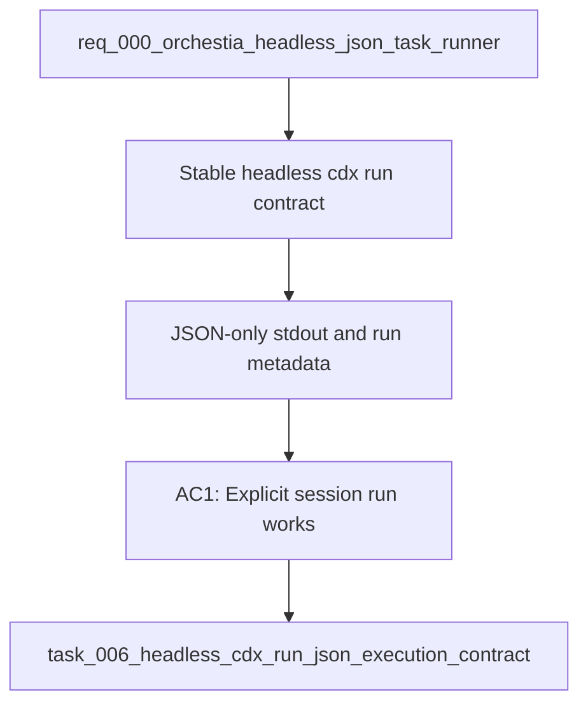

## item_006_headless_cdx_run_json_execution_contract - Headless cdx run JSON execution contract
> From version: 0.6.5
> Schema version: 1.0
> Status: Done
> Understanding: 100%
> Confidence: 95%
> Progress: 100%
> Complexity: High
> Theme: Integration
> Reminder: Update status/understanding/confidence/progress and linked request/task references when you edit this doc.

# Problem
- Orchestia needs a stable non-interactive `cdx run` command that launches a provider task from automation without depending on terminal UI output.
- The command must accept a target workspace, prompt input, model, reasoning effort, permission mode, and either an explicit session or provider-based auto-selection.
- In `--json` mode, stdout must contain only the final JSON response so the supervisor can parse the result deterministically.

# Scope
- In: `cdx run <session> --cwd PATH --prompt-file PATH --model MODEL --reasoning-effort LEVEL --permission MODE --json`.
- In: `cdx run --provider codex ... --json` delegating session choice to the selection policy once item `item_007_automatic_headless_session_selection` is available.
- In: support `--prompt-file PATH` and `--prompt TEXT`.
- In: support `--timeout-seconds N` and report timeout failures through the stable JSON envelope.
- In: return `run_id`, session, provider, model, reasoning effort, cwd, duration, exit code, warnings, and error fields.
- Out: full artifact capture and token usage extraction, covered by `item_009_headless_run_artifacts_usage_and_error_reporting`.
- Out: provider-neutral effort mapping internals, covered by `item_008_provider_neutral_reasoning_effort_mapping`.
- Out: non-Codex provider execution in the first delivery wave, unless it falls out naturally from existing launch abstractions.

# Acceptance criteria
- AC1: `cdx run <session> --cwd PATH --prompt-file PATH --model MODEL --reasoning-effort low --permission workspace-write --json` runs non-interactively and prints exactly one parseable JSON object to stdout.
- AC2: `cdx run` accepts `--prompt TEXT` as an alternative to `--prompt-file PATH` and validates that at least one prompt source is provided.
- AC3: The success response includes `ok`, `schema_version`, `run_id`, `session`, `provider`, `model`, `reasoning_effort`, `power`, `cwd`, `exit_code`, `duration_seconds`, `warnings`, and `error`.
- AC4: The command returns `ok: false` with `error.source: "cdx"` for cdx-side validation or launch errors.
- AC5: The command returns `ok: false` with `error.source: "provider"` for provider process failures while preserving provider exit status when available.
- AC6: `--timeout-seconds` stops long-running provider processes and returns a timeout error through the JSON contract.
- AC7: JSON mode does not mix provider stdout/stderr into stdout; provider streams are reserved for artifact handling in the related artifact slice.

# AC Traceability
- AC1 -> Scope: explicit session execution with workspace, prompt file, model, reasoning effort, permission, and JSON mode. Proof: `cdx run` parser and CLI tests.
- AC2 -> Scope: inline prompt support for small jobs and smoke tests. Proof: prompt source validation tests.
- AC3 -> Scope: stable Orchestia result envelope. Proof: run result payload tests.
- AC4 -> Scope: cdx-side error semantics. Proof: cdx validation error envelope tests.
- AC5 -> Scope: provider-side error semantics. Proof: provider failure envelope tests.
- AC6 -> Scope: first-version timeout support. Proof: timeout handling tests.
- AC7 -> Scope: final-JSON-only stdout behavior. Proof: JSON-mode stdout tests.
- request-AC8 -> Scope: promoted into backlog slices `item_006` through `item_009`. Proof: linked delivery chain.

# Decision framing
- Product framing: Required
- Product signals: Orchestia supervisor integration depends on parseable headless execution.
- Product follow-up: Link a product brief if this becomes a public automation API surface.
- Architecture framing: Required
- Architecture signals: CLI contract stability, process lifecycle, provider launch boundary, JSON schema.
- Architecture follow-up: Create or link an ADR before implementation if the launch pipeline needs structural changes.

# Links
- Product brief(s): `prod_002_headless_automation_contract_for_orchestia`
- Architecture decision(s): `adr_002_provider_native_headless_run_boundary`
- Request: `req_000_orchestia_headless_json_task_runner`
- Primary task(s): `task_006_headless_cdx_run_json_execution_contract`

# AI Context
- Summary: Implement the core `cdx run` headless JSON command contract for Orchestia, including explicit sessions, prompt input, timeout, and stable result/error shape.
- Keywords: cdx run, headless, json, Orchestia, run_id, timeout, prompt-file, prompt, provider error, cdx error
- Use when: Designing or implementing the non-interactive task execution entry point.
- Skip when: Work is only about session ranking, reasoning mapping, or transcript/usage artifacts.

# Priority
- Impact: High
- Urgency: High

# Notes
- Derived from request `req_000_orchestia_headless_json_task_runner`.
- Source file: `logics/request/req_000_orchestia_headless_json_task_runner.md`.
- Delivered by local implementation commits for reasoning normalization, `cdx select`, `cdx run`, and headless artifacts.
