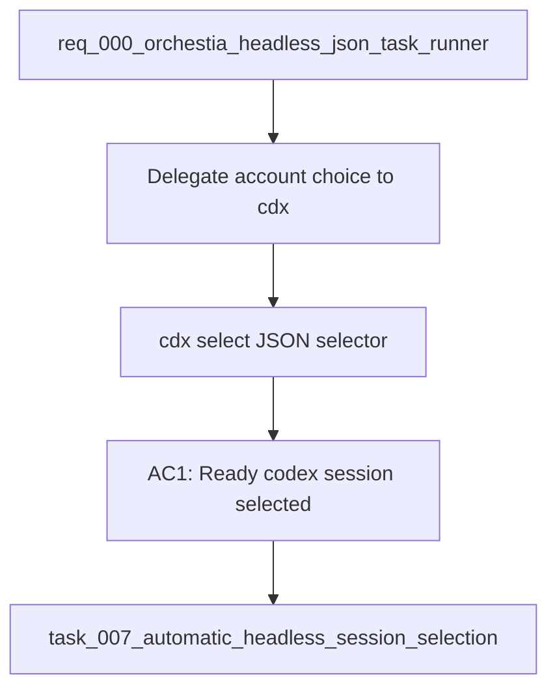

## item_007_automatic_headless_session_selection - Automatic headless session selection
> From version: 0.6.5
> Schema version: 1.0
> Status: Ready
> Understanding: 90
> Confidence: 82
> Progress: 0
> Complexity: Medium
> Theme: Integration
> Reminder: Update status/understanding/confidence/progress and linked request/task references when you edit this doc.

# Problem
- Orchestia should not duplicate cdx-manager's knowledge of accounts, providers, readiness, cooldowns, quotas, and session priority.
- A headless supervisor needs `cdx select --json` to return the best usable session for a provider and minimum reasoning capability.
- `cdx run --provider codex` should be able to reuse the same selection logic when no explicit session is supplied.

# Scope
- In: `cdx select --provider PROVIDER --min-power LEVEL --require-ready --json`.
- In: `--min-reasoning-effort LEVEL` as the preferred selector, with `--min-power LEVEL` as compatibility alias.
- In: deterministic selection policy: provider filter, readiness filter, cooldown avoidance, healthiest quota/availability state, configured priority, then stable name tie-breaker.
- In: stable JSON response with selected session, provider, reason, and selection policy.
- In: reusable internal selector callable from `cdx run --provider`.
- Out: implementing the full `cdx run` execution command, covered by `item_006_headless_cdx_run_json_execution_contract`.
- Out: changing quota collection semantics beyond what selection needs.

# Acceptance criteria
- AC1: `cdx select --provider codex --min-reasoning-effort low --require-ready --json` returns `ok: true`, `session`, `provider`, `reason`, and `selection_policy` when a suitable session exists.
- AC2: `--min-power low` behaves as an alias for the preferred minimum reasoning effort selector.
- AC3: With `--require-ready`, sessions that are logged out, unavailable, over quota, or in blocking cooldown are excluded according to existing readiness/status logic.
- AC4: When multiple sessions are suitable, selection is deterministic and follows the documented ranking policy.
- AC5: When no session is suitable, the command returns `ok: false` with `error.source: "cdx"`, a stable error code, and enough details for Orchestia to decide whether to retry later.
- AC6: The selector is available to `cdx run --provider codex` without duplicating ranking logic.

# AC Traceability
- AC1 -> Scope: core `cdx select` JSON response.
- AC2 -> Scope: `--min-power` compatibility.
- AC3 -> Scope: readiness requirement.
- AC4 -> Scope: deterministic ranking.
- AC5 -> Scope: no-suitable-session error contract.
- AC6 -> Scope: reusable selector for headless run.

# Decision framing
- Product framing: Required
- Product signals: supervisor should not manage account selection directly.
- Product follow-up: Document selection semantics once implementation is stable.
- Architecture framing: Required
- Architecture signals: readiness contract, ranking policy, shared selection service.
- Architecture follow-up: Link ADR if selection policy becomes configurable.

# Links
- Product brief(s): (none yet)
- Architecture decision(s): (none yet)
- Request: `req_000_orchestia_headless_json_task_runner`
- Primary task(s): `task_007_automatic_headless_session_selection`

# AI Context
- Summary: Add a deterministic JSON-first session selector for Orchestia and reuse it from provider-based headless runs.
- Keywords: cdx select, readiness, quota, cooldown, provider, min reasoning effort, session ranking, Orchestia
- Use when: Designing or implementing automatic account/session selection for headless automation.
- Skip when: Work is only about executing the selected task or capturing transcripts.

# Priority
- Impact: High
- Urgency: High

# Notes
- Derived from request `req_000_orchestia_headless_json_task_runner`.
- Source file: `logics/request/req_000_orchestia_headless_json_task_runner.md`.
