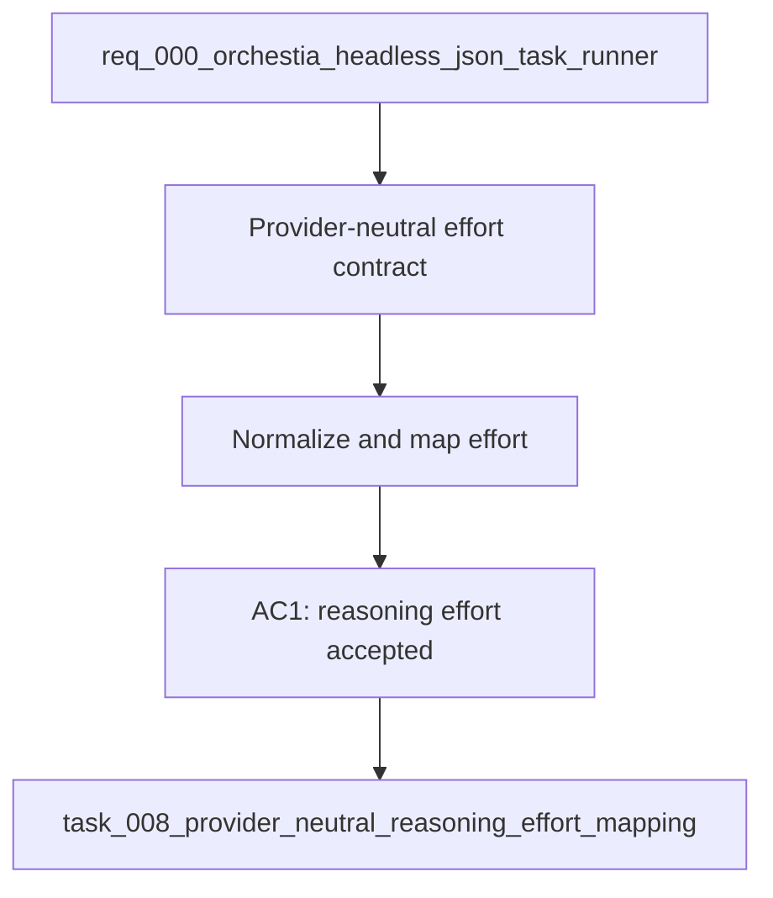

## item_008_provider_neutral_reasoning_effort_mapping - Provider-neutral reasoning effort mapping
> From version: 0.6.5
> Schema version: 1.0
> Status: Done
> Understanding: 100%
> Confidence: 95%
> Progress: 100%
> Complexity: Medium
> Theme: Integration
> Reminder: Update status/understanding/confidence/progress and linked request/task references when you edit this doc.

# Problem
- Orchestia wants to pass `--reasoning-effort low|medium|high` without knowing each provider's runtime flags.
- cdx-manager already exposes `--power`, but the public headless integration contract should prefer the clearer reasoning-effort terminology.
- The first implementation can be Codex-first, but the schema must remain compatible with Claude/Ollama and future providers.

# Scope
- In: normalize `--reasoning-effort low|medium|high` and `--power low|medium|high` into one internal effort value.
- In: map normalized effort to Codex `model_reasoning_effort` for headless runs.
- In: preserve a compatibility path for existing cdx `--power` usage.
- In: return both `reasoning_effort` and `power` in JSON during the transition so callers can audit alias resolution.
- In: define provider-neutral extension points for Claude/Ollama mappings without requiring full non-Codex execution in this slice.
- Out: implementing session selection or transcript capture.

# Acceptance criteria
- AC1: `--reasoning-effort low|medium|high` is accepted as the preferred public option for headless execution and selection.
- AC2: `--power low|medium|high` remains supported as a cdx compatibility alias.
- AC3: Supplying both options with conflicting values fails with `ok: false`, `error.source: "cdx"`, and a stable validation error code.
- AC4: Codex headless launch receives the correct provider-specific reasoning effort field.
- AC5: JSON responses expose the resolved `reasoning_effort` and `power` alias value.
- AC6: The mapping is centralized enough that Claude/Ollama support can be added without changing the public JSON contract.

# AC Traceability
- AC1 -> Scope: preferred public option.
- AC2 -> Scope: compatibility alias.
- AC3 -> Scope: conflict validation.
- AC4 -> Scope: Codex mapping.
- AC5 -> Scope: response auditability.
- AC6 -> Scope: future provider-neutral extension.

# Decision framing
- Product framing: Consider
- Product signals: public automation terminology must stay stable for Orchestia.
- Product follow-up: Update README/CLI help when implementation lands.
- Architecture framing: Required
- Architecture signals: provider abstraction and launch option normalization.
- Architecture follow-up: Link ADR if provider option mapping grows beyond a small helper.

# Links
- Product brief(s): `prod_002_headless_automation_contract_for_orchestia`
- Architecture decision(s): `adr_002_provider_native_headless_run_boundary`
- Request: `req_000_orchestia_headless_json_task_runner`
- Primary task(s): `task_008_provider_neutral_reasoning_effort_mapping`

# AI Context
- Summary: Normalize `--reasoning-effort` and `--power` into a provider-neutral effort value, Codex-first but compatible with future Claude/Ollama mappings.
- Keywords: reasoning-effort, power, Codex, Claude, Ollama, model_reasoning_effort, provider mapping, alias
- Use when: Designing or implementing provider-independent reasoning effort handling.
- Skip when: Work is only about selecting sessions or capturing run artifacts.

# Priority
- Impact: High
- Urgency: Medium

# Notes
- Derived from request `req_000_orchestia_headless_json_task_runner`.
- Source file: `logics/request/req_000_orchestia_headless_json_task_runner.md`.
- Delivered by normalized `--reasoning-effort` handling and `--power` alias support.
