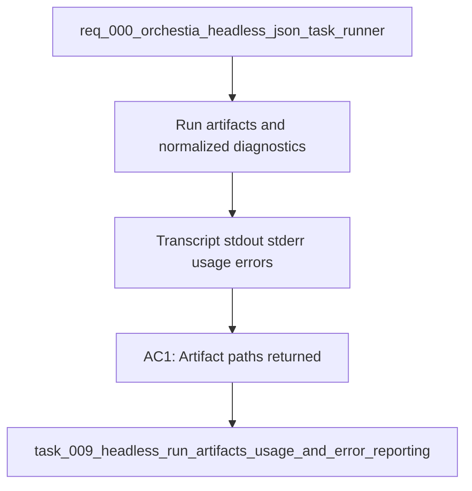

## item_009_headless_run_artifacts_usage_and_error_reporting - Headless run artifacts usage and error reporting
> From version: 0.6.5
> Schema version: 1.0
> Status: Done
> Understanding: 90
> Confidence: 80
> Progress: 100
> Complexity: High
> Theme: Integration
> Reminder: Update status/understanding/confidence/progress and linked request/task references when you edit this doc.

# Problem
- Orchestia needs every headless run to leave usable artifacts for diagnosis and audit without parsing terminal UI output.
- `cdx run --json` should return transcript, stdout, stderr, normalized usage fields, and stable cdx/provider error metadata.
- Usage may be unavailable for some providers, so the JSON contract must return explicit `null` token counts rather than omitting fields.

# Scope
- In: capture or expose absolute `transcript_path`, `stdout_path`, and `stderr_path` for headless runs.
- In: reserve stdout for final JSON in `--json` mode and write provider streams to artifacts.
- In: normalize usage as `input_tokens`, `output_tokens`, `reasoning_tokens`, and `total_tokens`, using `null` when unknown.
- In: add `error.source` with values `cdx` or `provider`, plus stable `error.code`, `error.message`, and optional provider details.
- In: include artifact paths on failures when files are available.
- Out: exact provider token extraction for providers that do not expose usage data.
- Out: long-term transcript retention and cleanup policy beyond documenting the open decision.

# Acceptance criteria
- AC1: Successful `cdx run --json` responses include absolute `transcript_path`, `stdout_path`, and `stderr_path` when artifacts are available.
- AC2: Failed `cdx run --json` responses include artifact paths whenever files were created before failure.
- AC3: Provider stdout/stderr are not written to stdout in JSON mode.
- AC4: Usage output always includes `input_tokens`, `output_tokens`, `reasoning_tokens`, and `total_tokens`, with `null` for unavailable values.
- AC5: cdx-side failures return `error.source: "cdx"` with a stable error code and message.
- AC6: provider failures return `error.source: "provider"` with provider exit status or provider code when available.
- AC7: Tests cover success, cdx validation failure, provider failure, unavailable usage, and artifact path behavior.

# AC Traceability
- AC1 -> Scope: success artifact paths.
- AC2 -> Scope: failure artifact paths.
- AC3 -> Scope: final-JSON-only stdout.
- AC4 -> Scope: normalized usage shape.
- AC5 -> Scope: cdx error distinction.
- AC6 -> Scope: provider error distinction.
- AC7 -> Scope: regression coverage.

# Decision framing
- Product framing: Required
- Product signals: supervisor diagnosis and audit rely on returned artifacts.
- Product follow-up: Document artifact locations and retention once finalized.
- Architecture framing: Required
- Architecture signals: transcript storage, stream capture, error schema, usage normalization.
- Architecture follow-up: Decide retention/cleanup policy before artifact volume becomes a support issue.

# Links
- Product brief(s): (none yet)
- Architecture decision(s): (none yet)
- Request: `req_000_orchestia_headless_json_task_runner`
- Primary task(s): `task_009_headless_run_artifacts_usage_and_error_reporting`

# AI Context
- Summary: Capture and report headless run artifacts, normalized usage, and stable cdx/provider errors for Orchestia.
- Keywords: transcript_path, stdout_path, stderr_path, usage tokens, error.source, provider failure, cdx failure, artifacts
- Use when: Designing or implementing headless run diagnostics and JSON result details.
- Skip when: Work is only about session selection or effort mapping.

# Priority
- Impact: High
- Urgency: High

# Notes
- Derived from request `req_000_orchestia_headless_json_task_runner`.
- Source file: `logics/request/req_000_orchestia_headless_json_task_runner.md`.
- Delivered by headless run artifact capture, usage placeholders, timeout handling, and cdx/provider error source reporting.
