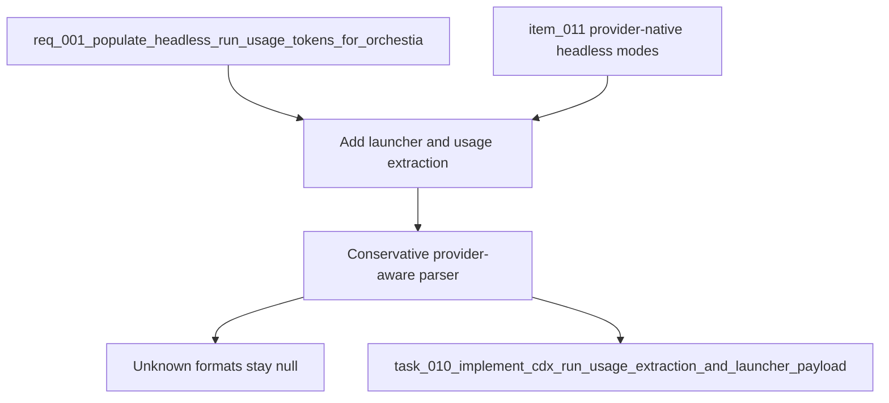

## item_010_populate_cdx_run_usage_and_launcher_payload - Populate cdx run usage and launcher payload
> From version: 0.7.0
> Schema version: 1.0
> Status: Done
> Understanding: 92
> Confidence: 82
> Progress: 100
> Complexity: Medium
> Theme: Headless automation
> Reminder: Update status/understanding/confidence/progress and linked request/task references when you edit this doc.

# Problem
- Orchestia needs `cdx run --json` to return a self-identifying cdx-manager payload and normalized token usage when provider output exposes it.
- v0.7.0 already returns a `usage` object, but every token field is currently `null`.
- Once provider-native headless modes expose stable JSON or JSONL artifacts, cdx-manager should parse those artifacts conservatively and keep nulls when usage cannot be trusted.

# Scope
- In: Add `launcher: "cdx"` to the top-level `cdx run --json` result payload.
- In: Add a small provider-aware usage extraction module for headless run artifacts.
- In: Parse only known machine-readable usage shapes from provider stdout artifacts.
- In: Preserve the existing nullable shape: `input_tokens`, `output_tokens`, `reasoning_tokens`, `total_tokens`.
- In: Return all-null usage when the provider is unsupported, the artifact is missing, parsing fails, or the output shape is not verified.
- In: Add unit tests for extraction and integration-style CLI tests for final payload behavior.
- Out: Switching provider launch modes; that is owned by `item_011_use_provider_native_headless_launch_modes_for_cdx_run`.
- Out: Free-text token parsing without real provider fixture coverage.
- Out: Changing `cdx select` reason text or selection policy.

# Acceptance criteria
- AC1: `cdx run --json` includes top-level `launcher: "cdx"` on success and structured failure payloads where a run result envelope is produced.
- AC2: `usage` is populated from verified provider artifact formats when token data is available.
- AC3: `usage` remains all-null when token data is unavailable, unknown, malformed, or unsupported.
- AC4: Claude usage extraction is covered with JSON or JSONL fixtures that specify whether values are cumulative or deltas.
- AC5: Codex usage extraction is covered only with verified `codex exec --json` fixtures or equivalent current CLI output.
- AC6: The parser avoids broad text regexes unless backed by real provider fixtures and narrow enough to avoid false positives.
- AC7: Tests use `unittest` discovery and the repo's local import pattern.
- AC8: Existing `cdx run --json` output fields remain backward compatible, with only additive fields or non-null usage values.

# AC Traceability
- request-AC1 -> This backlog slice. Proof: `launcher: "cdx"`.
- request-AC2 -> This backlog slice. Proof: normalized token extraction.
- request-AC3 -> This backlog slice. Proof: all-null fallback behavior.
- request-AC4 -> This backlog slice. Proof: conservative parser boundaries.
- request-AC5 -> This backlog slice. Proof: Claude fixture behavior.
- request-AC6 -> This backlog slice. Proof: Codex fixture behavior.
- request-AC7 -> This backlog slice. Proof: end-to-end CLI payload test.
- request-AC8 -> This backlog slice. Proof: unittest-based coverage.
- request-AC9 -> This backlog slice. Proof: excludes selection string changes.

# Decision framing
- Product framing: Consider
- Product signals: Orchestia wants stable token accounting without provider-specific artifact parsing.
- Product follow-up: Confirm which token fields the supervisor persists and which can remain null per provider.
- Architecture framing: Required
- Architecture signals: parser trust boundaries, provider artifact schemas, nullable usage contract, and additive JSON envelope changes.
- Architecture follow-up: Document provider fixture examples once collected.

# Links
- Product brief(s): (none yet)
- Architecture decision(s): (none yet)
- Request: `req_001_populate_headless_run_usage_tokens_for_orchestia`
- Depends on: `item_011_use_provider_native_headless_launch_modes_for_cdx_run`
- Primary task(s): `task_010_implement_cdx_run_usage_extraction_and_launcher_payload`

# AI Context
- Summary: Add the cdx launcher identifier and conservative provider-aware token usage extraction to the `cdx run --json` payload.
- Keywords: cdx run, usage, tokens, launcher, JSON payload, run_usage, Claude JSONL, Codex JSONL, Orchestia
- Use when: Implementing the result payload and token extraction layer after provider-native headless artifacts are available.
- Skip when: Work is about changing provider launch commands rather than parsing their output.

# Priority
- Impact: High
- Urgency: Medium

# Notes
- This item may be implemented after `item_011` or in the same PR if the provider-native output shapes are covered by fixtures.
- Implemented alongside `item_011_use_provider_native_headless_launch_modes_for_cdx_run`; usage extraction is limited to supported Codex/Claude JSON or JSONL shapes and returns nulls for unsupported or malformed artifacts.
