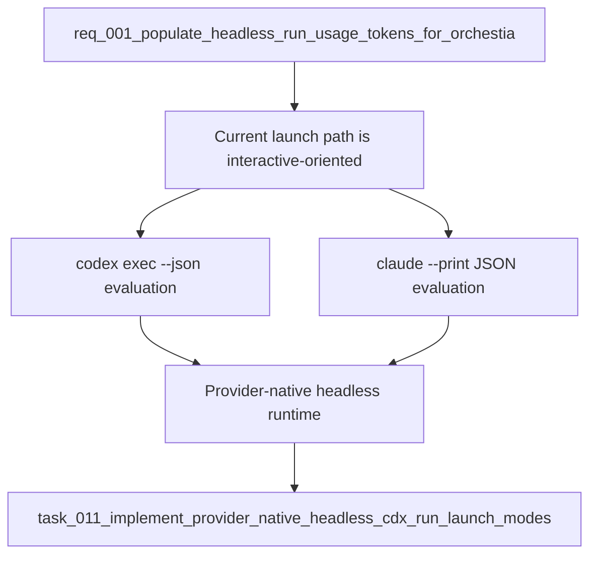

## item_011_use_provider_native_headless_launch_modes_for_cdx_run - Use provider native headless launch modes for cdx run
> From version: 0.7.0
> Schema version: 1.0
> Status: Done
> Understanding: 90
> Confidence: 78
> Progress: 100
> Complexity: High
> Theme: Headless automation
> Reminder: Update status/understanding/confidence/progress and linked request/task references when you edit this doc.

# Problem
- `cdx run --json` is intended to be the stable subprocess contract for Orchestia, but local fixture runs showed that the current provider launch path is still interactive-oriented.
- Codex currently fails in non-TTY mode with `stdin is not a terminal` when launched through the existing `cdx run` command path.
- Claude currently succeeds, but its captured stdout only contains the final text response and does not expose token usage metadata.
- cdx-manager should use provider-native non-interactive modes for headless runs before promising reliable usage extraction.

# Scope
- In: Add a provider-runtime path for headless `cdx run` that uses provider-native non-interactive commands where available.
- In: Evaluate and support `codex exec --json` for Codex headless runs while preserving session auth isolation through `CODEX_HOME`.
- In: Evaluate and support `claude --print --output-format json` or `stream-json` for Claude headless runs while preserving session auth isolation and launch settings.
- In: Continue writing provider stdout and stderr to cdx artifact files, never directly to cdx stdout in `--json` mode.
- In: Preserve the existing cdx result envelope, run metadata, timeout behavior, artifact paths, and cdx/provider error source split.
- Out: Changing interactive `cdx <session>` launches.
- Out: Implementing token parsing itself, except where minimal inspection is needed to prove the headless provider output shape.
- Out: Changing `cdx select` ranking or public reason text.
- Out: Adding Orchestia-specific SDK code.

# Acceptance criteria
- AC1: `cdx run --json` can execute a short Codex prompt without requiring a TTY by using a non-interactive Codex launch path.
- AC2: `cdx run --json` can execute a short Claude prompt through a non-interactive Claude launch path.
- AC3: cdx stdout remains reserved for the final cdx JSON payload; provider JSON, JSONL, text, or errors are captured only in artifact files.
- AC4: Existing success and failure payload fields remain stable: `run_id`, session, provider, cwd, exit code, duration, transcript path, stdout path, stderr path, warnings, and error envelope.
- AC5: Launch settings still map correctly for model, permission, and reasoning effort/power in the provider-native headless modes.
- AC6: Timeout and provider-start failures still return structured `cdx run --json` errors with artifact paths when available.
- AC7: Tests cover Codex and Claude headless command construction, JSON-only stdout behavior, provider failure behavior, and artifact capture.

# AC Traceability
- request-AC2 -> This backlog slice. Proof: provider output must expose known usage shapes before usage can be populated.
- request-AC3 -> This backlog slice. Proof: unknown or unsupported output still leaves usage null.
- request-AC6 -> This backlog slice. Proof: Codex support depends on the actual headless launch mode.
- request-AC10 -> This backlog slice. Proof: provider event streams must remain captured in artifacts.

# Decision framing
- Product framing: Required
- Product signals: Orchestia depends on `cdx run --json` as a subprocess contract, not on provider-specific CLIs.
- Product follow-up: Confirm whether switching provider launch mode changes any expected prompt behavior for Orchestia.
- Architecture framing: Required
- Architecture signals: provider-runtime launch modes, stream capture, command construction, auth isolation, and JSON stdout boundaries.
- Architecture follow-up: Decide whether provider-native headless mode should become mandatory for all providers or only for providers with verified support.

# Links
- Product brief(s): (none yet)
- Architecture decision(s): (none yet)
- Request: `req_001_populate_headless_run_usage_tokens_for_orchestia`
- Primary task(s): `task_011_implement_provider_native_headless_cdx_run_launch_modes`

# AI Context
- Summary: Switch headless `cdx run --json` provider execution to provider-native non-interactive modes so Orchestia gets reliable subprocess behavior and inspectable provider artifacts.
- Keywords: cdx run, headless, codex exec, claude print, output-format json, provider runtime, Orchestia, non-TTY
- Use when: Planning the foundational provider-runtime work needed before usage extraction can be reliable.
- Skip when: Work is only about parsing already-captured usage fields or adding the launcher field.

# Priority
- Impact: High
- Urgency: High

# Notes
- Local fixture evidence on 2026-05-29:
  - Codex through current `cdx run` path failed with `stdin is not a terminal`.
  - Claude through current `cdx run` path returned plain text stdout only.
- This item should be delivered before or alongside `item_010_populate_cdx_run_usage_and_launcher_payload`, because usage extraction depends on stable provider output.
- Implemented by adding a dedicated headless launch builder that uses `codex exec --json` for Codex and `claude --print --output-format json` for Claude while preserving provider stream artifact capture.
