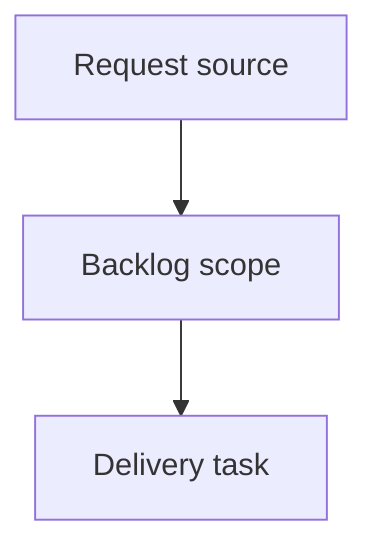

## item_012_support_logics_manager_suggestions_and_update_notices - Support logics-manager suggestions and update notices
> From version: 0.7.6
> Schema version: 1.0
> Status: Done
> Understanding: 90%
> Confidence: 85%
> Progress: 100%
> Complexity: High
> Theme: Operator workflow and runtime integration
> Reminder: Update status/understanding/confidence/progress and linked request/task references when you edit this doc.

# Problem
When `logics-manager` is available, `cdx` should help assistants use it for Logics workflow navigation, validation, viewer/focus workflows, and quick operational commands.
`cdx` should surface update suggestions for `cdx-manager`, RTK, and/or `logics-manager` when a newer version can be detected reliably.

# Scope
- In: detect `logics-manager` availability in health/diagnostics paths.
- In: inject concise Logics workflow guidance into assistant launch prompts when `logics-manager` is available or the session pins `--logics on`.
- In: persist and render `--logics on|off` alongside RTK and other launch settings.
- In: support multi-tool update notices for `cdx-manager` and `logics-manager`.
- In: keep RTK guidance as a launch preference without forcing shell execution through RTK.
- Out: making `logics-manager` or RTK hard runtime dependencies.
- Out: emitting RTK update warnings without a reliable version source.

# Acceptance criteria
- AC1: `cdx` detects `logics-manager` availability and reports it in diagnostics.
- AC2: Assistant launch prompts include Logics usage guidance by default when `logics-manager` is available, and sessions can explicitly disable it.
- AC3: The guidance mentions established and new high-value commands, including viewer/focus workflows, status, health, audit/lint, flow, search/read/list, context-pack, and MCP surfaces.
- AC4: Launch configuration displays and persists the Logics preference alongside RTK.
- AC5: Update warnings can represent multiple tools and include `logics-manager` when a newer version can be checked reliably.
- AC6: RTK update suggestions are considered only when the version source is explicit enough to avoid false positives.

# AC Traceability
- request-AC1 -> This backlog slice. Proof: AC1: `cdx` detects `logics-manager` availability and reports it in diagnostics.
- request-AC2 -> This backlog slice. Proof: AC2: Assistant launch prompts include Logics usage guidance by default when `logics-manager` is available, and sessions can explicitly disable it.
- request-AC3 -> This backlog slice. Proof: AC3: The guidance mentions established and new high-value commands, including viewer/focus workflows, status, health, audit/lint, flow, search/read/list, context-pack, and MCP surfaces.
- request-AC4 -> This backlog slice. Proof: AC4: Launch configuration displays and persists the Logics preference alongside RTK.
- request-AC5 -> This backlog slice. Proof: AC5: Update warnings can represent multiple tools and include `logics-manager` when a newer version can be checked reliably.
- request-AC6 -> This backlog slice. Proof: AC6: RTK update suggestions are considered only when the version source is explicit enough to avoid false positives.

# Decision framing
- Product framing: Not needed
- Product signals: operator workflow guidance for assistant launches.
- Product follow-up: README and release notes are sufficient product-facing documentation for this slice.
- Architecture framing: Required
- Architecture signals: optional companion tooling, launch prompt injection, update checks, no hard runtime dependency.
- Architecture follow-up: Keep update warnings conservative when version sources are uncertain.

# Links
- Product brief(s): (none yet)
- Architecture decision(s): `adr_003_logics_and_companion_tool_launch_guidance`
- Request: `logics/request/req_002_support_logics_manager_suggestions_and_update_notices.md`
- Primary task(s): `task_012_support_logics_manager_suggestions_and_update_notices`

# AI Context
- Summary: Support logics-manager suggestions and update notices
- Keywords: backlog-groom, request, support logics-manager suggestions and update notices, bounded slice
- Use when: Use when implementing or reviewing the delivery slice for Support logics-manager suggestions and update notices.
- Skip when: Skip when the change is unrelated to this delivery slice or its linked request.

# Priority
- Impact: Medium
- Urgency: Medium

# Notes
- Hybrid rationale: Derived from request `req_002_support_logics_manager_suggestions_and_update_notices` and kept bounded to one coherent delivery slice.
- Source file: `logics/request/req_002_support_logics_manager_suggestions_and_update_notices.md`.
- Generated locally by logics-manager.
- Delivered in release `0.7.8`.
- Validation evidence:
  - `npm run lint`
  - `npm test`
  - `python -m unittest discover -s test -p 'test_*_py.py'`
  - `python3 -m logics_manager lint --require-status`

# Tasks
- `task_012_support_logics_manager_suggestions_and_update_notices`
