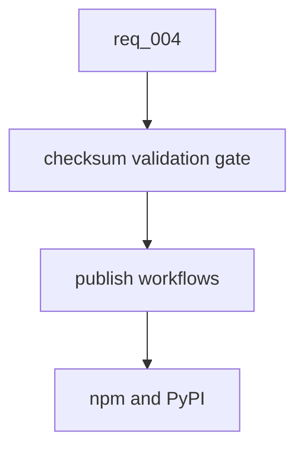

## item_013_release_checksum_governance_gate - Release checksum governance gate
> From version: 0.7.8
> Schema version: 1.0
> Status: Ready
> Understanding: 95%
> Confidence: 90%
> Progress: 0%
> Complexity: Medium
> Theme: Release governance
> Reminder: Update status/understanding/confidence/progress and linked request/task references when you edit this doc.

# Problem
The `0.7.8` release showed that a release tag/package can be published before its own GitHub archive checksums are present in `checksums/release-archives.json`.
Future publication should fail before npm or PyPI upload if the tagged version is missing checksum metadata.

# Scope
- In: add a validation script or command that checks version consistency and checksum presence for the current release version.
- In: wire that validation into npm/PyPI publication workflows before registry upload.
- In: document the required release ordering for tag alignment and checksum generation.
- In: update README, release/changelog guidance, Logics docs, and any helper/usage text that describes release validation.
- Out: rewriting the already-published `0.7.8` release.
- Out: changing the checksum file schema unless required by validation.

# Acceptance criteria
- AC1: Release validation fails when the current release version lacks a `vX.Y.Z` entry in `checksums/release-archives.json`.
- AC2: Validation requires both `github_tarball_sha256` and `github_zip_sha256`.
- AC3: npm and PyPI publication workflows run the validation before publishing.
- AC4: Release documentation explains version bump, checksum generation, tag alignment, and publication ordering.
- AC5: README, changelog/release guidance, Logics docs, and helper output references are updated where they describe release validation or publication order.

# AC Traceability
- request-AC1 -> This backlog slice. Proof: release checksum validation.
- request-AC2 -> This backlog slice. Proof: publish workflow gate.
- request-AC3 -> This backlog slice. Proof: release ordering docs.
- request-AC12 -> This backlog slice. Proof: README/changelog/Logics/helper documentation alignment for release validation.

# Decision framing
- Product framing: Not needed
- Product signals: safer registry publication and installer integrity.
- Product follow-up: mention in release checklist/changelog guidance.
- Architecture framing: Consider
- Architecture signals: release artifact integrity and tag/archive determinism.
- Architecture follow-up: keep checksum validation deterministic and independent from network when possible.

# Links
- Product brief(s): (none yet)
- Architecture decision(s): (none yet)
- Request: `req_004_harden_release_governance_and_add_logics_viewer_command`
- Primary task(s): (none yet)

# AI Context
- Summary: Add a release gate that prevents npm/PyPI publication when current-version GitHub archive checksums are missing.
- Keywords: release, checksums, github archive, npm publish, pypi publish, validation gate
- Use when: Implementing release validation or modifying publication workflows.
- Skip when: Work is only about runtime CLI behavior.

# Priority
- Impact: High
- Urgency: High

# Tasks
- `task_013_release_checksum_governance_gate`
