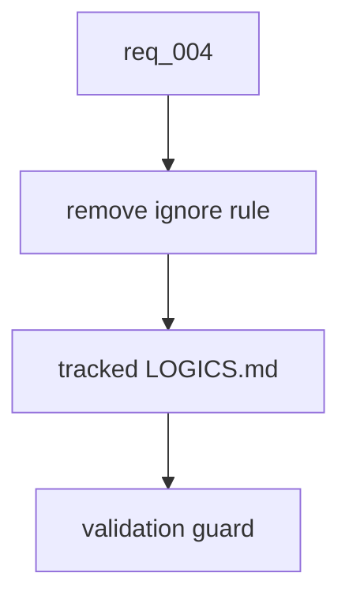

## item_014_version_logics_md_as_project_guidance - Version LOGICS.md as project guidance
> From version: 0.7.8
> Schema version: 1.0
> Status: Done
> Understanding: 100%
> Confidence: 95%
> Progress: 100%
> Complexity: Low
> Theme: Workflow governance
> Reminder: Update status/understanding/confidence/progress and linked request/task references when you edit this doc.

# Problem
`LOGICS.md` is now important repository guidance, but `.gitignore` still marks it as ignored.
Future contributors should see and validate the same local Logics instructions.

# Scope
- In: remove `LOGICS.md` from `.gitignore`.
- In: keep `LOGICS.md` tracked.
- In: add a lightweight validation guard that fails if `LOGICS.md` is missing or omits core Logics command families.
- In: update README, CLI/help references, Logics docs, and changelog/release guidance if they mention project instruction files.
- Out: changing generated `AGENTS.md` behavior.
- Out: vendoring Logics runtime artifacts.

# Acceptance criteria
- AC1: `LOGICS.md` is removed from `.gitignore`.
- AC2: `LOGICS.md` remains tracked in git.
- AC3: Validation fails if `LOGICS.md` is missing.
- AC4: Validation checks for core command families: `status`, `health`, `audit`, `lint`, `view`, `sync`, `flow`, and `mcp`.
- AC5: README, CLI/help references, Logics docs, and release guidance stay aligned with the decision to version `LOGICS.md`.

# AC Traceability
- request-AC4 -> This backlog slice. Proof: `.gitignore` cleanup and `LOGICS.md` validation guard.
- request-AC11 -> This backlog slice. Proof: focused validation/test for tracking expectations.
- request-AC12 -> This backlog slice. Proof: documentation/help alignment for versioned project guidance.

# Decision framing
- Product framing: Not needed
- Product signals: shared operator instructions.
- Product follow-up: none.
- Architecture framing: Not needed
- Architecture signals: repository governance only.
- Architecture follow-up: none.

# Links
- Product brief(s): (none yet)
- Architecture decision(s): (none yet)
- Request: `req_004_harden_release_governance_and_add_logics_viewer_command`
- Primary task(s): `task_014_version_logics_md_as_project_guidance`

# AI Context
- Summary: Make LOGICS.md a normal tracked project instruction file and validate that its core Logics guidance remains present.
- Keywords: LOGICS.md, gitignore, validation, Logics commands, project guidance
- Use when: Updating repository instruction files or validation scripts.
- Skip when: Work is only about release checksums or CLI runtime behavior.

# Priority
- Impact: Medium
- Urgency: High

# Notes
- Delivered as repository guidance validation.
- Validation evidence:
  - `python3 scripts/verify_project_docs.py`
  - `npm run lint`
  - `logics-manager lint --require-status`
  - `logics-manager audit`

# Tasks
- `task_014_version_logics_md_as_project_guidance`
