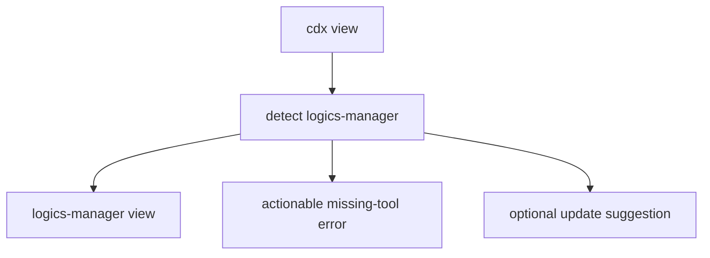

## item_015_add_cdx_view_logics_viewer_delegation - Add cdx view Logics viewer delegation
> From version: 0.7.8
> Schema version: 1.0
> Status: Done
> Understanding: 100%
> Confidence: 95%
> Progress: 100%
> Complexity: Medium
> Theme: Operator workflow
> Reminder: Update status/understanding/confidence/progress and linked request/task references when you edit this doc.

# Problem
Users working from `cdx-manager` should be able to open the Logics browser/focus viewer through `cdx view` instead of remembering the companion `logics-manager view` command.
The command should remain a thin delegation layer and should not make `logics-manager` mandatory for ordinary `cdx` use.

# Scope
- In: add `cdx view` command routing and help text.
- In: delegate to `logics-manager view` from the current working directory when available.
- In: support `cdx view --json` for diagnostics without opening the viewer.
- In: surface a non-blocking update suggestion when a newer `logics-manager` version is reliably detectable.
- In: document the command in README.
- In: update CLI help, JSON/help examples, changelog/release guidance, and Logics docs for `cdx view`.
- Out: implementing viewer functionality inside `cdx-manager`.
- Out: supporting unknown `logics-manager view` flags without explicit tests.

# Acceptance criteria
- AC1: `cdx view` delegates to `logics-manager view` from the caller's current working directory.
- AC2: Missing `logics-manager` produces a clear actionable error.
- AC3: `cdx view --json` returns structured availability, command, update, and failure details without opening the viewer.
- AC4: A reliable newer `logics-manager` version produces a non-blocking update suggestion.
- AC5: README and CLI help document `cdx view`.
- AC6: Tests cover delegation, missing tool behavior, JSON mode, and update suggestion behavior.
- AC7: Changelog/release guidance, Logics docs, and helper output examples are updated for `cdx view` where applicable.

# AC Traceability
- request-AC7 -> This backlog slice. Proof: `cdx view` delegation and docs.
- request-AC8 -> This backlog slice. Proof: missing-tool error path.
- request-AC9 -> This backlog slice. Proof: companion update suggestion.
- request-AC10 -> This backlog slice. Proof: JSON diagnostic mode.
- request-AC11 -> This backlog slice. Proof: focused `cdx view` tests.
- request-AC12 -> This backlog slice. Proof: README/help/changelog/Logics/helper documentation alignment for `cdx view`.

# Decision framing
- Product framing: Not needed
- Product signals: operator workflow shortcut for Logics viewer.
- Product follow-up: README command examples.
- Architecture framing: Already covered
- Architecture signals: optional companion tool delegation and update notices.
- Architecture follow-up: keep `cdx view` as a thin wrapper around `logics-manager view`.

# Links
- Product brief(s): (none yet)
- Architecture decision(s): `adr_003_logics_and_companion_tool_launch_guidance`
- Request: `req_004_harden_release_governance_and_add_logics_viewer_command`
- Primary task(s): `task_015_add_cdx_view_logics_viewer_delegation`

# AI Context
- Summary: Add `cdx view` as a thin, optional wrapper around `logics-manager view`, including JSON diagnostics and update hints.
- Keywords: cdx view, logics-manager view, viewer, update suggestion, companion tool
- Use when: Implementing or testing Logics viewer delegation.
- Skip when: Work is only about release governance or command modularization.

# Priority
- Impact: Medium
- Urgency: Medium

# Notes
- Delivered as optional companion-tool delegation.
- Validation evidence:
  - `node bin/python-runner.js -m unittest discover -s test -p test_cli_py.py -k view`
  - `npm run lint`
  - `logics-manager lint --require-status`
  - `logics-manager audit`

# Tasks
- `task_015_add_cdx_view_logics_viewer_delegation`
