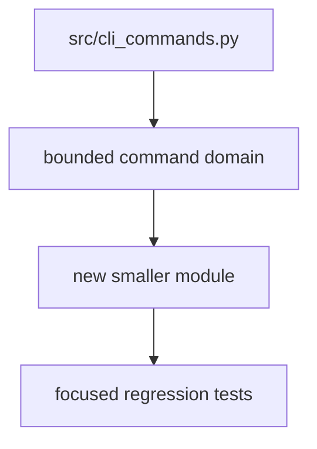

## item_016_modularize_cli_command_domains - Modularize CLI command domains
> From version: 0.7.8
> Schema version: 1.0
> Status: Ready
> Understanding: 90%
> Confidence: 85%
> Progress: 0%
> Complexity: High
> Theme: Code maintainability
> Reminder: Update status/understanding/confidence/progress and linked request/task references when you edit this doc.

# Problem
`src/cli_commands.py` is the largest change-risk hotspot in the repository.
It mixes argument parsers, command handlers, JSON payload helpers, launch settings, status/history, run/select, export/import, update, and context commands.
The next maintainability step should extract one coherent command domain without changing behavior.

# Scope
- In: extract at least one bounded command domain from `src/cli_commands.py`.
- In: preserve existing imports, command routing, JSON envelopes, and tests.
- In: prefer a first slice with clear boundaries such as `export/import`, `run/select`, or status/history.
- In: add or keep focused tests proving moved handlers behave identically.
- In: update README, CLI help, helper output examples, changelog/release guidance, and Logics docs if the moved domain's documented surface changes.
- Out: broad CLI redesign.
- Out: changing public usage strings unless required for `cdx view`.
- Out: extracting every command domain in one pass.

# Acceptance criteria
- AC1: One command domain is extracted from `src/cli_commands.py` into a smaller module.
- AC2: Existing CLI behavior and JSON contracts for that domain are preserved.
- AC3: Handler routing remains easy to audit from `src/cli.py` / `src/cli_commands.py`.
- AC4: Focused tests cover the moved domain after extraction.
- AC5: `npm run lint` and `npm test` pass after the extraction.
- AC6: README, CLI help, helper output examples, changelog/release guidance, and Logics docs remain aligned for the moved command domain.

# AC Traceability
- request-AC5 -> This backlog slice. Proof: first command-domain extraction.
- request-AC6 -> This backlog slice. Proof: routing clarity and focused tests.
- request-AC11 -> This backlog slice. Proof: modularization regression tests.
- request-AC12 -> This backlog slice. Proof: documentation/help alignment for the moved command domain.

# Decision framing
- Product framing: Not needed
- Product signals: lower future change risk.
- Product follow-up: none.
- Architecture framing: Consider
- Architecture signals: command module boundaries and import dependency direction.
- Architecture follow-up: keep `cli_commands.py` as a compatibility facade during early extractions.

# Links
- Product brief(s): (none yet)
- Architecture decision(s): (none yet)
- Request: `req_004_harden_release_governance_and_add_logics_viewer_command`
- Primary task(s): (none yet)

# AI Context
- Summary: Reduce `src/cli_commands.py` risk by extracting one coherent command domain while preserving behavior and tests.
- Keywords: cli_commands, modularization, command handlers, parser extraction, regression tests
- Use when: Planning or implementing the next CLI command extraction.
- Skip when: Work is only about release checksums, LOGICS.md, or `cdx view`.

# Priority
- Impact: Medium
- Urgency: Medium

# Tasks
- `task_016_modularize_cli_command_domains`
