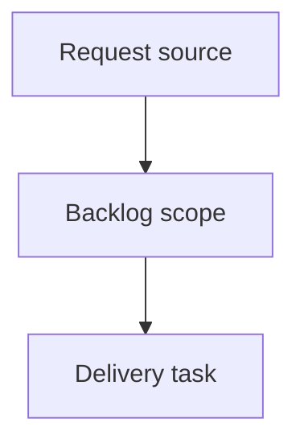

## item_017_add_observable_assistant_run_registry_and_structured_task_reports - Add observable assistant run registry and structured task reports
> From version: 0.8.0
> Schema version: 1.0
> Status: Done
> Understanding: 90%
> Confidence: 85%
> Progress: 100%
> Complexity: High
> Theme: Operator workflow and runtime integration
> Reminder: Update status/understanding/confidence/progress and linked request/task references when you edit this doc.

# Problem
CDX headless assistant runs should become observable jobs, not only blocking subprocess calls that return a final JSON payload.
Operators and upstream tools need to know when a run is queued, running, completed, failed, timed out, or cancelled.
Specialized assistant workflows such as code review should produce structured reports that can be consumed by Logics or another workflow layer without scraping raw transcripts.

# Scope
- In:
  - one coherent delivery slice from the source request
- Out:
  - unrelated sibling slices that should stay in separate backlog items instead of widening this doc

# Acceptance criteria
- AC1: Headless runs are persisted before provider execution starts with a stable `run_id`, `status: running`, session/provider metadata, cwd, timestamps, and artifact paths.
- AC2: Headless runs transition to a terminal status on success, provider failure, timeout, cancellation, or detected stale process.
- AC3: A caller can list recent runs and fetch a single run status as JSON without parsing transcripts or launch history text.
- AC4: A caller can fetch a completed run report as JSON, including final result metadata, usage, errors, artifact paths, and any structured task output.
- AC5: Existing `cdx run --json` consumers remain compatible and still receive exactly one final JSON object on stdout.
- AC6: A first `code-review` run kind can produce a structured report with findings, severities, file/line references when available, summary, and recommended next steps.
- AC7: The code-review report shape is documented and stable enough for Logics to consume and offer report-to-workflow actions.
- AC8: Tests cover run lifecycle persistence, stale PID cleanup, status/report CLI JSON output, final payload compatibility, and code-review report parsing or fallback behavior.

# AC Traceability
- request-AC1 -> This backlog slice. Proof: AC1: Headless runs are persisted before provider execution starts with a stable `run_id`, `status: running`, session/provider metadata, cwd, timestamps, and artifact paths.
- request-AC2 -> This backlog slice. Proof: AC2: Headless runs transition to a terminal status on success, provider failure, timeout, cancellation, or detected stale process.
- request-AC3 -> This backlog slice. Proof: AC3: A caller can list recent runs and fetch a single run status as JSON without parsing transcripts or launch history text.
- request-AC4 -> This backlog slice. Proof: AC4: A caller can fetch a completed run report as JSON, including final result metadata, usage, errors, artifact paths, and any structured task output.
- request-AC5 -> This backlog slice. Proof: AC5: Existing `cdx run --json` consumers remain compatible and still receive exactly one final JSON object on stdout.
- request-AC6 -> This backlog slice. Proof: AC6: A first `code-review` run kind can produce a structured report with findings, severities, file/line references when available, summary, and recommended next steps.
- request-AC7 -> This backlog slice. Proof: AC7: The code-review report shape is documented and stable enough for Logics to consume and offer report-to-workflow actions.
- request-AC8 -> This backlog slice. Proof: AC8: Tests cover run lifecycle persistence, stale PID cleanup, status/report CLI JSON output, final payload compatibility, and code-review report parsing or fallback behavior.

# Decision framing
- Product framing: Not needed
- Product signals: (none detected)
- Product follow-up: No product brief follow-up is expected based on current signals.
- Architecture framing: Not needed
- Architecture signals: (none detected)
- Architecture follow-up: No architecture decision follow-up is expected based on current signals.

# Links
- Product brief(s): (none yet)
- Architecture decision(s): (none yet)
- Request: `logics/request/req_005_add_observable_assistant_run_registry_and_structured_task_reports.md`
- Primary task(s): (none yet)

# AI Context
- Summary: Add observable assistant run registry and structured task reports
- Keywords: backlog-groom, request, add observable assistant run registry and structured task reports, bounded slice
- Use when: Use when implementing or reviewing the delivery slice for Add observable assistant run registry and structured task reports.
- Skip when: Skip when the change is unrelated to this delivery slice or its linked request.

# Priority
- Impact:
- Urgency:

# Notes
- Hybrid rationale: Derived from request `req_005_add_observable_assistant_run_registry_and_structured_task_reports` and kept bounded to one coherent delivery slice.
- Source file: `logics/request/req_005_add_observable_assistant_run_registry_and_structured_task_reports.md`.
- Generated locally by logics-manager.
- Task `task_017_add_observable_assistant_run_registry_and_structured_task_reports` was finished via `logics-manager flow finish task` on 2026-06-11.

# Tasks
- `task_017_add_observable_assistant_run_registry_and_structured_task_reports`
