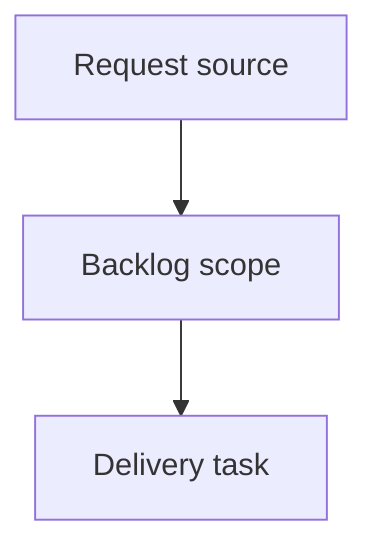

## item_018_keep_codex_fast_mode_opt_in_and_normalize_launch_settings - Keep Codex Fast mode opt-in and normalize launch settings
> From version: 0.9.2
> Schema version: 1.0
> Status: Ready
> Understanding: 90%
> Confidence: 85%
> Progress: 0%
> Complexity: High
> Theme: Operator workflow and runtime integration
> Reminder: Update status/understanding/confidence/progress and linked request/task references when you edit this doc.

# Problem
`cdx-manager` must keep OpenAI Codex Fast mode disabled by default after users upgrade to newer Codex CLI releases.
Fast mode must be strictly opt-in: `cdx` must not enable the Codex Fast service tier unless the user explicitly asks for it.
`cdx` launch settings must use current Codex CLI semantics so stored `--fast off` preferences reliably prevent unintended Fast billing or credit consumption.
`cdx` must normalize its persisted launch settings so `power`, `fast`, permissions, and headless/runtime behavior mean the same thing across supported Codex CLI versions.

# Scope
- In:
  - one coherent delivery slice from the source request
- Out:
  - unrelated sibling slices that should stay in separate backlog items instead of widening this doc

# Acceptance criteria
- AC1: New Codex sessions created by `cdx` do not launch with Codex `service_tier = "fast"` unless the user explicitly configured Fast on.
- AC2: `cdx set <session> --fast off`, default launch state, and any safe-reset/unset flow actively prevent Codex Fast service tier usage, including when a session `CODEX_HOME/config.toml` already contains `service_tier = "fast"`.
- AC3: `cdx set <session> --fast on` uses current Codex semantics for Codex sessions instead of only lowering `model_reasoning_effort`, or the setting is renamed/split so Codex Fast tier and low reasoning effort are not conflated.
- AC4: Provider-neutral "low effort" behavior remains available through `--power low` and does not implicitly opt users into Codex Fast tier.
- AC5: Interactive and headless Codex launches use explicit, documented Codex CLI/config overrides for Fast-on and Fast-off behavior.
- AC6: Persisted `power` values for Codex align with documented Codex `model_reasoning_effort` values: support `minimal|low|medium|high|xhigh` where compatible, and remove, reject, or migrate undocumented `max` for Codex.
- AC7: `cdx run --power` and `cdx run --reasoning-effort` use the same Codex-compatible reasoning effort contract as persisted launch settings, or clearly document and enforce why headless has a narrower contract.
- AC8: Session selection and priority ranking handle `minimal`, `low`, `medium`, `high`, and `xhigh` deterministically without treating unknown values as silently equivalent to `low`.
- AC9: `cdx unset --all` and related unset/default flows preserve the product safety rule that Codex Fast remains off by default, rather than falling through to an unsafe provider or stale session config default.
- AC10: README/help/config output explain that Codex Fast mode is opt-in, more expensive in credits, and disabled by default under `cdx`; they also distinguish Codex Fast tier from reasoning effort.
- AC11: Regression tests cover Codex launch args for default Fast-off, explicit Fast-off, explicit Fast-on, coexistence with `--power minimal|low|medium|high|xhigh`, rejection or migration of `max`, and interactive/headless parity.
- AC12: Any migration handles existing session launch records where `fast=true` currently meant low effort, without silently turning on paid Codex Fast tier.

# AC Traceability
- request-AC1 -> This backlog slice. Proof: AC1: New Codex sessions created by `cdx` do not launch with Codex `service_tier = "fast"` unless the user explicitly configured Fast on.
- request-AC2 -> This backlog slice. Proof: AC2: `cdx set <session> --fast off`, default launch state, and any safe-reset/unset flow actively prevent Codex Fast service tier usage, including when a session `CODEX_HOME/config.toml` already contains `service_tier = "fast"`.
- request-AC3 -> This backlog slice. Proof: AC3: `cdx set <session> --fast on` uses current Codex semantics for Codex sessions instead of only lowering `model_reasoning_effort`, or the setting is renamed/split so Codex Fast tier and low reasoning effort are not conflated.
- request-AC4 -> This backlog slice. Proof: AC4: Provider-neutral "low effort" behavior remains available through `--power low` and does not implicitly opt users into Codex Fast tier.
- request-AC5 -> This backlog slice. Proof: AC5: Interactive and headless Codex launches use explicit, documented Codex CLI/config overrides for Fast-on and Fast-off behavior.
- request-AC6 -> This backlog slice. Proof: AC6: Persisted `power` values for Codex align with documented Codex `model_reasoning_effort` values: support `minimal|low|medium|high|xhigh` where compatible, and remove, reject, or migrate undocumented `max` for Codex.
- request-AC7 -> This backlog slice. Proof: AC7: `cdx run --power` and `cdx run --reasoning-effort` use the same Codex-compatible reasoning effort contract as persisted launch settings, or clearly document and enforce why headless has a narrower contract.
- request-AC8 -> This backlog slice. Proof: AC8: Session selection and priority ranking handle `minimal`, `low`, `medium`, `high`, and `xhigh` deterministically without treating unknown values as silently equivalent to `low`.
- request-AC9 -> This backlog slice. Proof: AC9: `cdx unset --all` and related unset/default flows preserve the product safety rule that Codex Fast remains off by default, rather than falling through to an unsafe provider or stale session config default.
- request-AC10 -> This backlog slice. Proof: AC10: README/help/config output explain that Codex Fast mode is opt-in, more expensive in credits, and disabled by default under `cdx`; they also distinguish Codex Fast tier from reasoning effort.
- request-AC11 -> This backlog slice. Proof: AC11: Regression tests cover Codex launch args for default Fast-off, explicit Fast-off, explicit Fast-on, coexistence with `--power minimal|low|medium|high|xhigh`, rejection or migration of `max`, and interactive/headless parity.
- request-AC12 -> This backlog slice. Proof: AC12: Any migration handles existing session launch records where `fast=true` currently meant low effort, without silently turning on paid Codex Fast tier.

# Decision framing
- Product framing: Not needed
- Product signals: (none detected)
- Product follow-up: No product brief follow-up is expected based on current signals.
- Architecture framing: Not needed
- Architecture signals: (none detected)
- Architecture follow-up: No architecture decision follow-up is expected based on current signals.

# Links
- Product brief(s): (none yet)
- Architecture decision(s): (none yet)
- Request: `logics/request/req_006_codex_fast_mode_opt_in_upgrade_safe.md`
- Primary task(s): (none yet)

# AI Context
- Summary: Keep Codex Fast mode opt-in and normalize launch settings
- Keywords: backlog-groom, request, keep codex fast mode opt-in and normalize launch settings, bounded slice
- Use when: Use when implementing or reviewing the delivery slice for Keep Codex Fast mode opt-in and normalize launch settings.
- Skip when: Skip when the change is unrelated to this delivery slice or its linked request.

# Priority
- Impact:
- Urgency:

# Notes
- Hybrid rationale: Derived from request `req_006_codex_fast_mode_opt_in_upgrade_safe` and kept bounded to one coherent delivery slice.
- Source file: `logics/request/req_006_codex_fast_mode_opt_in_upgrade_safe.md`.
- Generated locally by logics-manager.

# Tasks
- `task_018_keep_codex_fast_mode_opt_in_and_normalize_launch_settings`
