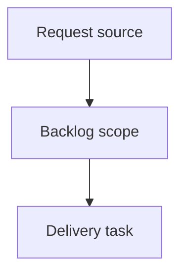

## item_019_harden_codex_multi_account_authentication_isolation - Harden Codex multi-account authentication isolation
> From version: 0.9.2
> Schema version: 1.0
> Status: Done
> Understanding: 90%
> Confidence: 85%
> Progress: 100%
> Complexity: High
> Theme: Operator workflow and runtime integration
> Reminder: Update status/understanding/confidence/progress and linked request/task references when you edit this doc.

# Problem
`cdx-manager` should harden Codex authentication isolation for users running multiple Codex accounts through separate `cdx` sessions.
A user reports that one of two Codex accounts regularly requires reauthentication; `cdx` should make it clear whether this is caused by local session handling, upstream Codex token behavior, or user/global auth state.
Reauthenticating one Codex session must not accidentally invalidate, overwrite, mask, or confuse the auth state of another Codex session.
`cdx` should provide enough diagnostics to inspect per-session Codex auth homes, account identity, local token presence, and live `codex login status` results without exposing secrets.

# Scope
- In:
  - one coherent delivery slice from the source request
- Out:
  - unrelated sibling slices that should stay in separate backlog items instead of widening this doc

# Acceptance criteria
- AC1: `cdx login <codex-session>` no longer performs an unconditional `codex logout` first, or the logout behavior becomes explicitly opt-in with clear documentation and tests.
- AC2: Reauthenticating one Codex session does not modify another session's isolated `auth.json`, session root, launch settings, or auth state.
- AC3: Session creation either makes global `~/.codex/auth.json` seeding explicit/diagnosable or provides a safer flow for users who need two different Codex accounts.
- AC4: A live Codex auth probe path is available and used by `cdx status --refresh`, `cdx doctor`, or a dedicated diagnostic command to compare local token presence against `codex login status` for each session.
- AC5: Launch authentication checks do not rely solely on token presence when the session is known or suspected stale; stale or invalid tokens produce an actionable "run cdx login <name>" result.
- AC6: Diagnostics report per-session Codex `authHome`, whether `auth.json` exists, decoded non-secret account identity/email when available, and live login status, without printing raw tokens.
- AC7: Tests cover two Codex sessions with distinct isolated auth homes and assert that login/logout/status/refresh operations for one session do not touch the other.
- AC8: Tests cover stale-token behavior where `auth.json` contains tokens but `codex login status` reports "Not logged in".
- AC9: README troubleshooting documents the multi-account auth model, the global-auth seeding caveat, and the safe procedure to create or repair two Codex account sessions.

# AC Traceability
- request-AC1 -> This backlog slice. Proof: AC1: `cdx login <codex-session>` no longer performs an unconditional `codex logout` first, or the logout behavior becomes explicitly opt-in with clear documentation and tests.
- request-AC2 -> This backlog slice. Proof: AC2: Reauthenticating one Codex session does not modify another session's isolated `auth.json`, session root, launch settings, or auth state.
- request-AC3 -> This backlog slice. Proof: AC3: Session creation either makes global `~/.codex/auth.json` seeding explicit/diagnosable or provides a safer flow for users who need two different Codex accounts.
- request-AC4 -> This backlog slice. Proof: AC4: A live Codex auth probe path is available and used by `cdx status --refresh`, `cdx doctor`, or a dedicated diagnostic command to compare local token presence against `codex login status` for each session.
- request-AC5 -> This backlog slice. Proof: AC5: Launch authentication checks do not rely solely on token presence when the session is known or suspected stale; stale or invalid tokens produce an actionable "run cdx login <name>" result.
- request-AC6 -> This backlog slice. Proof: AC6: Diagnostics report per-session Codex `authHome`, whether `auth.json` exists, decoded non-secret account identity/email when available, and live login status, without printing raw tokens.
- request-AC7 -> This backlog slice. Proof: AC7: Tests cover two Codex sessions with distinct isolated auth homes and assert that login/logout/status/refresh operations for one session do not touch the other.
- request-AC8 -> This backlog slice. Proof: AC8: Tests cover stale-token behavior where `auth.json` contains tokens but `codex login status` reports "Not logged in".
- request-AC9 -> This backlog slice. Proof: AC9: README troubleshooting documents the multi-account auth model, the global-auth seeding caveat, and the safe procedure to create or repair two Codex account sessions.

# Decision framing
- Product framing: Not needed
- Product signals: (none detected)
- Product follow-up: No product brief follow-up is expected based on current signals.
- Architecture framing: Not needed
- Architecture signals: (none detected)
- Architecture follow-up: No architecture decision follow-up is expected based on current signals.

# Links
- Product brief(s): (none yet)
- Architecture decision(s): (none yet)
- Request: `req_007_harden_codex_multi_account_auth_isolation`
- Primary task(s): `task_018_harden_codex_multi_account_authentication_isolation`

# AI Context
- Summary: Harden Codex multi-account authentication isolation
- Keywords: backlog-groom, request, harden codex multi-account authentication isolation, bounded slice
- Use when: Use when implementing or reviewing the delivery slice for Harden Codex multi-account authentication isolation.
- Skip when: Skip when the change is unrelated to this delivery slice or its linked request.

# Priority
- Impact:
- Urgency:

# Notes
- Hybrid rationale: Derived from request `req_007_harden_codex_multi_account_auth_isolation` and kept bounded to one coherent delivery slice.
- Source file: `logics/request/req_007_harden_codex_multi_account_auth_isolation.md`.
- Generated locally by logics-manager.
- Task `task_018_harden_codex_multi_account_authentication_isolation` was finished via `logics-manager flow finish task` on 2026-06-18.

# Tasks
- `task_018_harden_codex_multi_account_authentication_isolation`
