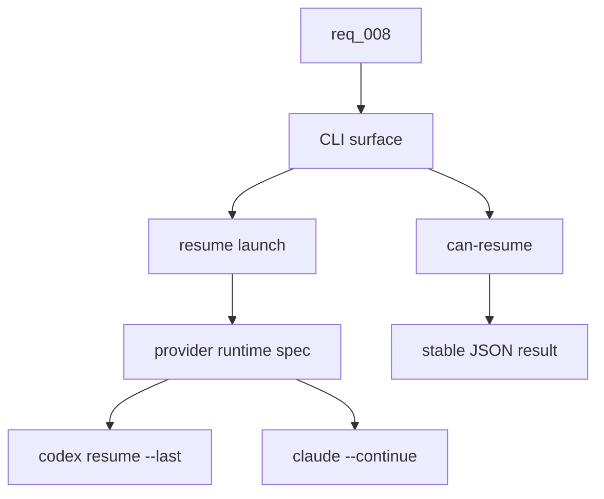

## item_020_add_provider_native_session_resume_commands - Add provider-native session resume commands
> From version: 0.9.3
> Schema version: 1.0
> Status: Done
> Understanding: 95%
> Confidence: 90%
> Progress: 100%
> Complexity: Medium
> Theme: Provider workflow
> Reminder: Update status/understanding/confidence/progress and linked request/task references when you edit this doc.

# Problem
- `cdx <name>` launches the right provider account, but users still need provider-specific knowledge to continue the previous conversation.
- Codex and Claude both expose native resume behavior, but their flags differ and should be hidden behind a provider-neutral `cdx` command surface.
- Operators and scripts need a dry capability check before starting an interactive resume.

# Scope
- In:
  - Add `cdx <name> -r` and `cdx <name> --resume` as launch modifiers for provider-native resume.
  - Add `cdx resume <name> [--json]` as the discoverable command form.
  - Add `cdx can-resume <name> [--json]` as a non-launching capability probe.
  - Route Codex resume through the session's isolated `CODEX_HOME` and provider launch preferences.
  - Route Claude resume through the session's isolated `HOME`, provider launch preferences, and current `cwd`.
  - Return explicit unsupported results for providers without verified native resume support.
  - Document command help, README command table, and JSON payloads.
- Out:
  - Building a full resume picker UI inside `cdx`.
  - Cross-provider handoff or transcript summarization; existing `cdx handoff` remains separate.
  - Headless `cdx run` continuation semantics.
  - Provider session archival, deletion, or fork management beyond preserving current native defaults.

# Acceptance criteria
- AC1: `cdx <name> -r` and `cdx <name> --resume` launch provider-native resume for an enabled known session.
- AC2: `cdx resume <name>` launches the same resume path and `cdx resume <name> --json` emits the standard success envelope after the interactive run exits.
- AC3: `cdx can-resume <name>` prints a concise human-readable capability result without launching the provider.
- AC4: `cdx can-resume <name> --json` emits a stable payload with `schema_version`, `ok`, `session`, `provider`, `resumable`, `strategy`, `reason`, and a redacted `command_preview`.
- AC5: Codex runtime builds `codex resume --last` under the named session's `CODEX_HOME`, applies configured model, reasoning effort, fast tier, permission, RTK, and Logics launch prompts where compatible, and keeps cwd scoping with `--cd`.
- AC6: Claude runtime builds `claude --continue` under the named session's isolated `HOME`, applies configured model, effort, permission, RTK, and Logics launch prompts where compatible, and keeps cwd scoping through process options.
- AC7: Resume capability for Antigravity and Ollama returns `resumable: false`, `reason: "not_supported"`, and resume launch fails with a user-facing recovery message instead of falling back to a normal launch.
- AC8: Missing sessions, disabled sessions, missing state, and unauthenticated sessions preserve existing error behavior before provider launch.
- AC9: Normal launch, login, logout, status, handoff, and headless run behavior remain unchanged when resume is not requested.
- AC10: Tests cover CLI parsing, provider launch spec construction, JSON can-resume payloads, unsupported providers, and unchanged normal launch behavior.

# AC Traceability
- request-AC1 -> Backlog AC1. Proof: launch modifier coverage in CLI tests.
- request-AC2 -> Backlog AC2. Proof: command routing and JSON launch envelope coverage.
- request-AC3 -> Backlog AC3/AC4. Proof: can-resume human and JSON tests.
- request-AC4 -> Backlog AC5. Proof: Codex resume launch spec tests.
- request-AC5 -> Backlog AC6. Proof: Claude resume launch spec tests.
- request-AC6 -> Backlog AC7. Proof: unsupported provider tests.
- request-AC7 -> Backlog AC4. Proof: stable JSON payload assertions.
- request-AC8 -> Backlog AC9. Proof: regression tests for normal launch path.

# Decision framing
- Product framing: Required
- Product signals: Resume is a core daily workflow distinction from launching a fresh provider session.
- Product follow-up: Keep `prod_000_codex_multi_account_session_manager` aligned with resume as a first-class session action.
- Architecture framing: Required
- Architecture signals: provider behavior, launch semantics, JSON contract, command routing, and provider isolation.
- Architecture follow-up: Use `adr_004_provider_native_resume_command_boundary` as the implementation boundary.

# Links
- Product brief(s): `logics/product/prod_000_codex_multi_account_session_manager.md`
- Architecture decision(s): `adr_004_provider_native_resume_command_boundary`
- Request: `logics/request/req_008_add_provider_native_session_resume_commands.md`
- Primary task(s): `task_019_add_provider_native_session_resume_commands`

# AI Context
- Summary: Implement provider-native resume and can-resume commands for named `cdx` sessions.
- Keywords: resume, can-resume, provider-native, Codex, Claude, command routing, provider runtime, JSON contract
- Use when: Implementing or reviewing interactive resume support for named sessions.
- Skip when: The change only affects headless automation, status refresh, or auth import/export.

# Priority
- Impact: High
- Urgency: Medium

# Notes
- Default Codex strategy: `provider_last`, implemented as `codex resume --last` scoped by isolated `CODEX_HOME`.
- Optional later Codex refinement: `provider_session_id`, implemented by parsing the latest reliable `codex resume <id>` transcript line.
- Default Claude strategy: `provider_continue`, implemented as `claude --continue` scoped by isolated `HOME` and cwd.
- Optional later Claude refinement: `provider_resume_value`, implemented through `claude --resume <value>` when `cdx` records or accepts an explicit value.
- `cdx handoff` remains the cross-provider continuity workflow; it should not be conflated with native resume.

# Report
- Added provider runtime resume specs for Codex and Claude.
- Added `cdx <name> -r`, `cdx <name> --resume`, `cdx resume <name> [--json]`, and `cdx can-resume <name> [--json]`.
- Added unsupported-provider resume failures for Antigravity and Ollama instead of falling back to normal launch.
- Updated README and CLI help with the new command surface.
- Validation evidence:
  - `python -m unittest discover -s test -p 'test_runtime_py.py' -k resume`
  - `python -m unittest discover -s test -p 'test_cli_py.py' -k resume`
  - `python -m unittest discover -s test -p 'test_cli_py.py' -k help`
  - `python -m unittest discover -s test -p 'test_*_py.py' -k resume`
  - `npm run lint`
  - `npm test`

# Tasks
- `task_019_add_provider_native_session_resume_commands`
