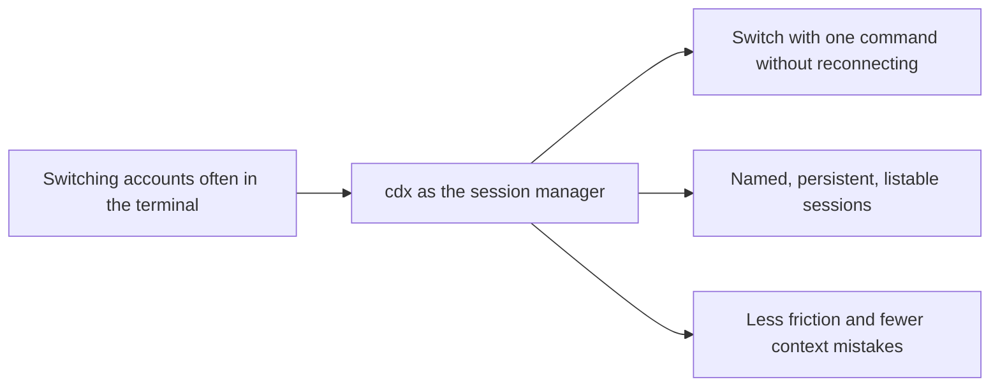

## prod_000_codex_multi_account_session_manager - Codex multi-account session manager
> Date: 2026-04-15
> Status: Active
> Related request: (none yet)
> Related backlog: `item_000_cdx_core_session_manager`, `item_001_persistent_codex_session_storage_and_rehydration`, `item_002_multi_provider_session_support_for_codex_and_claude`, `item_003_command_ergonomics_validation_and_safety`, `item_004_cdx_status_global_session_overview`, `item_005_cdx_session_auth_management`
> Related task: `task_005_cdx_session_auth_management`
> Related architecture: `adr_000_persist_and_restore_cdx_sessions`
> Reminder: Update status, linked refs, scope, decisions, success signals, and open questions when you edit this doc.

# Overview
Create a `cdx` command that acts as a persistent session manager for the terminal.
Users can list profiles, add them, remove them, and launch the right session without reconnecting.
The product starts with multi-account Codex support, with a natural path to other assistants such as Claude.
The goal is to reduce daily friction when one person switches between several identities or work contexts.

# Product problem
Users who work with multiple Codex accounts or contexts on the same machine must currently manage session selection, persistence, and reconnection themselves.
That creates friction, increases context mistakes, and makes daily usage slower than it should be.

# Target users and situations
- Advanced users who use the terminal as their primary entry point for Codex.
- People who alternate between several named contexts, for example `main`, `work1`, and `work2`.
- Users who want to preserve login state to avoid repeated reconnection.

# Goals
- Allow multiple named sessions to be managed from a single `cdx` command.
- Allow an existing session to be launched with `cdx <name>`.
- Allow a Codex session to be added with `cdx add <name>`.
- Allow an explicit provider session to be added with `cdx add <provider> <name>`, where the provider is `codex` or `claude`.
- Bootstrap the login flow on first creation when a session does not already have valid credentials.
- Allow targeted reauthentication and sign-out with `cdx login <name>` and `cdx logout <name>`.
- Allow a session to be removed with `cdx rmv <name>`.
- Preserve user session state so reconnecting is not required every time.
- Support `cdx status` as a global overview for comparing the latest usage data across saved sessions.

# Non-goals
- Replace Codex's native interface with a new graphical experience.
- Add complex shared-account or team orchestration from day one.
- Support every assistant on the market in the first version.

# Scope and guardrails
- In: Named session catalog, list output, create, delete, and direct launch.
- In: Persistence of login state so the user does not start from a fresh reconnect each session.
- In: An extensible multi-provider model, with Codex as the priority and Claude as a natural candidate.
- In: Standard CLI affordances such as `--help`/`-h` and `--version`/`-v`.
- In: A global `cdx status` overview for comparing the latest usage data across saved sessions.
- Out: Advanced enterprise policy management, centralized provisioning, or sharing sessions between users.
- Out: Automatic account switching without explicit naming from the user.

# Key product decisions
- The product should be oriented around one memorable command rather than a configuration UI.
- The base model must be explicit and predictable: one session equals one stable name equals one stable context.
- Login persistence is a core product expectation, not a convenience feature.
- The CLI contract should stay conventional: `cdx` lists, `add` creates, `rmv` deletes, and `--help`/`--version` behave as standard flags.
- `cdx add` should act as onboarding: create the session and immediately trigger login when the session has no valid credentials yet.
- `cdx login` and `cdx logout` should manage the account behind one named session without affecting the others.
- `cdx status` should be the global comparison surface; per-session storage remains the backing model.
- The status payload should be interpreted as usage metrics, including remaining percentages over the 5h and week windows when present.
- Claude support should remain secondary until it meaningfully improves daily usage.

# Success signals
- A user can see their sessions in one command and start one without an intermediate step.
- Users naturally return to `cdx` to change context instead of manually reauthenticating their assistants.
- Repeated reconnects drop sharply in daily use.
- Users describe the tool as reliable for switching from `main` to `work1` or `work2` without confusion.

# References
- `logics/backlog/item_000_cdx_core_session_manager.md`
- `logics/backlog/item_001_persistent_codex_session_storage_and_rehydration.md`
- `logics/backlog/item_002_multi_provider_session_support_for_codex_and_claude.md`
- `logics/backlog/item_003_command_ergonomics_validation_and_safety.md`
- `logics/architecture/adr_000_persist_and_restore_cdx_sessions.md`
- `logics/product/prod_001_per_session_codex_status_recall.md`
- `logics/backlog/item_005_cdx_session_auth_management.md`
- `logics/specs/spec_003_cdx_session_auth_management.md`

# Open questions
- Should list output remain purely human-readable, or also expose a script-friendly mode later?
- Should provider names be shown in the list output only when multiple providers are configured?
