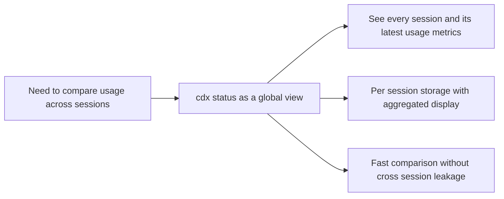

## prod_001_per_session_codex_status_recall - Per-session Codex status usage recall
> Date: 2026-04-15
> Status: Proposed
> Related request: (none yet)
> Related backlog: (none yet)
> Related task: (none yet)
> Related architecture: (none yet)
> Reminder: Update status, linked refs, scope, decisions, success signals, and open questions when you edit this doc.

# Overview
Create a `cdx status` command that summarizes the latest `/status` result for every saved Codex session.
The default view should let the user compare `main`, `work1`, and `work2` at the same time, while still keeping each session's stored result isolated.
An optional `cdx status <name>` detail view should expose the latest result for one session when the user wants to inspect it more closely.
The user value is fast recall of recent usage information across sessions without manually searching transcripts.

# Product problem
Users can issue `/status` inside Codex, but the result is easy to lose once the session moves on.
When a person works across multiple named sessions, they need a way to compare the last known usage metrics for all sessions in one place.
Without a dedicated recall command, users have to search raw transcripts or jump between sessions to understand the current state.

# Target users and situations
- Advanced Codex users who switch between several named sessions on one machine.
- Users who rely on `/status` to surface structured usage data inside Codex.
- Users who want to compare the last `/status` response across sessions without manually digging through transcripts.
- Users who occasionally need a detail view for a single session.

# Goals
- Provide a `cdx status` command that lists every saved session and its latest `/status` result.
- Keep status recall isolated per session, so `main`, `work1`, and `work2` do not share results.
- Allow `cdx status <name>` to show the detailed latest status for one session.
- Extract the useful usage data from each recalled response so it can be displayed or reused directly.
- Reduce the need to search transcript history manually.
- Store both the raw latest `/status` response and the extracted fields needed for display, including usage and remaining percentage for 5h and week windows.
- Sort the global view by the most recent status activity first.

# Non-goals
- Redesign the `/status` command inside Codex itself.
- Build a full transcript browser or general-purpose chat archive.
- Merge status history across different sessions or providers by default.
- Reconstruct missing status data when a session has never produced a `/status`.
- Support non-Codex providers in the first version.

# Scope and guardrails
- In: session-scoped storage of the latest `/status` entry and its extracted usage data.
- In: a global status view that aggregates each session's latest result.
- In: a session detail view for `cdx status <name>`.
- Out: arbitrary transcript search across all sessions, full conversation replay, and cross-session aggregation beyond the latest stored status.

# Key product decisions
- The product should treat status recall as a session-native capability with a global summary view on top.
- The stored result must belong to the named session that produced it.
- The command should prioritize the latest relevant `/status`, not an exhaustive transcript listing.
- Extraction of the useful usage data is part of the value, not a separate manual step.
- Sessions with no stored `/status` should still appear in the global view with a clear empty state.
- The global view should sort by most recent status activity first.
- The first version should stay Codex-only for status recall.

# Success signals
- A user can run `cdx status` and see the latest usage metrics for every saved session in one place.
- A user can run `cdx status <name>` and inspect one session in detail when needed.
- `main`, `work1`, and `work2` can each keep a different status result without interference.
- Users spend less time reopening transcripts to find the last useful usage output.
- The recalled data is accurate enough to be reused in follow-up work.
- A user can immediately spot stale sessions because empty states remain visible.

# References
- `logics/backlog/item_004_cdx_status_global_session_overview.md`

# Open questions
- None for v1.
