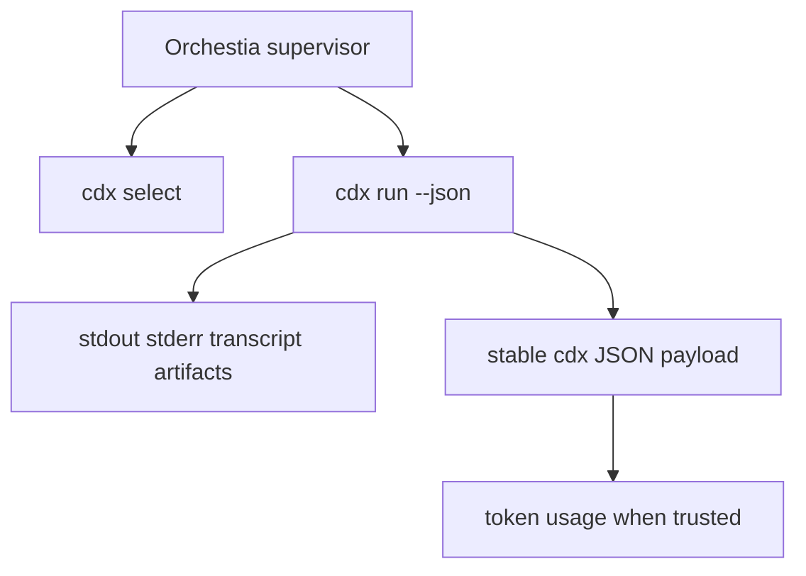

## prod_002_headless_automation_contract_for_orchestia - Headless automation contract for Orchestia
> Date: 2026-06-08
> Status: Settled
> Related request: `req_000_orchestia_headless_json_task_runner`, `req_001_populate_headless_run_usage_tokens_for_orchestia`
> Related backlog: `item_006_headless_cdx_run_json_execution_contract`, `item_007_automatic_headless_session_selection`, `item_008_provider_neutral_reasoning_effort_mapping`, `item_009_headless_run_artifacts_usage_and_error_reporting`, `item_010_populate_cdx_run_usage_and_launcher_payload`, `item_011_use_provider_native_headless_launch_modes_for_cdx_run`
> Related task: `task_006_headless_cdx_run_json_execution_contract`, `task_007_automatic_headless_session_selection`, `task_008_provider_neutral_reasoning_effort_mapping`, `task_009_headless_run_artifacts_usage_and_error_reporting`, `task_010_implement_cdx_run_usage_extraction_and_launcher_payload`, `task_011_implement_provider_native_headless_cdx_run_launch_modes`
> Related architecture: `adr_002_provider_native_headless_run_boundary`
> Reminder: Update status, linked refs, scope, decisions, success signals, and open questions when you edit this doc.

# Overview
Orchestia needs `cdx-manager` to act as a stable local launcher for headless assistant tasks.
The product surface is a JSON-first CLI contract: select a usable provider session, run a prompt in a target workspace, capture provider artifacts, and return one parseable result payload to the supervisor.

# Product Problem
- Orchestia should not own provider account selection, quota readiness, cooldown interpretation, or provider-specific launch flags.
- A subprocess supervisor needs stdout to contain one final JSON payload, not mixed provider logs.
- Token usage is valuable for accounting, but unknown or unsupported usage must remain nullable rather than guessed.

# Goals
- Provide explicit-session and provider-selected `cdx run --json` workflows.
- Provide `cdx select --json` for account choice without duplicating readiness logic outside `cdx-manager`.
- Preserve stable fields for supervisor correlation: `launcher`, `run_id`, session, provider, cwd, exit code, duration, artifact paths, warnings, and error details.
- Normalize reasoning effort/power enough that Orchestia can request capability without knowing each provider's flags.
- Keep provider stdout/stderr in artifacts so cdx stdout remains machine-readable.
- Populate usage only from trusted provider JSON or JSONL shapes.

# Non-goals
- Building an Orchestia SDK inside this repository.
- Adding daemon, queue, or remote execution APIs.
- Guaranteeing token usage for providers or versions that do not expose a verified machine-readable shape.
- Changing interactive `cdx <session>` launches.

# Key Product Decisions
- The public integration boundary is the CLI, not a library import.
- `--json` mode prioritizes machine readability over live provider streaming.
- `--reasoning-effort low|medium|high` is the preferred supervisor-facing capability knob; `--power` remains a compatibility alias.
- Usage fields stay present and nullable so consumers can handle missing provider data without schema branching.
- Provider-native headless modes are acceptable when needed to make subprocess behavior reliable.

# Success Signals
- Orchestia can run a single assistant task through `cdx run --json` and parse stdout directly.
- Provider output never pollutes cdx stdout in JSON mode.
- Artifact paths are enough to debug provider failures without scraping terminal UI.
- Token usage appears when known provider shapes expose it and remains null otherwise.

# References
- `logics/request/req_000_orchestia_headless_json_task_runner.md`
- `logics/request/req_001_populate_headless_run_usage_tokens_for_orchestia.md`
- `logics/backlog/item_006_headless_cdx_run_json_execution_contract.md`
- `logics/backlog/item_007_automatic_headless_session_selection.md`
- `logics/backlog/item_008_provider_neutral_reasoning_effort_mapping.md`
- `logics/backlog/item_009_headless_run_artifacts_usage_and_error_reporting.md`
- `logics/backlog/item_010_populate_cdx_run_usage_and_launcher_payload.md`
- `logics/backlog/item_011_use_provider_native_headless_launch_modes_for_cdx_run.md`
- `logics/tasks/task_006_headless_cdx_run_json_execution_contract.md`
- `logics/tasks/task_007_automatic_headless_session_selection.md`
- `logics/tasks/task_008_provider_neutral_reasoning_effort_mapping.md`
- `logics/tasks/task_009_headless_run_artifacts_usage_and_error_reporting.md`
- `logics/tasks/task_010_implement_cdx_run_usage_extraction_and_launcher_payload.md`
- `logics/tasks/task_011_implement_provider_native_headless_cdx_run_launch_modes.md`
- `logics/architecture/adr_002_provider_native_headless_run_boundary.md`
