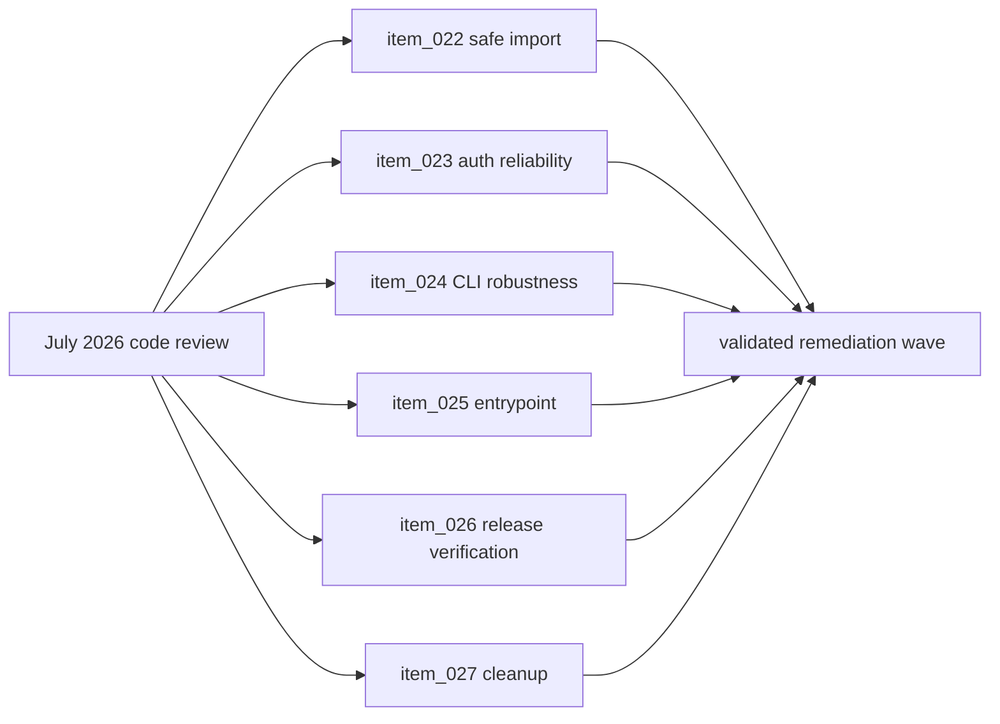

## prod_003_code_review_remediation_wave_2026_07 - Code review remediation wave 2026-07
> Date: 2026-07-18
> Status: Settled
> Related request: `req_010_address_july_2026_code_review_findings_data_safety_reliability_and_cleanup`
> Related backlog: `item_022_safe_bundle_import_pre_validation_credential_guard_per_session_rollback`, `item_023_provider_auth_reliability_probe_timeout_bounded_auth_lock_power_effort_precedence`, `item_024_cli_robustness_tolerant_history_parsing_concurrent_removal_safe_status_clean_disk_view_fixes`, `item_025_unify_npm_entrypoint_through_cli_entry`, `item_026_release_verification_trust_root_and_unverified_install_warning`, `item_027_deduplication_dead_code_removal_and_docs_hygiene`
> Related task: `task_021_orchestrate_july_2026_code_review_remediation`
> Related architecture: (none yet)
> Reminder: Update status, linked refs, scope, decisions, success signals, and open questions when you edit this doc.
> Confidence: 95
> Non-semantic edit: Added overview Mermaid diagram after implementation closeout.

# Overview
Fix every finding from the July 2026 three-track code review of the session manager CLI: eliminate the bundle-import data-loss path, make provider auth probing and locking reliable under contention, repair five robustness/UX defects in history/status/clean/disk/view, unify the npm and pip entrypoints, harden the release verification trust root, and clear the accumulated duplication and dead code.

# Goals
- No CLI operation can destroy credentials it cannot restore.
- Launch, run, doctor, status, and history never hang or hard-fail on recoverable conditions (slow provider CLI, torn log line, concurrent session removal).
- npm and pip installs behave identically on every platform.
- Release artifacts are verifiable against a trust root independent of the repository main branch.
- One implementation per helper: no drifting duplicate builders, formatters, or regexes.

# Non-goals
- Per-session provider login flows (the global-auth token-rotation clash between homes is documented, not redesigned).
- Full artifact signing (Sigstore/GPG) — out of scope beyond moving checksums off the main branch.
- New test coverage for presentation modules beyond the regression tests tied to these fixes.

# Scope and guardrails
- In: scaffolded request, product, backlog, orchestration task, validation, and handoff context.
- Out: unrelated workflow docs and implementation of generated tasks.

# Key product decisions
- Use structured input as the source of truth for generated docs.
- Keep generated write paths local and repo-bounded.

# Success signals
- Generated docs pass lint and audit without broad manual rewrites.
- Context-pack output can be handed to an implementation agent directly.

# References
- Product back-reference: `req_010_address_july_2026_code_review_findings_data_safety_reliability_and_cleanup`
- Task back-reference: `task_021_orchestrate_july_2026_code_review_remediation`
