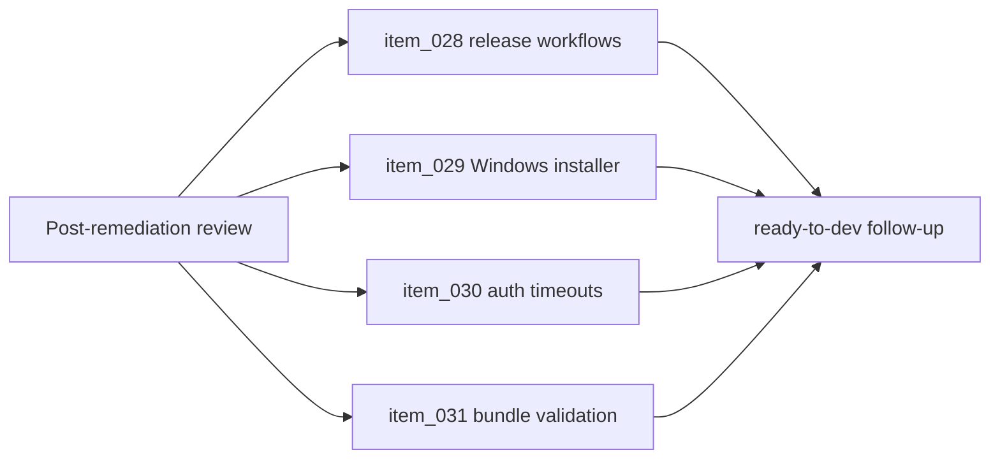

## prod_004_post_remediation_hardening_follow_up_2026_07 - Post-remediation hardening follow-up 2026-07
> Date: 2026-07-18
> Status: Settled
> Related request: `req_011_address_july_2026_post_remediation_review_follow_up_findings`
> Related backlog: `item_028_use_tagged_release_checksum_assets_in_package_publication_workflows`
> Related task: `task_022_orchestrate_post_remediation_hardening_follow_up`
> Related architecture: (none yet)
> Reminder: Update status, linked refs, scope, decisions, success signals, and open questions when you edit this doc.

# Overview
Close the remaining defects found by the post-remediation review: finish the checksum trust-root migration for package publication, repair the standalone Windows installer launcher, preserve degraded auth semantics on probe timeouts, and make bundle import validation reject malformed profile entries cleanly.

# Goals
- Release publication and standalone installation verify against the same tagged release trust root.
- Windows standalone installs produce a usable launcher without manual repair.
- Transient provider CLI hangs do not mark sessions as logged out.
- Malformed bundle payloads fail with controlled user-facing errors before touching session profiles.

# Non-goals
- Introduce artifact signing such as GPG or Sigstore.
- Redesign provider authentication flows or token storage.
- Change the encrypted bundle format.

# Scope and guardrails
- In: scaffolded request, product, backlog, orchestration task, validation, and handoff context.
- Out: unrelated workflow docs and implementation of generated tasks.

# Key product decisions
- Use structured input as the source of truth for generated docs.
- Keep generated write paths local and repo-bounded.

# Success signals
- Generated docs pass lint and audit without broad manual rewrites.
- Context-pack output can be handed to an implementation agent directly.

# References
- Product back-reference: `item_028_use_tagged_release_checksum_assets_in_package_publication_workflows`
- Task back-reference: `task_022_orchestrate_post_remediation_hardening_follow_up`
