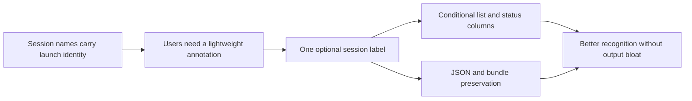

## prod_005_session_labeling_for_cdx - Session labeling for cdx
> Date: 2026-07-23
> Status: Proposed
> Related request: `req_012_add_optional_labels_to_cdx_sessions`
> Related backlog: `item_032_optional_session_labels_in_cli_list_and_status_surfaces`
> Related task: `task_023_orchestrate_optional_session_labels`
> Related architecture: (none yet)
> Reminder: Update status, linked refs, scope, decisions, success signals, and open questions when you edit this doc.

# Overview
Add a small optional label field to cdx sessions so users can annotate saved assistant sessions without changing their names, launch settings, authentication state, or provider behavior. Labels appear only when present, keeping the default CLI output compact for existing users.

# Goals
- Let users attach one short human-readable label to a saved session.
- Keep labels as session metadata, separate from launch settings and provider runtime behavior.
- Show labels in list and full status tables only when at least one session has a label.
- Expose labels in JSON outputs so other tools can group or display sessions.
- Preserve labels across copy, rename, export, and import.

# Non-goals
- Multiple labels or tag filtering.
- Colorized label badges, label search, or label-based sorting.
- Provider-specific account metadata discovery.
- Changing session names, auth homes, launch priority, or provider command construction.

# Scope and guardrails
- In: one optional label per saved session, stored as root-level session metadata.
- In: a dedicated CLI command for setting and clearing the label.
- In: conditional label columns in the default session list and full status table.
- In: JSON output and export/import preservation.
- Out: multi-label tagging, label filtering, label-based sorting, and automatic provider-account labeling.

# Key product decisions
- Labels identify sessions for humans; they must not alter launch settings, provider command construction, auth checks, or selection priority.
- The CLI should use a dedicated `cdx label` command rather than overloading launch-setting `set` / `unset`.
- Table columns should remain conditional so users without labels keep the current compact output.
- Legacy session records without a label key are valid and should require no migration step.

# Success signals
- A user can label a session, clear that label, and see the label only on surfaces where it adds information.
- Existing no-label output remains unchanged.
- Automation consumers receive labels in JSON payloads without parsing human table output.
- Copy, rename, export, and import keep labels attached to the session.

# References
- Product back-reference: `req_012_add_optional_labels_to_cdx_sessions`
- Task back-reference: `task_023_orchestrate_optional_session_labels`
