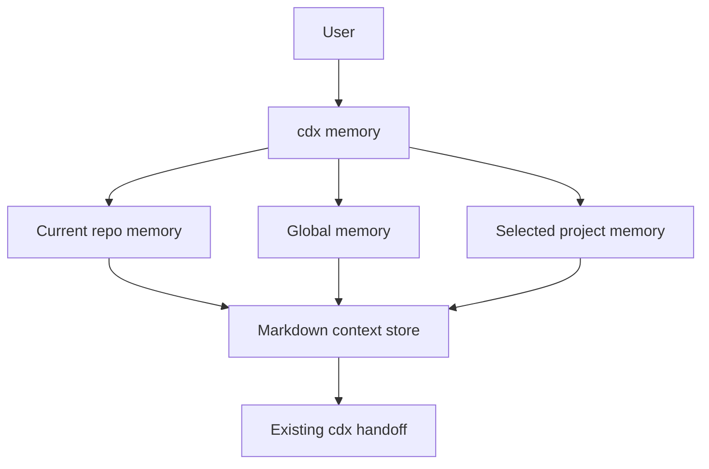

## prod_006_workspace_memory_command_for_cdx - Workspace memory command for cdx
> Date: 2026-07-28
> Status: Proposed
> Related request: `req_013_add_a_small_workspace_memory_command_to_cdx`
> Related backlog: `item_033_scoped_memory_alias_and_append_command`
> Related task: `task_024_orchestrate_workspace_memory_command`
> Related architecture: (none yet)
> Reminder: Update status, linked refs, scope, decisions, success signals, and open questions when you edit this doc.

# Overview
Expose the existing shared context storage as a clearer `cdx memory` command, with current-workspace, global, and explicit project scopes plus a minimal append operation for durable notes. The command reuses user-controlled Markdown context files and handoff flow so assistant sessions can share memory without depending on provider-private databases.

# Goals
- Make the existing workspace context easier to discover as project memory.
- Let users maintain current-workspace, global, and explicitly selected project memory.
- Let users append short notes or decisions without opening an editor or rewriting the full context.
- Keep one storage model based on user-controlled Markdown files under `~/.cdx/contexts/`.
- Keep `cdx context` and `cdx handoff` behavior compatible for existing users and scripts.
- Avoid provider-private memory internals and expose only user-controlled Markdown memory.

# Non-goals
- Reading or writing provider-owned SQLite memory files.
- Adding a new memory database, sync service, daemon, or background summarizer.
- Automatic extraction of memories from transcripts.
- Memory search, tagging, ranking, pruning, or semantic recall.
- Complex project registry management beyond resolving a simple project name or path to a stable local memory file.
- Changing how provider sessions launch beyond existing handoff context installation.

# Scope and guardrails
- In: current-workspace memory, global memory, explicit project memory selection, append/set/view/path/init/edit/clear commands, JSON output, docs, and focused tests.
- Out: provider-owned memory databases, automatic summarization, memory search, project listing, cross-machine sync, remote APIs, and changes to provider launch behavior beyond existing handoff context installation.

# Key product decisions
- `cdx memory` is a user-facing alias over user-controlled Markdown memory; it must reuse the existing context store instead of introducing a second persistence model.
- The default scope is the current workspace/repo. `--global` selects one operator-wide memory, and `--project <name-or-path>` selects a specific project memory from any cwd.
- `append` is intentionally line-oriented and simple: add a note, preserve existing content, and reject empty input.
- `cdx context` remains the compatibility surface for existing scripts; `cdx memory` is the clearer operator-facing surface.
- Provider-private files such as `profiles/*/memories_*.sqlite` are not part of the supported memory contract.

# Success signals
- Users can inspect and update memory without knowing the hashed context path.
- A global note and a project-specific note can be appended from any repo without modifying the wrong memory file.
- Existing `cdx context` and `cdx handoff` workflows continue to pass their current tests.
- JSON output identifies the action and selected scope clearly enough for automation.
- The implementation stays small: one storage model, one append helper, and no provider-private memory handling.

# References
- Product back-reference: `req_013_add_a_small_workspace_memory_command_to_cdx`
- Task back-reference: `task_024_orchestrate_workspace_memory_command`
