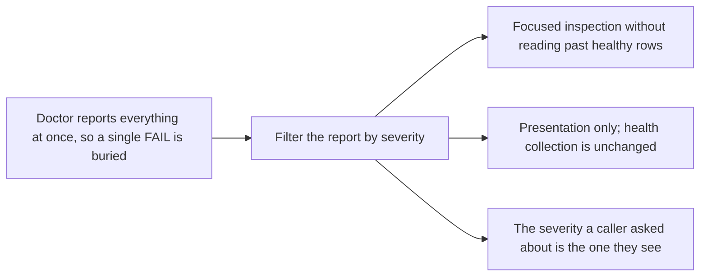

## prod_008_filterable_doctor_diagnostics - Filterable doctor diagnostics
> Date: 2026-08-05
> Status: Settled
> Related request: `req_015_add_a_severity_filter_to_cdx_doctor`
> Related backlog: `item_035_filter_cdx_doctor_report_by_severity`
> Related task: `task_026_orchestrate_cdx_doctor_severity_filtering`
> Related architecture: (none yet)
> Reminder: Update status, linked refs, scope, decisions, success signals, and open questions when you edit this doc.

# Overview
Allow focused inspection of doctor severities without changing health collection.

# Goals
- Make warning/failure triage concise.
- Keep the existing report schema predictable.

# Non-goals
- Changing health checks or their assigned severities.
- Adding multiple simultaneous filters, exit-code policy changes, or automatic repair.

# Scope and guardrails
- In: scaffolded request, product, backlog, orchestration task, validation, and handoff context.
- Out: unrelated workflow docs and implementation of generated tasks.

# Key product decisions
- Use structured input as the source of truth for generated docs.
- Keep generated write paths local and repo-bounded.

# Success signals
- Generated docs pass lint and audit without broad manual rewrites.
- Context-pack output can be handed to an implementation agent directly.

# References
- Product back-reference: `req_015_add_a_severity_filter_to_cdx_doctor`
- Task back-reference: `task_026_orchestrate_cdx_doctor_severity_filtering`
