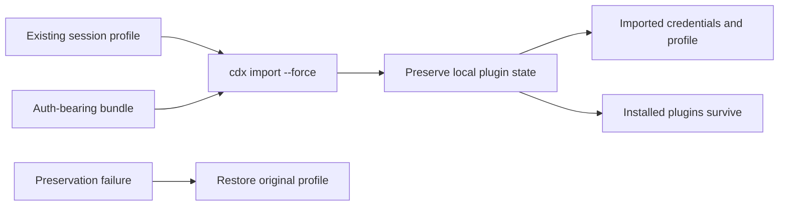

## prod_010_force_import_preservation_for_local_plugin_state - Force import preservation for local plugin state
> Date: 2026-08-05
> Status: Proposed
> Related request: `req_020_prevent_cdx_import_force_from_silently_discarding_local_plugins`
> Related backlog: `item_040_preserve_local_plugin_state_during_force_import`
> Related task: `task_031_orchestrate_force_import_plugin_preservation`
> Related architecture: (none yet)
> Reminder: Update status, linked refs, scope, decisions, success signals, and open questions when you edit this doc.

# Overview
Make `cdx import --force` safe for auth refresh workflows by preserving locally installed plugin/non-auth profile state, or refusing before mutation when that state cannot be preserved.

# Goals
- Prevent silent loss of locally installed plugins during auth-bearing force imports.
- Keep the existing credential guard from `item_022` intact and separate.
- Preserve the current transactional import pattern: validate first, rename aside, restore on failure, delete backup only after success.
- Document the difference between credentials restored from bundles and local plugin state managed outside the bundle.

# Non-goals
- Changing the bundle schema to export/import installed plugins.
- Adding a new plugin marketplace reconciliation feature.
- Changing `cdx update all` behavior.
- Preserving arbitrary cache directories unless they are required plugin manager state or explicitly covered by the implementation plan.
- Changing `cdx import --merge` behavior.

# Scope and guardrails
- In: scaffolded request, product, backlog, orchestration task, validation, and handoff context.
- Out: unrelated workflow docs and implementation of generated tasks.

# Key product decisions
- Use structured input as the source of truth for generated docs.
- Keep generated write paths local and repo-bounded.

# Success signals
- Generated docs pass lint and audit without broad manual rewrites.
- Context-pack output can be handed to an implementation agent directly.

# References
- Product back-reference: `req_020_prevent_cdx_import_force_from_silently_discarding_local_plugins`
- Task back-reference: `task_031_orchestrate_force_import_plugin_preservation`
