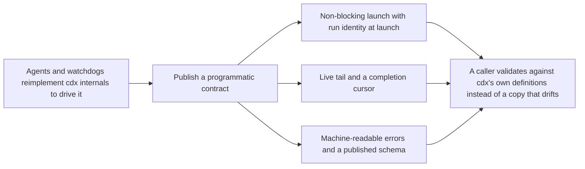

## prod_011_programmatic_cli_contract_for_non_interactive_callers - Programmatic CLI contract for non-interactive callers
> Date: 2026-08-07
> Status: Settled
> Related request: `req_021_close_the_programmatic_cli_contract_gaps_that_force_agent_callers_to_reimplement_cdx_internals`
> Related backlog: `item_041_add_detached_run_launch_returning_run_identity_immediately`, `item_042_add_run_tail_subcommand_for_live_run_output`, `item_043_replace_catch_all_usage_errors_with_specific_machine_readable_error_codes`, `item_044_publish_machine_readable_schema_for_enums_and_argument_constraints`, `item_045_accept_prompt_on_standard_input_and_add_a_completion_cursor_to_runs`
> Related task: `task_032_orchestrate_the_programmatic_cli_contract_for_agent_callers`
> Related architecture: (none yet)
> Reminder: Update status, linked refs, scope, decisions, success signals, and open questions when you edit this doc.

# Overview
Make cdx directly consumable by agents, MCP servers, and watchdogs by closing the gaps that currently force those callers to reimplement cdx internals: non-blocking launch with immediate run identity, live output through the CLI, machine-readable errors and schema, stdin prompts, and a completion cursor.

# Goals
- Let a caller launch a run without blocking and know immediately which run it launched.
- Let a caller observe a running run's live output through cdx rather than by reading cdx's own files behind its back.
- Make failures machine-distinguishable so a caller can react to the specific error instead of pattern-matching English text.
- Publish the enums and argument constraints so downstream callers stop maintaining drifting copies of them.
- Remove the need for temporary prompt files and caller-side de-duplication state.

# Non-goals
- Adding a daemon, scheduler, or long-lived server process to cdx.
- Building or shipping an MCP server inside this repository.
- Changing the interactive terminal UX or the default blocking behavior of `cdx run`.
- Streaming or following output continuously; `run-tail` returns a bounded snapshot, not a follow mode.
- Adding provider-side capabilities such as resuming or reusing a provider session between runs.
- Modifying the downstream repositories that consume this CLI.

# Scope and guardrails
- In: scaffolded request, product, backlog, orchestration task, validation, and handoff context.
- Out: unrelated workflow docs and implementation of generated tasks.

# Key product decisions
- Use structured input as the source of truth for generated docs.
- Keep generated write paths local and repo-bounded.

# Success signals
- Generated docs pass lint and audit without broad manual rewrites.
- Context-pack output can be handed to an implementation agent directly.

# References
- Product back-reference: `req_021_close_the_programmatic_cli_contract_gaps_that_force_agent_callers_to_reimplement_cdx_internals`
- Task back-reference: `task_032_orchestrate_the_programmatic_cli_contract_for_agent_callers`
