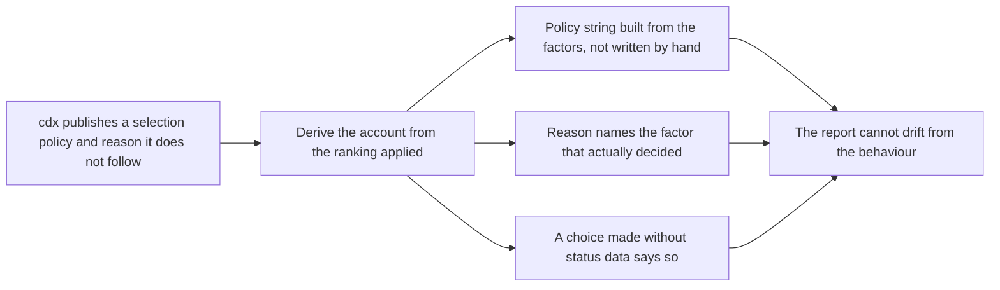

## prod_013_truthful_reporting_of_how_a_session_was_selected - Truthful reporting of how a session was selected
> Date: 2026-08-07
> Status: Settled
> Related request: `req_023_stop_cdx_select_from_publishing_a_selection_policy_and_reason_it_does_not_follow`
> Related backlog: `item_049_derive_the_published_selection_policy_and_reason_from_the_ranking`, `item_050_let_run_provider_refresh_status_and_warn_when_it_selects_blind`
> Related task: `task_034_orchestrate_truthful_selection_reporting`
> Related architecture: (none yet)
> Reminder: Update status, linked refs, scope, decisions, success signals, and open questions when you edit this doc.

# Overview
Make cdx's account of its own session selection derived rather than hand-written, and let a caller both request fresh status and learn when a choice was made without it.

# Goals
- Never publish a selection policy the code does not follow.
- Tell a caller which factor actually decided, not which one usually does.
- Let a caller who cares about freshness ask for it.
- Distinguish 'this session has low availability' from 'we have no idea what this session's availability is'.

# Non-goals
- No change to the ranking itself; that is tracked separately.
- No new status-gathering mechanism.
- No refresh-by-default, which would make every auto-selected run pay for a provider probe.
- No stable machine identifier for a policy, if the policy string is derived and therefore free to change.

# Scope and guardrails
- In: scaffolded request, product, backlog, orchestration task, validation, and handoff context.
- Out: unrelated workflow docs and implementation of generated tasks.

# Key product decisions
- Use structured input as the source of truth for generated docs.
- Keep generated write paths local and repo-bounded.

# Success signals
- Generated docs pass lint and audit without broad manual rewrites.
- Context-pack output can be handed to an implementation agent directly.

# References
- Product back-reference: `req_023_stop_cdx_select_from_publishing_a_selection_policy_and_reason_it_does_not_follow`
- Task back-reference: `task_034_orchestrate_truthful_selection_reporting`
