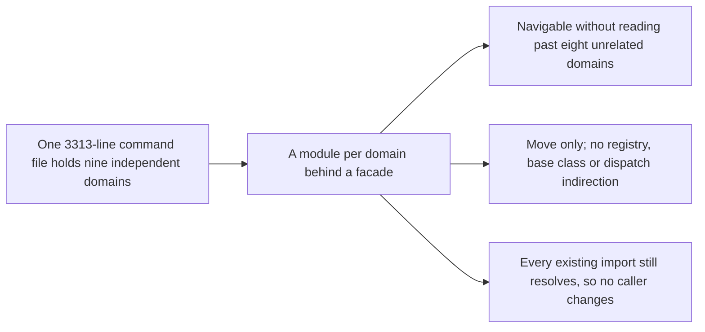

## prod_015_navigable_command_modules - Navigable command modules
> Date: 2026-08-07
> Status: Settled
> Related request: `req_025_split_cli_commands_into_per_domain_command_modules_behind_a_facade`
> Related backlog: `item_054_pilot_the_split_with_the_runs_and_maintenance_domains`, `item_055_extract_the_remaining_seven_command_domains`, `item_056_mirror_the_split_in_the_command_test_file`
> Related task: `task_036_orchestrate_the_command_module_split`
> Related architecture: (none yet)
> Reminder: Update status, linked refs, scope, decisions, success signals, and open questions when you edit this doc.

# Overview
Turn the single 3313-line command file into nine per-domain modules behind an unchanged import surface, taking advantage of the fact that the domains are already independent.

# Goals
- Make the handler for a command findable without scrolling past unrelated domains.
- Keep every existing import working, so no caller has to change.
- Land the move in reviewable, individually revertible pieces.
- Leave the structure no more abstract than it is today.

# Non-goals
- No behavior change, no renaming, no signature changes.
- No new dispatch abstraction, registry, or command base class.
- No split of `provider_runtime.py`, which is cohesive per provider and would only gain cross-imports.
- No decomposition of `session_service.py`, whose problem is a 1153-line function rather than a file size and which is tracked separately.
- No dead-code removal, since the file has none.

# Scope and guardrails
- In: scaffolded request, product, backlog, orchestration task, validation, and handoff context.
- Out: unrelated workflow docs and implementation of generated tasks.

# Key product decisions
- Use structured input as the source of truth for generated docs.
- Keep generated write paths local and repo-bounded.

# Success signals
- Generated docs pass lint and audit without broad manual rewrites.
- Context-pack output can be handed to an implementation agent directly.

# References
- Product back-reference: `req_025_split_cli_commands_into_per_domain_command_modules_behind_a_facade`
- Task back-reference: `task_036_orchestrate_the_command_module_split`
