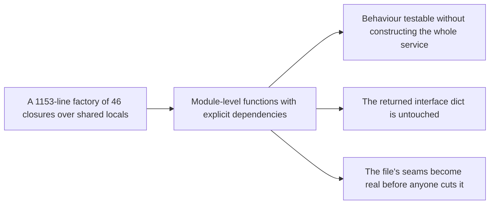

## prod_016_a_session_service_that_can_be_read_in_pieces - A session service that can be read in pieces
> Date: 2026-08-07
> Status: Settled
> Related request: `req_026_break_up_the_1153_line_session_service_factory_before_splitting_its_file`
> Related backlog: `item_057_lift_the_closures_that_capture_nothing_into_module_level_functions`, `item_058_give_the_state_dependent_closures_explicit_dependencies`, `item_059_decide_the_file_split_from_the_seams_the_decomposition_exposed`
> Related task: `task_037_orchestrate_the_session_service_decomposition`
> Related architecture: (none yet)
> Reminder: Update status, linked refs, scope, decisions, success signals, and open questions when you edit this doc.

# Overview
Turn a 1153-line factory of 46 closures into module-level functions with explicit dependencies, leaving the service interface untouched, so the file's seams become real before anyone decides where to cut it.

# Goals
- Make individual session-service behavior readable and testable without constructing the whole service.
- Make each piece's dependencies visible in its signature instead of implicit in a closure.
- Keep every caller and every existing test working throughout.
- Reach a state where splitting the file is an obvious next step rather than a guess.

# Non-goals
- No change to the service interface or to any caller.
- No file split in this request.
- No behavior change, no renaming of interface keys.
- No new abstraction: no service class, no dependency injection framework, no repository layer.
- No change to `session_store.py`, which is already a separate layer.

# Scope and guardrails
- In: scaffolded request, product, backlog, orchestration task, validation, and handoff context.
- Out: unrelated workflow docs and implementation of generated tasks.

# Key product decisions
- Use structured input as the source of truth for generated docs.
- Keep generated write paths local and repo-bounded.

# Success signals
- Generated docs pass lint and audit without broad manual rewrites.
- Context-pack output can be handed to an implementation agent directly.

# References
- Product back-reference: `req_026_break_up_the_1153_line_session_service_factory_before_splitting_its_file`
- Task back-reference: `task_037_orchestrate_the_session_service_decomposition`
