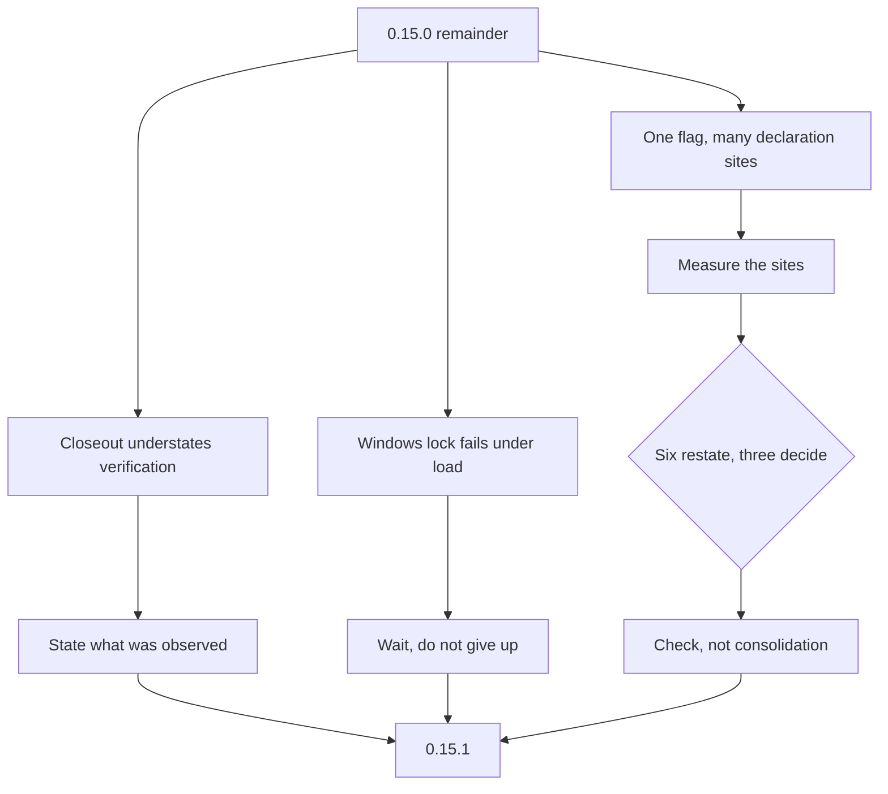

## prod_019_settle_0_15_0_s_remainder - Settle 0.15.0's remainder
> Date: 2026-08-09
> Status: Settled
> Related request: `req_029_settle_what_0_15_0_left_behind_before_cutting_0_15_1`
> Related backlog: `item_068_correct_the_req_028_record_to_state_what_background_delegation_was_actually_verified_to_do`
> Related task: `task_040_settle_0_15_0_s_remainder_and_cut_0_15_1`
> Related architecture: (none yet)
> Reminder: Update status, linked refs, scope, decisions, success signals, and open questions when you edit this doc.
> Indicators reviewed: 2026-08-09

# Overview
Three loose ends from 0.15.0, plus the patch release that carries them. A traceability record that understates what was verified, a registry lock that fails on Windows under the concurrency cdx exists to serve, and an option layer where adding one flag means five to eight coordinated edits and forgetting one produces a flag that silently does nothing.

# Goals
- Make the closeout record say what was actually verified, in both directions.
- Let a fleet of parallel runs write the registry on Windows without one of them failing.
- Make an incomplete option declaration impossible rather than merely unlikely.
- Ship 0.15.1 with the failover false-negative fix that is already on main and unreleased.

# Non-goals
- Adopting an argument-parsing framework, or any runtime dependency.
- Redesigning the command surface, renaming options, or changing what any existing flag does.
- Extending `cdx schema --json` to describe passthrough arguments, which remain deliberately unvalidated.
- Splitting `provider_runtime.py`; the coupling measurement found one seam worth 183 lines of 1320 and that is hygiene, not a problem.

# Scope and guardrails
- In: scaffolded request, product, backlog, orchestration task, validation, and handoff context.
- Out: unrelated workflow docs and implementation of generated tasks.

# Key product decisions
- Use structured input as the source of truth for generated docs.
- Keep generated write paths local and repo-bounded.

# Success signals
- Generated docs pass lint and audit without broad manual rewrites.
- Context-pack output can be handed to an implementation agent directly.

# References
- Product back-reference: `item_068_correct_the_req_028_record_to_state_what_background_delegation_was_actually_verified_to_do`
- Task back-reference: `task_040_settle_0_15_0_s_remainder_and_cut_0_15_1`
