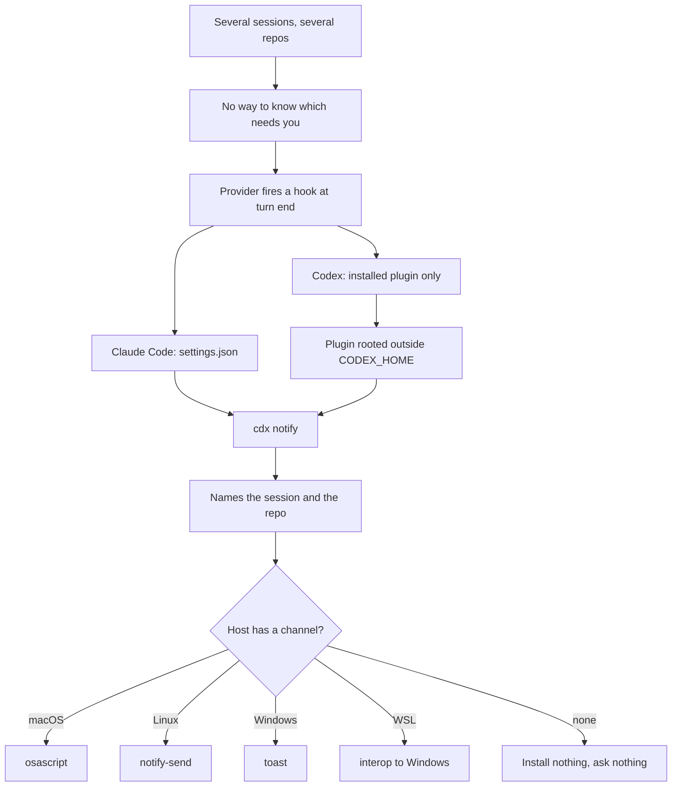

## prod_020_know_which_parallel_session_needs_you - Know which parallel session needs you
> Date: 2026-08-09
> Status: Settled
> Related request: `req_030_tell_the_user_which_parallel_cdx_session_finished_or_is_waiting_without_watching_terminals`
> Related backlog: `item_073_reassign_cdx_notify_to_the_agent_event_hook_target`
> Related task: `task_041_orchestrate_agent_completion_notifications`
> Related architecture: (none yet)
> Reminder: Update status, linked refs, scope, decisions, success signals, and open questions when you edit this doc.
> Indicators reviewed: 2026-08-09 18:51:14

# Overview
Make cdx raise a native desktop notification when one of its sessions finishes a turn or blocks waiting for input, wiring the providers' own hook mechanisms into each session's isolated home so the notification can say which session, in which repository.

# Goals
- Answer 'which of my running sessions needs me' without looking at any terminal.
- Work identically for Codex and Claude Code through one command.
- Cost the user nothing to set up, and one command to turn off.
- Reuse the cross-platform notifier and the per-session home isolation cdx already has.

# Non-goals
- No routing to Discord, Slack, or a phone; the hook target is the single point to extend when that day comes.
- No third-party shell script shared between the two CLIs.
- No notification templating or message configuration.
- No change to how the providers themselves are launched or authenticated.
- No removal of the quota-reset scheduling internals in this request; only its command surface is retired.

# Scope and guardrails
- In: scaffolded request, product, backlog, orchestration task, validation, and handoff context.
- Out: unrelated workflow docs and implementation of generated tasks.

# Key product decisions
- Use structured input as the source of truth for generated docs.
- Keep generated write paths local and repo-bounded.

# Success signals
- Generated docs pass lint and audit without broad manual rewrites.
- Context-pack output can be handed to an implementation agent directly.

# References
- Product back-reference: `item_073_reassign_cdx_notify_to_the_agent_event_hook_target`
- Task back-reference: `task_041_orchestrate_agent_completion_notifications`
