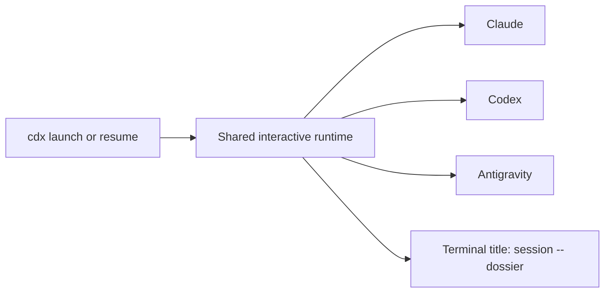

## prod_021_titres_de_terminal_coherents_pour_les_sessions_cdx - Titres de terminal cohérents pour les sessions cdx
> Date: 2026-08-09
> Status: Settled
> Related request: `req_031_unifier_les_titres_de_terminaux_des_sessions_interactives`
> Related backlog: `item_075_imposer_le_titre_session_dossier_aux_tui_interactifs`
> Related task: `task_042_implementer_les_titres_de_terminal_unifies`
> Related architecture: (none yet)
> Reminder: Update status, linked refs, scope, decisions, success signals, and open questions when you edit this doc.

# Overview
cdx conserve le titre session -- dossier pendant chaque session interactive prise en charge.

# Goals
- Fournir une convention visible et identique pour Claude, Codex et Antigravity.
- Préserver les commandes et identités natives des fournisseurs.
- N'émettre aucune séquence de titre lorsque la sortie n'est pas un terminal.

# Non-goals
- Ajouter un réglage persistant de format ou de fréquence de titre dans cette livraison.
- Modifier les titres ou le comportement d'Ollama.
- Modifier les titres de terminaux après le retour au shell appelant.

# Scope and guardrails
- In: scaffolded request, product, backlog, orchestration task, validation, and handoff context.
- Out: unrelated workflow docs and implementation of generated tasks.

# Key product decisions
- Use structured input as the source of truth for generated docs.
- Keep generated write paths local and repo-bounded.

# Success signals
- Generated docs pass lint and audit without broad manual rewrites.
- Context-pack output can be handed to an implementation agent directly.

# References
- Product back-reference: `req_031_unifier_les_titres_de_terminaux_des_sessions_interactives`
- Task back-reference: `task_042_implementer_les_titres_de_terminal_unifies`
