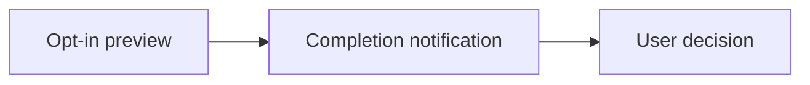

## prod_022_actionable_private_agent_notifications - Actionable, private agent notifications
> Date: 2026-08-10
> Status: Settled
> Related request: `req_032_show_a_privacy_aware_preview_in_agent_completion_notifications`
> Related backlog: `item_076_add_opt_in_bounded_assistant_response_previews_to_agent_notifications`
> Related task: `task_043_orchestrate_privacy_aware_agent_notification_previews`
> Related architecture: (none yet)
> Reminder: Update status, linked refs, scope, decisions, success signals, and open questions when you edit this doc.

# Overview
Let an explicitly opted-in session include a short final-response preview in its completion notification, while preserving private-by-default lock-screen behavior and useful attention signals.

# Goals
- Let the user assess a completed agent turn without immediately reopening its terminal.
- Offer one consistent response-preview behavior across the supported hook providers.
- Keep assistant text out of notifications unless the session owner explicitly opts in.
- Use documented hook payload fields and retain the current failure isolation.

# Non-goals
- No transcript parsing, transcript storage, or response summarization.
- No previews for headless runs, unsupported providers, or attention events.
- No global preview setting, custom templates, notification actions, or provider-specific configuration surface.
- No attempt to expose complete assistant responses in a desktop notification.

# Scope and guardrails
- In: scaffolded request, product, backlog, orchestration task, validation, and handoff context.
- Out: unrelated workflow docs and implementation of generated tasks.

# Key product decisions
- Use structured input as the source of truth for generated docs.
- Keep generated write paths local and repo-bounded.

# Success signals
- Generated docs pass lint and audit without broad manual rewrites.
- Context-pack output can be handed to an implementation agent directly.

# References
- Product back-reference: `item_076_add_opt_in_bounded_assistant_response_previews_to_agent_notifications`
- Task back-reference: `task_043_orchestrate_privacy_aware_agent_notification_previews`
