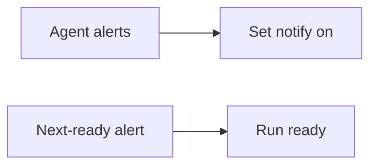

## prod_023_clear_notification_controls - Clear notification controls
> Date: 2026-08-10
> Status: Settled
> Related request: `req_033_make_agent_notification_controls_discoverable_and_self_explanatory`
> Related backlog: `item_077_clarify_notification_setup_lifecycle_feedback_and_documentation`
> Related task: `task_044_orchestrate_discoverable_agent_notification_controls`
> Related architecture: (none yet)
> Reminder: Update status, linked refs, scope, decisions, success signals, and open questions when you edit this doc.

# Overview
Make notification setup discoverable and its lifecycle truthful, so users can distinguish agent attention alerts from next-ready alerts without learning internal hook plumbing.

# Goals
- Let a new user enable the intended notification behavior from root help or the main screen.
- Make setting changes explain their deferred launch-time effect.
- Keep internal provider-hook plumbing available but out of the ordinary user journey.
- Use the existing settings, launch, and notification paths.

# Non-goals
- No new notification subcommand family or interactive wizard.
- No new persistent record of hook installation, trust, or delivery success.
- No change to notification delivery backends, response previews, or provider authentication.
- No notifications enabled by default.

# Scope and guardrails
- In: scaffolded request, product, backlog, orchestration task, validation, and handoff context.
- Out: unrelated workflow docs and implementation of generated tasks.

# Key product decisions
- Use structured input as the source of truth for generated docs.
- Keep generated write paths local and repo-bounded.

# Success signals
- Generated docs pass lint and audit without broad manual rewrites.
- Context-pack output can be handed to an implementation agent directly.

# References
- Product back-reference: `item_077_clarify_notification_setup_lifecycle_feedback_and_documentation`
- Task back-reference: `task_044_orchestrate_discoverable_agent_notification_controls`
